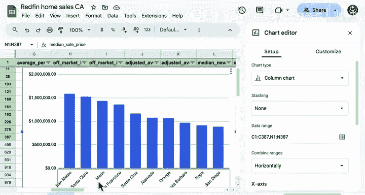
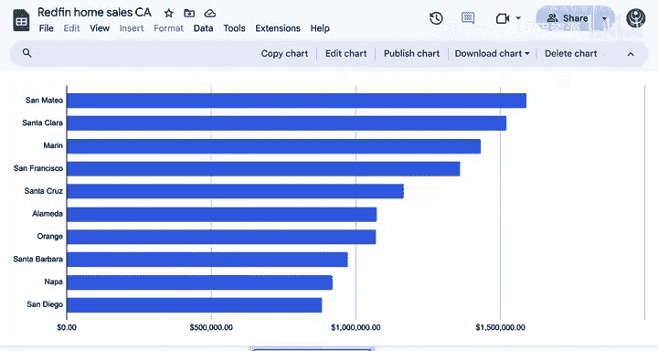
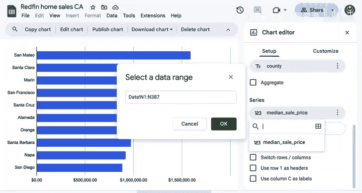
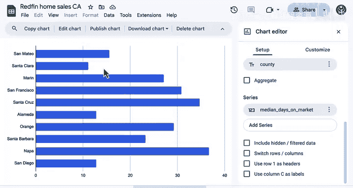

# 045：柱状图与条形图 📊

在本节课中，我们将学习如何使用Google Sheets创建柱状图和条形图。这两种图表是最常见的数据可视化形式之一，它们用途广泛、易于理解，非常适合用于比较不同组别的数据。我们将通过一个来自Redfin的房屋销售数据集进行演示。

## 数据集概览

首先，我们来了解一下将要使用的数据集。每个观测值代表特定时间段内特定县的房屋销售情况。

例如，第二行显示了斯坦尼斯劳斯县从2023年2月27日到2024年5月21日（共12周）的房屋销售数据。数据集中的每个特征都代表了该时期内房屋销售的某个特性。

其中一些特征可能比较专业，不易理解。例如：
*   **D列**是“调整后的平均新挂牌量”，代表该县在该时间段内新挂牌出售的房屋数量。
*   **J列**代表同一时间段内该县售出的房屋数量。
*   **L列**是挂牌房屋的“中位挂牌价格”。
*   **N列**是“中位销售价格”。
*   **W列**是“中位在售天数”，即房屋实际出售所需的时间，以及其“同比变化”，这代表与上一年相比的百分比差异。

## 数据预处理与探索

为了更好地理解数据，我们先进行一些简单的预处理。

首先，冻结首行以便查看标题。接着，让我们查看“平均新挂牌量”这一列。为其添加一个条件格式化的色阶，这能帮助我们更直观地探索数据。

你可以看到，在圣克拉拉县，这个特定时间段内挂牌的房屋数量要多得多，而其他大多数数据点的数值则小很多。

接下来，我们通过筛选来缩小数据范围。这里我们选择六月的第一周作为起始时间段。这个时期正值返校季，是房屋销售的活跃期。现在，我们来探索第三季度各县的“平均新挂牌量”。趋势非常有趣：像洛杉矶、圣地亚哥甚至奥兰治这样的大县，其挂牌量远多于图中颜色较浅的一些小县。例如，塞拉县在此期间只有一个挂牌。

现在，让我们看看W列——“在售天数”的同比变化。由于此列代表百分比变化，应用发散色阶是一个很好的选择。许多数据的颜色实际上非常浅，只有像增长14%或22%这样远离零值的数值，才会显示更深的颜色。

我们再做一点侦察。首先，数据中共有58个不同的县。我还可以查看房屋的平均销售数量。在低端，最低售出房屋数为1套；而在其他县，售出的房屋超过1000套。你可以在这里看到这个最大值，它对应的是洛杉矶县。

如果我高亮“中位销售价格”，我还可以获得所有县的平均房屋销售价格信息，大约为**$627,000**。加州的房地产市场非常昂贵。你还可以看到，低端的中位销售价格约为**$165,000**，而高端有一个县的中位房屋销售价格接近**$160万**。这确实非常昂贵。我们确保数据已排序。

## 创建第一个图表

现在，让我们创建第一个图表。我将高亮前10个县，并针对它们的“中位销售价格”进行可视化。

然后，我转到“插入”菜单，插入一个新图表。你可以看到，每个县的X轴标签是可读的，但它们靠得有点近。因此，这是一个很好的例子，说明我们可能希望将图表类型更改为条形图，以便所有标签都更容易阅读。

我将关闭图表编辑器，以便看得更清楚。使用这个图表菜单，你可以下载图表、删除图表，也可以将图表移动到它自己的工作表中。

你在数据中看到了什么？总体而言，你可以看到圣马特奥县的中位销售价格最高，接近**160万美元**。这就是我们刚才看到的那个最大值。在其余的前10个县中，你可以看到圣地亚哥县排在最后，中位销售价格约为**$883,000**。但请记住，这仍然是第10高的价格。

## 修改图表以展示不同特征

现在，让我们修改这个图表，以展示另一个数值特征（在这些中位房屋销售价格排名前10的县中）的表现。

因此，我需要编辑图表。实际上，你可以更改图表所包含的数据范围。我只需将其更改为数据中的“中位在售天数”特征。

结果不再按顺序排列，因为它们已经按中位房屋销售价格排序了。但这是中位在售天数。例如，纳帕县的房屋通常需要近**37天**才能售出，而圣马特奥、圣克拉拉、阿拉米达和圣地亚哥的房屋只需几周或更短时间就能售出。在房屋销售价格和实际售出所需时间之间，并没有明确的关系。

## 总结

好了，你已经成功在Google Sheets中创建了你的第一个数据可视化图表。在下一节视频中，我们将学习如何自定义你的图表，以讲述一个更有力的数据故事。

本节课中，我们一起学习了柱状图和条形图的基本概念，并通过实际数据集演示了如何在Google Sheets中创建和修改这些图表，以比较不同组别的数据。