# 046：图表定制演示 📊

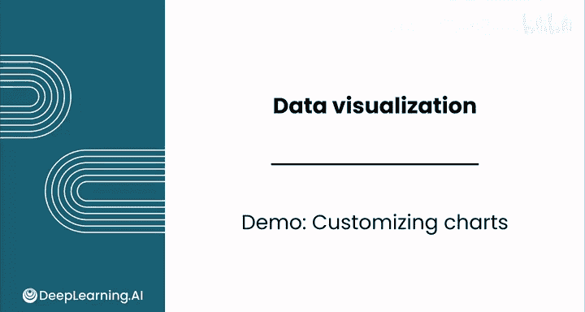

在本节课中，我们将学习如何在Google Sheets中定制图表，使其更清晰、更具表现力。我们将通过一个关于中位数房屋售价的条形图案例，逐步讲解如何调整样式、添加标题、格式化数据点以及配置坐标轴和网格线，最终让图表更好地传达数据故事。

---

你已经创建了一个Google Sheets图表，但看起来有些单调。是时候发挥创意了。你可以通过定制让数据可视化变得生动。

我们将定制上一视频中关于中位数房屋售价的条形图。如果你想跟着操作，可以在本视频下方的下载选项卡中找到这个表格。

## 图表样式与标题

首先，我们来看图表样式类别。你可以更改背景颜色，例如改为灰色，但这里我们不这样做。你还可以启用3D效果，但这会分散注意力，且不会为图表增加任何洞察，因此我们将其关闭。

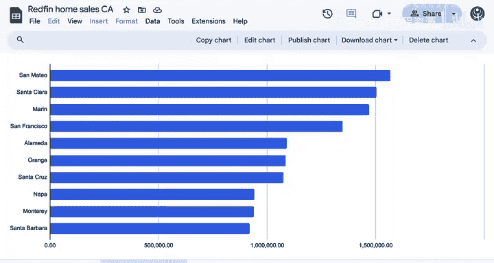

接下来，你可以添加图表或坐标轴标题。标题应尽可能具有描述性。例如，“Q3”代表第三季度。你也可以选择其他坐标轴或添加副标题。

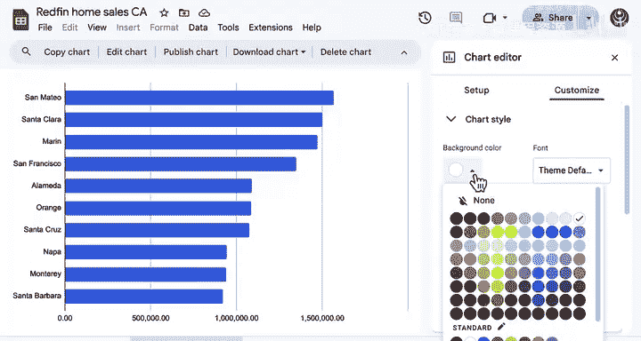

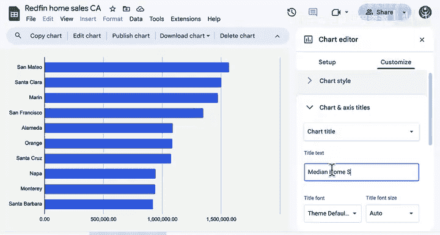

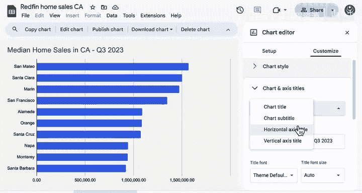

我们为图表添加标题“中位数房屋售价”，并将文本加粗、调大一些。

对于Y轴，标题“县”会占用一些额外空间。根据坐标轴标签本身，你已经能看出它代表县，因此这个坐标轴标题有些多余，我们可以将其移除。

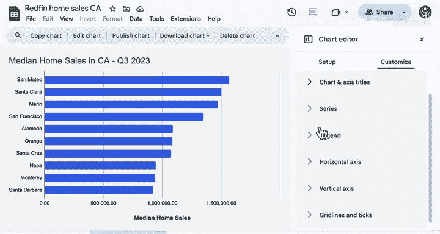

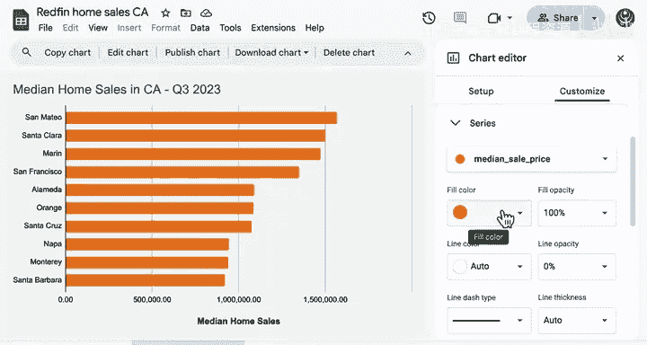

## 系列数据格式化

现在，让我们看看“系列”选项卡。例如，你可以将填充颜色改为不同的颜色，如橙色或粉色。

或者，我可以改回默认的蓝色。通过勾选“数据标签”选项，你现在可以看到每个条形图上都显示了精确的房屋售价。这有助于我们不再仅仅依赖网格线来解读数据。

如果你想突出显示旧金山的中位数房价（这是你公司正在工作的县），你实际上可以将这个数据点的格式设置为与其他数据点不同。在系列设置中，点击“添加格式数据点”，然后选择数据中的特定值（本例中是“San Francisco”）并设置一个高亮颜色，如橙色。

假设你确实想弱化其他县的数据，可以将其他条形改为灰色。

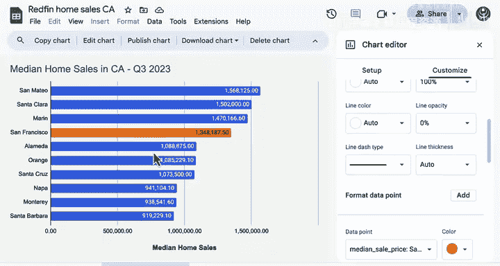

这样就弱化了所有其他数据点，并将观众的注意力引导到旧金山上，这是你故事的关键。你不需要图例来区分这两种颜色，因为Y轴上已经有标签了。

## 坐标轴与网格线配置

接下来，我们看看水平轴设置。总体而言，这些标签很好，但我们可以稍微增大字体大小。我还要添加货币格式。

我认为这些标签可以更突出一些，可以加粗并增大字体大小。这能让每个县的名称更容易阅读。

最后，我们来配置网格线和刻度线。网格线指的是横跨整个图表的线条，而刻度线则位于坐标轴本身上。

那么，你为何要在网格线和刻度线之间选择呢？当你需要通读整个图表时，网格线非常有帮助，而刻度线可以作为一个更简单的参考。

对于网格线和刻度线，我们这里只需要关注水平轴。网格线通常分为主要和次要网格线。在本例中，你会注意到我们的主要网格线增量是50万美元，因此我们也可以设置次要网格线。

勾选此选项后，你现在可以看到在主要网格线之间出现了中间的次要网格线。有时这很有帮助，可以确保它们均匀分布，以便你知道如何解读与这些次要网格线对齐的确切金额。

我将次要网格线数量增加到4。这代表主要网格线之间的次要网格线数量。设置为4可以确保每个增量是10万美元。

## 最终效果与总结

总体而言，我认为这个最终设计相当简洁。

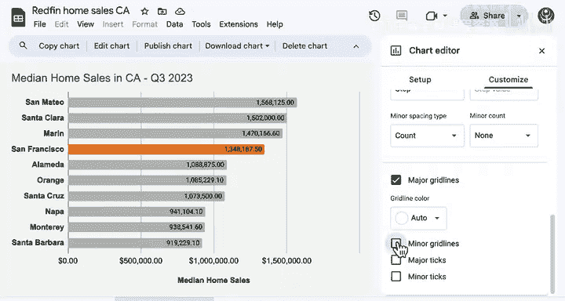

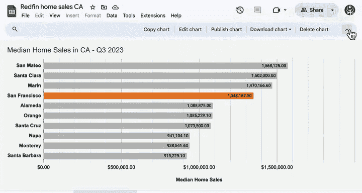

如你所见，我们最初的图表没问题，但现在的新图表无疑突出了我们想要讲述的故事，也使读取单个房屋售价变得更加容易。

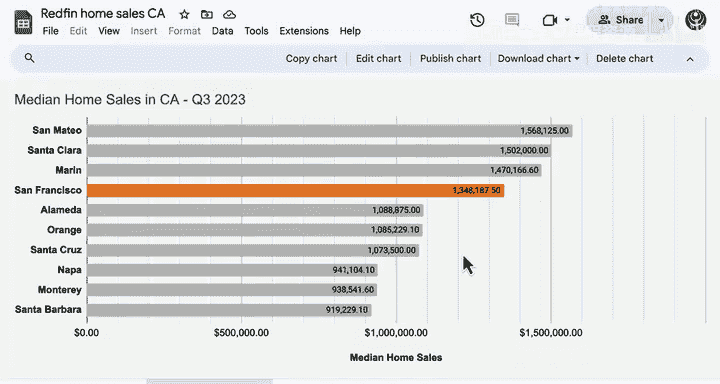

不要害怕尝试并享受这个过程。只要有一点创意和对细节的关注，你就可以将图表转化为传达数据故事的有力工具。

---

本节课中，我们一起学习了如何定制Google Sheets图表。我们从调整基础样式和添加标题开始，然后学习了如何格式化特定数据点以突出重点，最后配置了坐标轴和网格线以提高可读性。记住，清晰的图表能更有效地传达你的数据洞察。在下一视频中，我们将探索创建散点图来展示房屋面积与售价之间的关系。