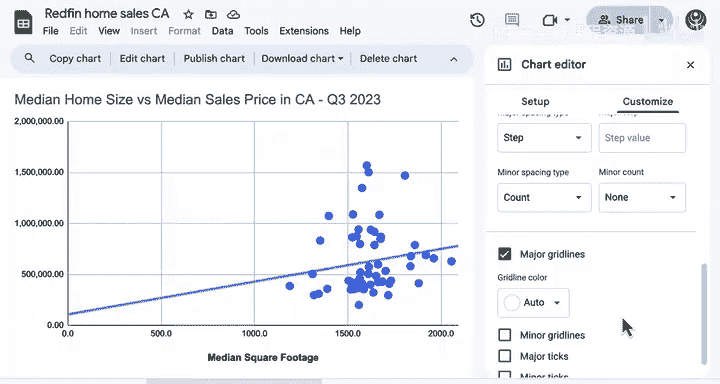

# 047：散点图绘制与解读 📊

在本节课中，我们将学习如何使用散点图来揭示两个数值特征之间的关系。散点图是一种强大的数据可视化工具，能够帮助我们直观地观察数据点之间的相关性、识别异常值，并为后续的深入分析提供假设。

## 散点图的核心概念

散点图用于展示两个数值变量之间的关系。图表中的每一个点都代表一对数值：一个对应X轴，另一个对应Y轴。点的位置直观地显示了这两个特征是如何相互关联的。

**核心公式/概念**：每个数据点可表示为 `(x_i, y_i)`，其中 `x_i` 是自变量（如房屋面积），`y_i` 是因变量（如销售价格）。

## 创建基础散点图

上一节我们介绍了散点图的基本概念，本节中我们来看看如何从数据开始创建一个散点图。

假设我们想了解房屋面积与销售价格中位数之间的关系。这两个都是数值特征，非常适合用散点图进行可视化。

1.  在数据选项卡中，选择“面积中位数”和“销售价格中位数”两列数据。
2.  点击“插入图表”。默认的图表类型通常是柱状图，我们需要将其更改为散点图。
3.  将图表移动到一个新的工作表标签页，以便有更多空间进行操作。

## 自定义与优化图表

创建基础图表后，我们可以通过一系列自定义设置使其更清晰、更专业。

以下是图表自定义的关键步骤：

*   **添加标题**：为图表添加一个描述性的标题。例如，“房屋面积与销售价格关系图”。如果标题已包含关键信息（如“房屋销售中位数”），Y轴标签有时可以省略。
*   **修改横轴标题**：确保横轴（X轴）的标题清晰明了。例如，明确标注其代表的是“面积（平方英尺）”。
*   **调整数据点标记**：每个点代表一个县的数据，而非单个房屋。标记的大小和透明度需要根据数据量调整。数据点多时，应使用较小的标记或降低不透明度（增加透明感），以避免重叠。数据点较少时，可以适当增大标记尺寸（例如调整为10像素），使其更醒目。
*   **慎用数据标签**：在柱状图中，数据标签可能很有效。但在散点图中，为每个点添加数据标签会使图表变得非常杂乱，难以阅读。通常不建议在散点图中直接添加数据标签。
*   **添加趋势线**：趋势线能帮助我们可视化数据中的线性趋势。添加趋势线后，可以增加其粗细和不透明度，使其更明显。趋势线的**正斜率**表明，随着县房屋面积中位数的增加，销售价格中位数也倾向于增加。

## 调整坐标轴与网格线

为了使图表更精确，便于读者估算数据点的具体数值，我们需要对坐标轴和网格线进行精细调整。

默认情况下，图表会缩放到我们数据的观测范围（例如，面积从约1200到2000平方英尺）。将坐标轴最小值设置为0，有助于理解趋势线在理论起点（面积为0）的行为，尽管现实中可能不存在面积极小的房屋。

由于两个轴都是数值数据，都值得仔细调整。当数据标签过于繁重时，观众需要依靠网格线来估算每个数据点的坐标值。

以下是优化网格线的步骤：

1.  **为横轴添加次要网格线**：设置间隔为100平方英尺，这样能形成更精细的网格。
2.  **为纵轴添加次要网格线**：设置网格线数量为4条，这将创建出10万美元的增量间隔。

经过这些调整，我们得到了一个既能帮助准确估算数据点坐标，又不会因线条过重而干扰数据本身显示的网格系统。

## 解读散点图

现在，我们已经拥有了一个美观且信息丰富的散点图。你能从数据中看到什么？

根据趋势线，可以观察到房屋面积中位数与销售价格中位数之间存在**正相关关系**：随着房屋面积的增大，销售价格也倾向于升高。

然而，深入观察会发现，趋势线似乎将数据分成了两组：一组是价格较低、紧密遵循趋势的数据点；另一组是价格较高、但似乎完全不遵循该趋势的数据点。这表明，一些房价最高的县并不拥有面积最大的房屋。因此，可能还有其他因素（如地理位置、学区、社区环境等）在驱动这些高房价。

## 总结

本节课中我们一起学习了散点图的创建、优化与解读。记住，散点图是发现数据中隐藏关系的强大工具。我们可以用它来探索变量间的相关性、识别异常值，并为进一步的调查分析生成假设。

接下来，请跟随下一节视频，学习如何创建分组条形图和柱状图。