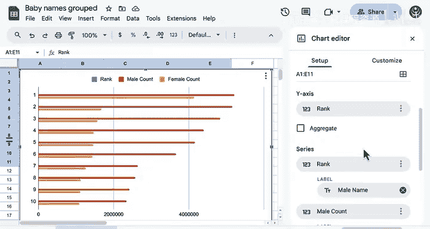
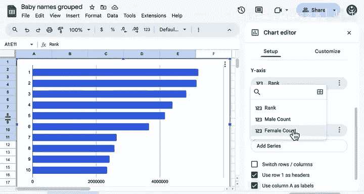
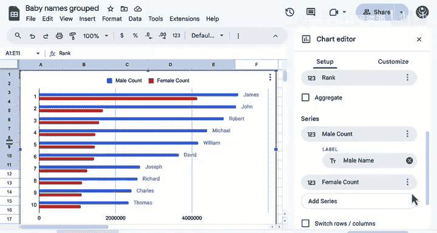
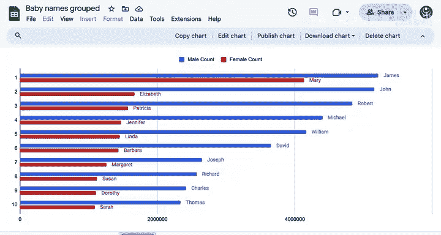
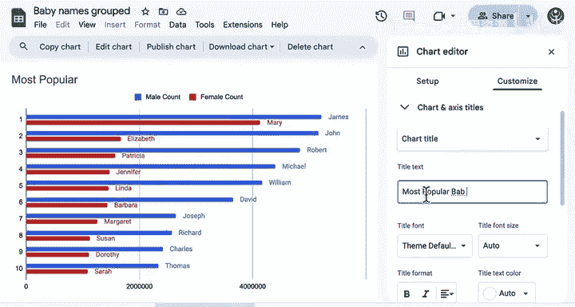
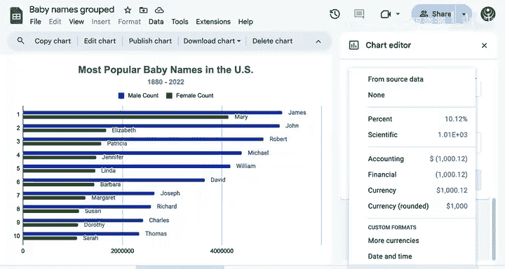
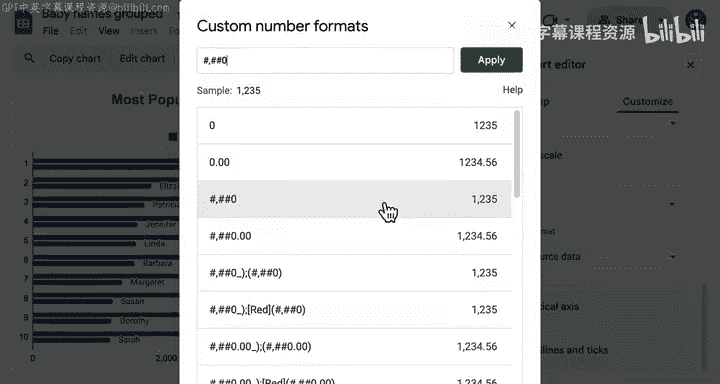
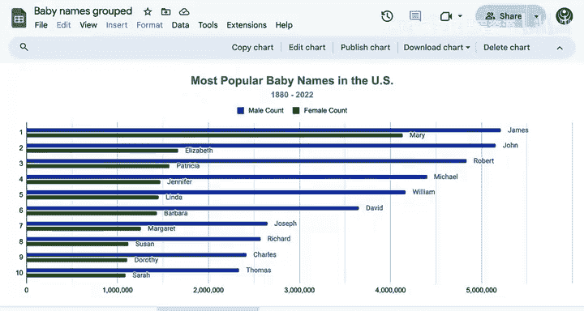

# 048：分组柱状图/条形图演示

在本节课中，我们将学习如何使用分组柱状图或条形图来比较不同组别之间的结果，从而揭示数据中复杂的关系和趋势。

分组柱状图和条形图允许你比较不同组别之间感兴趣的结果。它们能揭示数据中复杂的关系和趋势。

假设你想可视化所有年份中最受欢迎的男性和女性婴儿名字，使用你之前见过几次的婴儿名字数据集。你需要同时通过排名和性别这两个特征来可视化婴儿数量。这使得这个数据集成为分组图表的理想选择。

## 准备数据

让我们首先看看创建这个图表所需的数据。

以下是基于数据汇总的有史以来前10名男性和女性婴儿名字的摘要。这些数据汇总了每个名字和性别在所有年份中的婴儿总数，并按排名排序。

例如，John是美国最受欢迎的男性婴儿名字，有超过500万婴儿被取这个名字。排名第一的女性婴儿名字是Mary，有超过400万婴儿。因此，这些名字都排名第一：John在男性名字中排名第一，Mary在女性名字中排名第一。

整理这些数据需要一些工作。你将在下一门课程中学习更多关于数据透视表的知识，它可以简化这项任务。现在，我们将从这里开始。

要在Google Sheets中创建分组条形图，你需要这种格式的数据：一组共同的类别（这里是排名），然后为每个性别提供不同的计数集合。

## 配置图表

正确配置这个图表需要做一些工作。因为有10个婴儿名字，所以将图表类型切换为条形图，将排名列分配给Y轴，你会看到10个标签中的一个出现。

我想为男性婴儿计数设置一个系列，为女性婴儿计数设置另一个系列。我将清除所有这些，然后重新添加它们。

我将添加标签，这些标签将是男性名字。对于女性计数，则是女性名字。这是一个相当不错的开始。我将把这个图表移动到一个单独的工作表。

## 添加标题和副标题

添加一个标题。添加一个副标题，这可以帮助你为图表添加上下文。

不要担心标签与条形重叠的问题。这只是因为我放大了图表，以便你能更轻松地阅读。

## 调整颜色和格式

接下来，在系列菜单中柔化这些颜色，它们对眼睛有点刺眼。将女性系列改为绿色，男性系列改为深蓝色。

X轴的值因为有太多零而难以阅读，所以让我们添加逗号。更改数字的格式。你需要进入自定义格式才能添加逗号，选择其他自定义格式，并寻找为数字添加逗号的格式。就是这个。现在更容易看出这些数字是以百万计的婴儿。

## 添加网格线

最后，仅靠主要网格线来估算婴儿数量是相当具有挑战性的。从水平轴开始，配置主要网格线。我启用7条。然后添加次要网格线，在每对主要网格线之间添加一条。这将实现50万的计数增量。现在很清楚，从Elizabeth到Barbara都徘徊在150万左右。

## 总结与洞察

我认为这相当不错。你看到了什么洞察？对我来说，最突出的是排名前10的男性婴儿名字明显比对应的女性名字更受欢迎。事实上，除了Mary之外，排名前10的男性婴儿名字比所有排名前10的女性婴儿名字都更受欢迎。这很有趣。

在本节课中，我们一起学习了如何创建和配置分组柱状图/条形图，从数据准备到图表美化，再到最终解读数据洞察。干得好，接下来请跟随我到下一个视频，学习如何创建堆叠图。