# 049：堆叠柱状图与条形图 📊

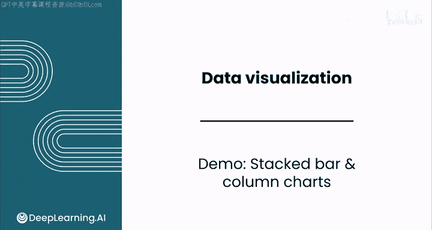

在本节课中，我们将学习如何使用堆叠柱状图来分析随时间变化的趋势，特别是针对一个中性名字中男婴与女婴的比例变化。我们将以名字“Riley”为例，演示如何创建和解读堆叠柱状图，并进一步将其转换为百分比堆叠柱状图以专注于比例分布。

## 概述与数据准备

假设我们想分析一个中性名字的男婴与女婴比例随时间变化的趋势。为此，可以创建堆叠柱状图。我们以“Riley”为例，这是一个相当常见且趋势有趣的中性名字。

以下是数据准备后的表格，显示了数据集中每年男婴和女婴“Riley”的数量。许多早期年份没有女婴“Riley”的记录。

```plaintext
| 年份 | 男婴数量 | 女婴数量 |
|------|----------|----------|
| 1880 | 10       | 0        |
| ...  | ...      | ...      |
| 1980 | 150      | 5        |
| ...  | ...      | ...      |
```

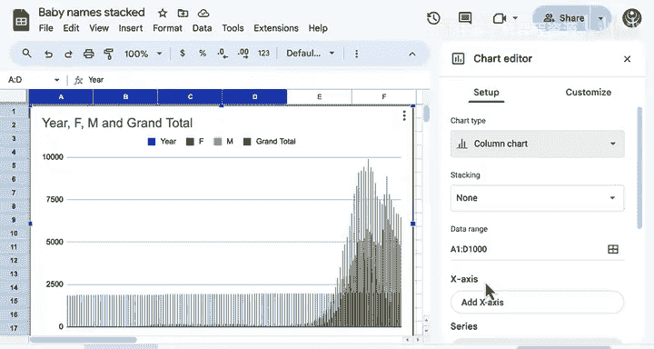

## 创建基础堆叠柱状图

首先，选中所有数据列，然后插入图表。尽管数据集中包含多年份，但柱状图更为合适，因为我们通常希望将时间放在X轴上。

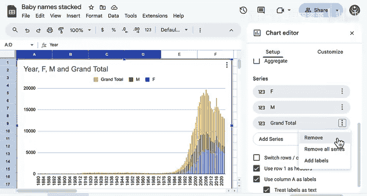

初始图表可能比较杂乱，需要进行清理和配置。


接下来，我们需要配置坐标轴。对于X轴，选择年份数据。对于Y轴，进行清理，使其仅包含女婴和男婴的数量。为了操作清晰，可以将图表移动到一个单独的工作表中。


## 优化图表样式

现在，开始优化图表使其更清晰易懂。首先，为图表添加一个主标题。同时，添加一个副标题，用以说明数据的时间跨度。

然后，对数据系列进行一些配置。将系列的颜色更改为与之前图表一致的配色方案。进行一些细微调整，例如将图例移动到图表内部。这样可以扩大图表绘图区的空间。

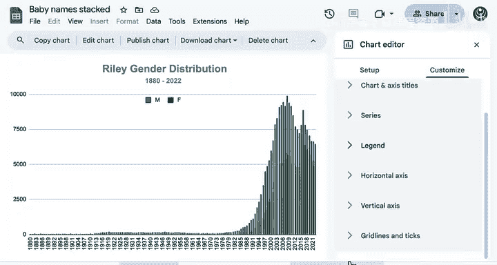

由于我们使用不同颜色代表不同性别，因此需要在图表中保留图例，以帮助观众轻松区分不同类别。接着，将网格线的颜色调浅一些，因为它们对于讲述数据故事并非至关重要。


## 分析堆叠柱状图

现在，让我们分析完成的图表。从图表中可以看到，“Riley”这个名字从1880年到1980年代初期都相当不常见。在其知名度开始上升之前，这个名字几乎完全用于男婴。随着知名度上升，用于女婴的数量也开始稳步增长。进入21世纪后，“Riley”实际上成为了一个更受女婴欢迎的名字。

## 转换为百分比堆叠柱状图

假设我们不太关心“Riley”婴儿的总数，而更想关注男婴与女婴“Riley”的分布比例。为了更直接地回答这个问题，可以使用100%堆叠柱状图。

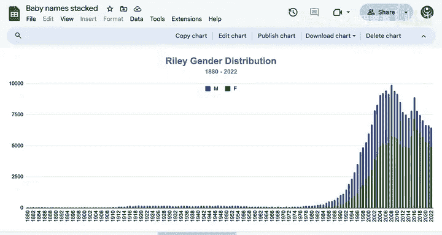

首先，复制已创建的堆叠柱状图。


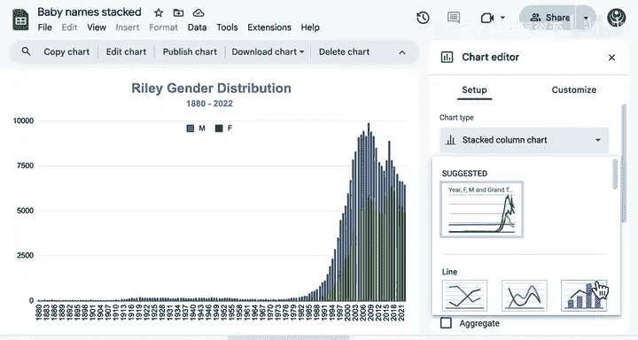

然后，将图表类型从“堆叠柱状图”更改为“100%堆叠柱状图”。


## 优化百分比堆叠柱状图

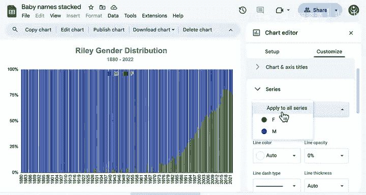

更改后，图表外观差异很大，Y轴标签也从计数变为了百分比。此时，蓝色可能过于突出，可以将其调浅一些。


由于数据系列现在与图例重叠，可以同时移动图例的位置。如果只关注哪个性别占主导地位，可以简化网格线，只保留中点线（50%），并将其颜色加深，以便轻松看出哪个性别占多数。

进入垂直轴的网格线设置，将三条线简化为只显示0%、50%和100%，并将颜色改为灰色。


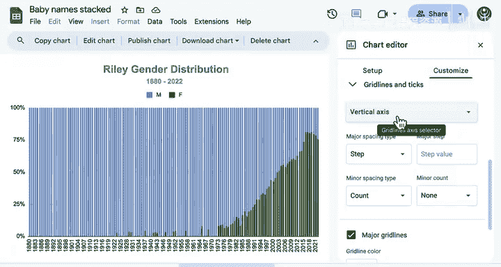

从优化后的百分比堆叠柱状图可以清晰看出，大约在2003年，女婴“Riley”的数量开始超过男婴。


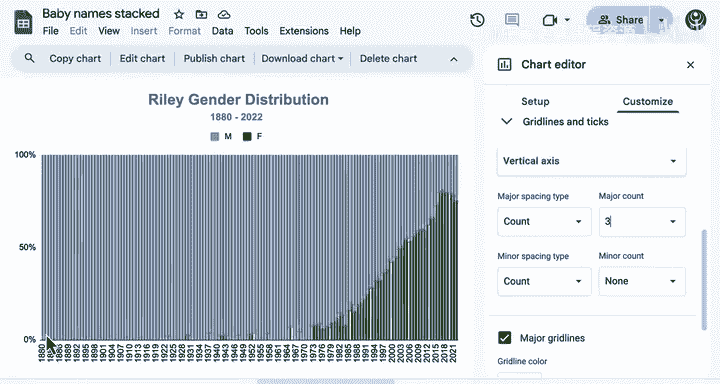

## 总结

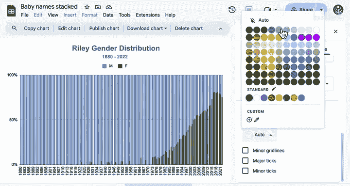

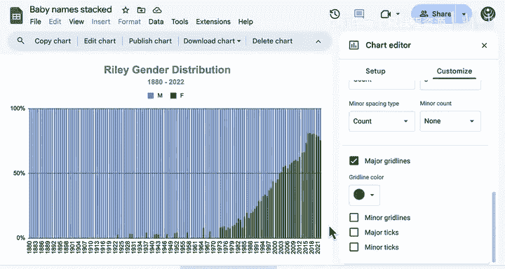

本节课中，我们一起学习了堆叠柱状图和百分比堆叠柱状图的创建与分析方法。我们了解到，分组和堆叠的条形图与柱状图是展示多个特征之间复杂关系的强大工具。

堆叠柱状图适用于展示各部分随时间变化的绝对数量，而百分比堆叠柱状图则能清晰地揭示各部分在整体中的比例变化趋势。

在下一个视频中，我们将学习最后一种可视化类型——折线图。折线图非常适合展示时间序列数据。我们下节课再见。