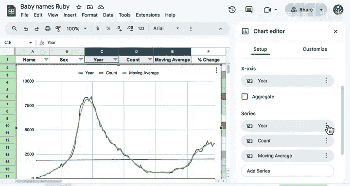
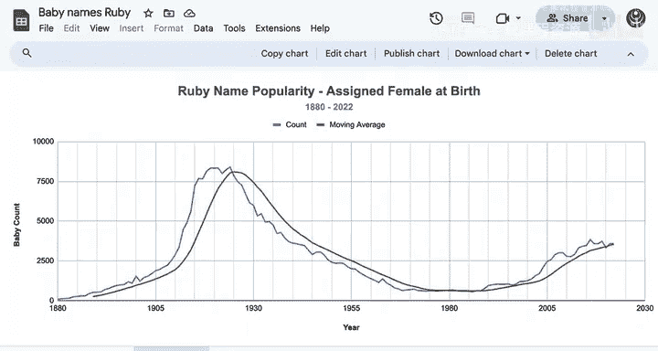

# 050：演示 - 折线图 📈

在本节课中，我们将学习如何使用折线图来可视化时间序列数据。折线图是展示数据随时间变化趋势的核心图表类型，虽然看似简单，但它能持续为商业决策提供重要价值。

## 创建折线图

上一节我们介绍了数据准备，本节中我们来看看如何将数据转化为直观的折线图。

以下是在Google Sheets中创建包含原始计数和移动平均值的折线图步骤。

1.  选择包含年份、原始计数和移动平均值的三列数据。
2.  点击“插入”菜单，选择“图表”。
3.  在弹出的图表编辑器中，将图表类型设置为“折线图”。
4.  配置坐标轴：将X轴设置为“年份”。
5.  将“年份”从数据系列中移除，确保它仅作为横坐标。

## 优化图表布局

创建基础图表后，我们需要优化其布局，以提升可读性和专业性。

将图表移动到一个新的工作表。接着，我们可以为图表添加以下元素：

*   **图表标题**：概括图表的核心内容。
*   **副标题**：提供更详细的背景信息。
*   **横坐标轴标题**：明确标注时间单位（如“年份”）。
*   **纵坐标轴标题**：说明数据的度量单位（如“名字数量”）。

## 添加网格线进行分析

为了帮助观众更轻松地定位到特定年份的数据点，我们可以为图表添加网格线。

1.  选中横坐标轴（即年份所在的位置）。
2.  添加**主要网格线**，间隔设置为25年。
3.  添加**次要网格线**，数量设置为4条。这样，图表上就会形成以5年为间隔的网格线，便于观察。

## 解读图表趋势

现在，让我们来分析这张优化后的折线图所揭示的信息。

图中蓝色的折线代表原始计数数据。其趋势显示，名字的流行度最初有所上升，随后持续下降。而在最近几年，数据似乎出现了小幅回升。

你可能还记得，在1963年这个名字的数量曾有一个急剧的峰值。虽然在这个图表中那个尖峰不那么明显，但我们能清晰地看到数据中存在一个周期性规律：经历了最初的上升和下降后，近期又出现了复苏。这种周期仅从历史数据中才能清晰显现，而无法提前预测。未来或许会出现另一个周期，我们拭目以待。

总体而言，数据中虽然存在一些“噪声”（即短期波动），但它们并不妨碍我们观察整体的模式。橙色的移动平均线紧密地跟随数据趋势，很好地平滑了这些波动。

## 总结

本节课中，我们一起学习了在Google Sheets中创建和美化折线图的完整流程。从选择数据、插入图表，到添加标题、网格线并进行趋势分析，你已经掌握了可视化时间序列数据的基本技能。希望你能运用这些知识，创建出清晰、美观且富有洞察力的图表。

接下来，请在练习中尝试为之前模块的酒店预订数据集创建可视化图表。完成练习和评估后，请跟随我进入下一个视频，学习数据可视化的最佳实践。