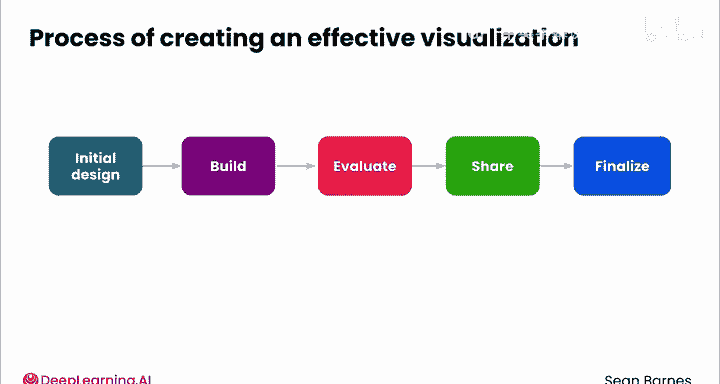
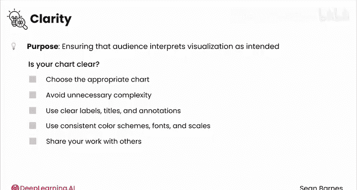
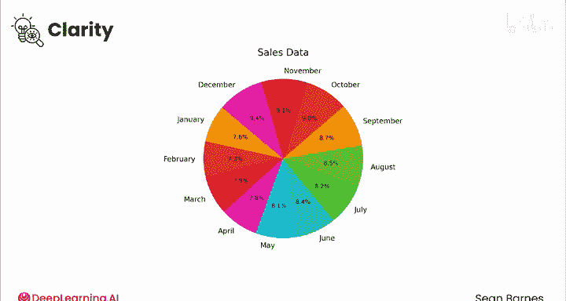
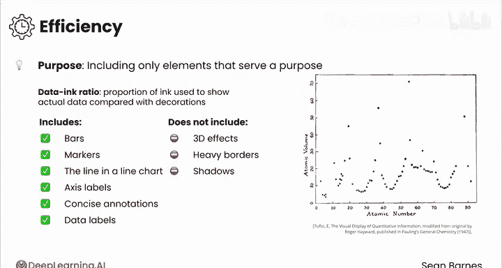
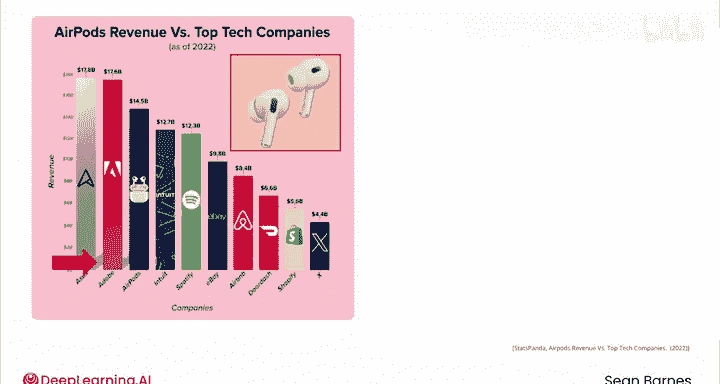
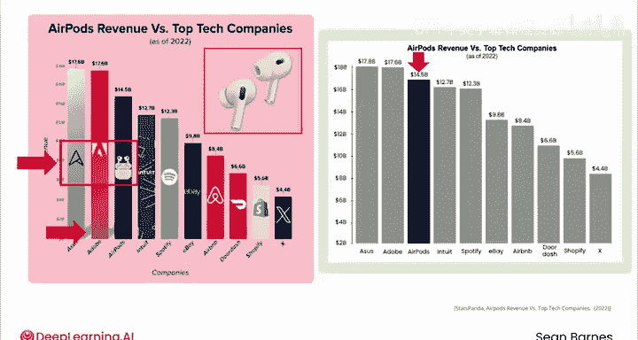
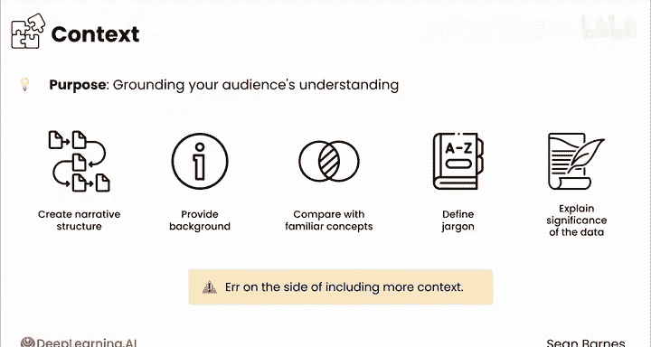

# 051：有效数据可视化策略

在本节课中，我们将学习如何创建清晰、有效且不易产生误解的数据可视化图表。我们将探讨一个核心流程和三个关键原则，帮助你确保观众能准确理解你希望传达的信息。

---

请先观察这张图片片刻。你看到了什么？

是一个从左到右向下的楼梯，还是一个上下颠倒的楼梯？

两种解释都有可能。两个理性的人可以对同一张图片得出两种完全不同的结论。

如果不加注意，你的数据可视化最终可能会像这个视觉错觉（也称为“肖特阶梯”）一样。当你将图表展示给利益相关者时，每个人可能会得出不同的见解。

如何避免这种混淆？首先，我将介绍创建可视化图表的流程。

---

## 🛠️ 创建可视化图表的流程

上一节我们提出了避免误解的目标，本节中我们来看看实现这一目标的具体步骤。以下是创建有效数据可视化的标准流程：

1.  **初步设计**：首先勾勒出初步设计草图。虽然传达同一信息通常有多种方式，但其中一种可能是最佳的。
2.  **构建初稿**：在制作时，考虑你的可视化图表将如何被观众消费。
3.  **评估效果**：评估你的可视化图表是否能有效传达关键见解。
4.  **收集反馈**：分享你的可视化图表，获取同事的初步反应，看看它是否被清晰理解。
5.  **最终定稿**：结合前几个步骤的见解，完成可视化图表。

根据可视化图表的重要性和所涉利益相关方，你可能需要多次迭代这些步骤。

---

## 🔑 评估可视化图表的三大原则

在评估自己的可视化图表时，应聚焦于三个关键原则：清晰性、高效性和情境性。

### 原则一：清晰性

清晰性是指确保观众以你期望的方式解读你的可视化图表。你的目标应该是让尽可能多的人，尤其是最重要的利益相关者，得出相同的见解。

如何判断你的图表是否清晰？以下是几个关键检查点：

*   **选择合适的图表类型**：根据你的数据选择恰当的图表类型，这你已经知道如何操作。
*   **避免不必要的复杂性**：使用简单、干净的设计，避免杂乱。
*   **使用清晰的标签和标题**：确保观众理解他们正在看什么。使用注释来突出关键见解。
*   **保持一致性**：确保颜色方案、字体和比例尺保持一致。
*   **检查可读性**：字体大小过小是一个常见错误，尤其是在一张图表中容纳大量信息时。对于演示文稿，需要使用足够大的字体。
*   **寻求他人反馈**：与你的经理、同事和可信赖的利益相关者分享你的作品，获取宝贵意见。获得新的视角至关重要。

让我们看一个例子。这是一张月度销售额的可视化图表。

你认为它清晰地展示了正在发生的情况吗？

首先，图表类型选择不当。在饼图中，很难比较多个扇区的相对大小，而且它不适合展示时间序列数据。其次，使用了太多颜色，并且缺少关键信息，如年份和实际销售额。我也无法清晰地感知销售趋势。这张图表存在很多问题。

现在，这是同一数据的另一张图表。这次使用了折线图，X轴是时间，Y轴是销售额。

乍一看，我就能看出销售额在整个时间段（2023年）内呈持续上升趋势。坐标轴标注清晰，我可以从Y轴估算销售额。这张图表清晰得多。

### 原则二：高效性

高效性意味着只包含有目的的元素。问问自己：你的图表中是否有任何无助于讲述你试图传达的故事的东西？

统计学家爱德华·塔夫特（我的灵感来源之一）首先提出了 **数据墨水比** 这个概念。

**公式：数据墨水比 = 用于展示实际数据的墨水（或像素） / 图表使用的总墨水（或像素）**

首要任务是聚焦于数据本身。

以下是一个具有很高数据墨水比的图表示例，它在X轴上显示元素的原子序数，在Y轴上显示其体积。它只展示了理解数据所必需的最关键信息（数据墨水）。

数据墨水包括：条形图中的条形、标记点、折线图中的线条、坐标轴标签、简洁的注释和数据标签。

另一方面，3D效果、粗边框、阴影、过多的网格线、过于描述性的注释等都属于非数据墨水。塔夫特也用 **“图表垃圾”** 来形容那些分散注意力、无助于增强观众理解的装饰性元素，例如装饰物、额外文本、过多颜色等。

如果你发现自己只是为了“让图表更有趣”而添加东西，请停止。让数据自己说话。

之前，你看到过一张类似的AirPods收入图表。这张实际上是带有“图表垃圾”的原版。问问自己：角落里的AirPods图片到底有什么用？为什么柱状图要有阴影？这主要会分散观众对AirPods赚了多少钱这一核心见解的注意力。

你可能还记得在之前课程中看到的同一数据的这张图表。像AirPods图片和Logo这样的无关元素已被去除，同时用颜色突出了AirPods的收入。它可能更简单，但解读起来要快得多。

### 原则三：情境性

情境性是指为观众的理解奠定基础。考虑你的观众对这些数据有哪些背景知识。

你需要创建一个清晰的叙事结构，即讲故事。提供相关的背景信息，将你的见解与熟悉的概念进行比较，解释专业术语，阐明数据的重要性。

根据你的汇报对象，你可能需要调整你提供的情境。倾向于包含更多情境。你很少会听到关于“信息过多”的抱怨，但信息不足则可能导致误解。

---

## 📝 总结

本节课中，我们一起学习了创建有效数据可视化的完整流程和三大核心原则。

一个设计精良、能清晰讲述故事的可视化图表将产生持久的影响力。请记住，你的目标是创建一个可视化作品，让每个看到它的人都能得出相同且正确的解读。

最后留给你一张图片。你看到的是一位老妇人还是一位年轻女子？

请继续观看下一个视频，学习更多关于数据可视化设计的知识。