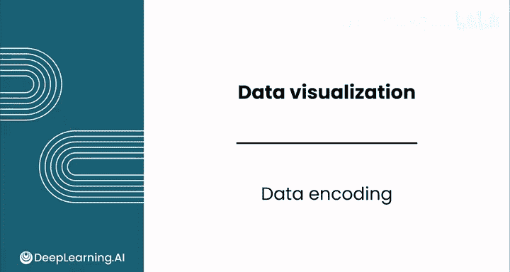
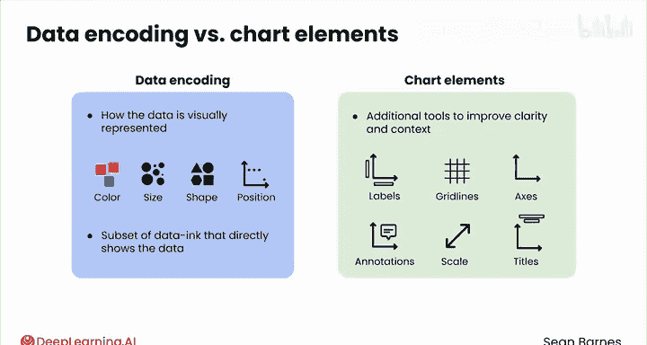
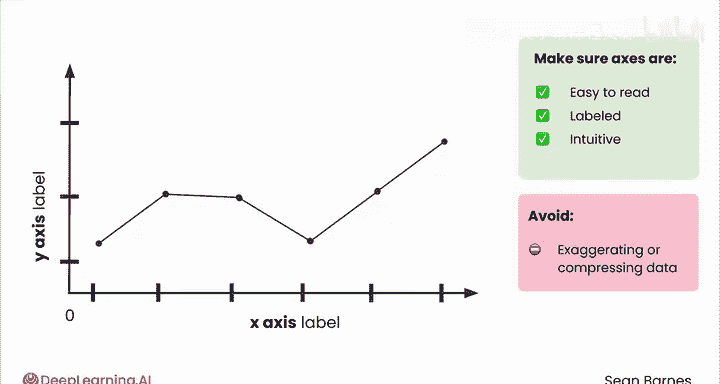
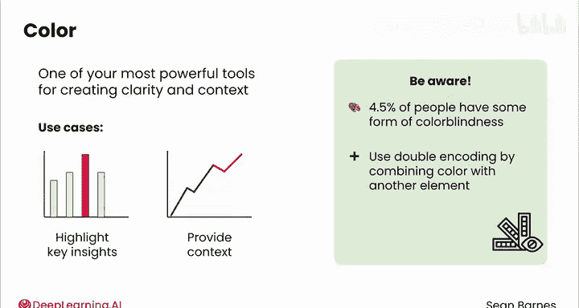
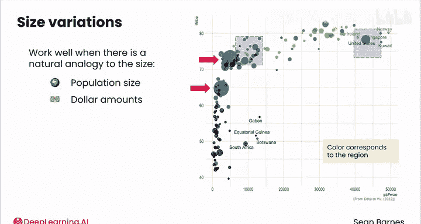

# 052：数据编码 📊

在本节课中，我们将学习数据可视化的核心环节——数据编码。我们将了解如何通过视觉元素（如颜色、大小、形状和位置）来有效地表示数据，并遵循清晰、高效和提供上下文的设计原则。

---

## 数据编码与图表元素的区别

上一节我们介绍了有效数据可视化的总体原则。本节中，我们来看看构成图表的两个基本部分：数据编码元素和图表元素。

*   **数据编码** 指数据如何通过颜色、大小、形状和位置等视觉元素被呈现。你可以将数据编码理解为“数据墨水”中直接展示数据的部分，不包括标签、网格线、坐标轴等。
*   **图表元素** 则包含其他所有内容，如标签、网格线、坐标轴，以及注释、比例尺调整和标题。这些是用于提升清晰度和提供上下文的附加工具，但应审慎使用以保持图表简洁。

本视频将重点讨论数据编码，图表元素将在下一个视频中详细介绍。

---

## 数据编码的核心步骤

让我们回到之前提到的基本流程。创建图表时，应遵循一个清晰的层次结构。

### 第一步：确保坐标轴无误

首先，从X轴和Y轴开始。确保它们易于阅读、标签清晰且直观。
*   对于数值特征，通常应包含零点。
*   合理缩放坐标轴，避免夸大或压缩数据，以免扭曲信息。
*   标签应清晰简洁。当从网格线读取精确值有困难时，标签尤其有用。

### 第二步：善用颜色

颜色是创造清晰度和上下文的最强大工具之一。
*   例如，你可以用颜色来突出关键洞察，比如你公司的表现与竞争对手的对比。
*   或者，你可以用颜色来提供上下文，比如将历史数据灰显，以将注意力集中在当前年份的表现上。

需要注意，部分观众可能存在辨色困难。全球约4.5%的人有某种形式的色盲，通常是红绿色盲。因此，在可能的情况下，建议采用**双重编码**，即将颜色与另一种编码方式（如独特的标记形状）结合使用，这能为所有人提供额外的清晰度。

### 第三步：审慎添加其他维度

但要注意你要求观众同时解读的维度数量。通常，将数据保持在两个维度（X和Y）有助于观众解读正确的洞察。如果你确实需要展示三个或更多维度，可以尝试将多个图表并排放置。

以下是一个例子：假设你想创建一个图表，来展示根据温度记录的你每天在后院观察到的鸟类数量。你通常追踪两种鸟类：知更鸟和蓝松鸦。因此你的数据有三个维度：温度、观察到的鸟类数量和物种。

让我们看看所有这些维度绘制在同一图表上的效果：X轴是温度，Y轴是鸟类数量，鸟类物种用不同颜色区分。这两种鸟似乎偏好不同的温度：知更鸟偏好适中温度，而蓝松鸦偏好更高温度。但这个图上有大量数据点，很难将两者区分开。

提高清晰度的一个选择是将数据分成两个散点图，每个图只展示一个物种。这样，单个物种的模式变得更清晰，同时仍允许你的观众比较不同物种的习性。

---

## 其他数据编码元素

本视频中剩余的元素应更审慎地使用，因为它们通常更难解读。

### 标记形状

标记形状是一种数据编码元素，通常用于散点图中，为数据添加第三个维度。
*   你刚才看到的鸟类散点图是用颜色区分两个序列。
*   这里是相同的数据，但这次使用标记形状而非颜色来区分不同物种。
*   你认为这个图更容易还是更难解读？可能更难。因为标记很小，不同的形状并不醒目。
*   标记形状在对比清晰时可能有用。但如果你发现自己使用了超过两种形状，或许就该重新考虑你的方法了。考虑改用颜色，或将数据分离到多个图表中。

### 大小变化

大小变化（常见于气泡图中）也能为可视化添加第三个维度。
*   当存在与大小的自然类比时（如人口规模、金额），它们效果很好。
*   以下是一个气泡图的例子，其中气泡大小由人口规模决定。该图将国家按财富（X轴）和预期寿命（Y轴）绘制。
*   注释帮助观众发现一些最有趣的点。你能找到中国和印度——世界上人口最多的两个国家吗？它们就在这里，是两个最大的气泡。
*   顺便一提，颜色为这个图表添加了第四个维度，你能猜出它代表什么吗？颜色对应地区：紫色代表非洲，浅蓝色代表亚洲，绿色代表欧洲，深蓝色代表美洲。

这确实是一次需要解读大量数据。请记住，效率是关键。不要过度使用视觉元素，每一次添加都应有明确的目的，即增强理解。

---

## 总结

本节课中，我们一起学习了数据编码的核心概念与技术。我们明确了数据编码与图表元素的区别，掌握了从设置清晰坐标轴、善用颜色，到审慎添加标记形状和大小变化等维度的层次化设计流程。关键在于，每个视觉元素的添加都应以提升图表的清晰度和信息传递效率为目的，避免不必要的复杂化。

现在你已经熟悉了如何在图表中使用数据编码，请加入下一个视频，我们将探索图表元素如何让你的洞察更加清晰。我们下个视频见。