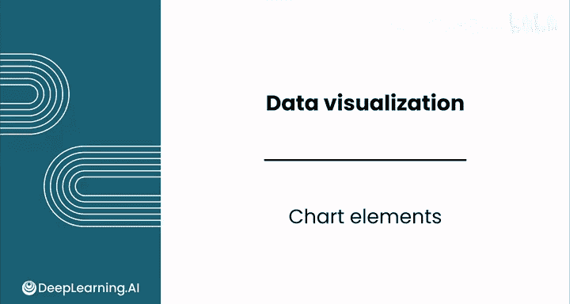
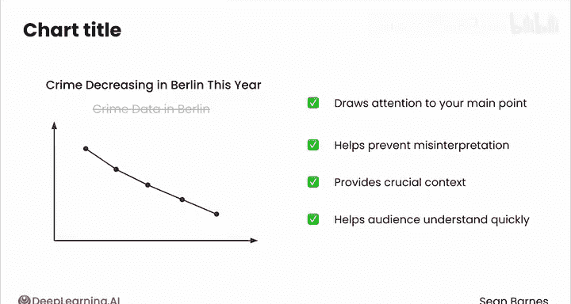

# 053：图表元素 📊

在本节课中，我们将学习图表的核心组成部分——图表元素。这些元素不直接代表数据本身，但对于有效传达数据背后的故事至关重要。我们将探讨坐标轴刻度、注释和标题等元素，并学习如何运用它们来提升图表的清晰度和影响力。

---

## 坐标轴刻度：线性与对数

上一节我们介绍了图表的基本构成，本节中我们来看看如何通过调整坐标轴刻度来更好地展示数据。

观察这张展示互联网主机数量（即连接到互联网的设备数）的图表。X轴代表时间，Y轴代表主机数量。可以明显看出，从起始年到结束年，互联网使用量激增。然而，1981年到1997年间的设备数量变化却不够清晰。

如何更好地展示这部分数据？一种技术是使用**对数刻度** 替代线性刻度。

*   在线性刻度上，数值是均匀分布的。如果你绘制10、100和1000，第二个距离（100到1000）是第一个距离（10到100）的10倍。
*   对数刻度会转换这些数值，使10、100和1000均匀分布。它改变了Y轴上数值之间的距离，**展开了较小的数值，压缩了较大的数值**，从而使较低范围内的模式更加可见。

你可以通过对数据值取以10为底的对数来创建对数刻度。无需担心数学计算，软件会为你完成这一步。

`# 示例：将对数刻度应用于Y轴`

这是同一组互联网主机数据，但Y轴采用了对数刻度。请注意，1到10,000（差值为9,999）的距离，与10到100,000（差值为99,990）的距离长度相同。在这个版本的图表中，1981年至1997年间的显著增长变得清晰得多。

以下是考虑使用对数刻度的几种情况：
*   当你需要覆盖大范围的数据时。
*   当你想强调比例变化而非绝对值时。
*   当数据点聚集在一起需要展开以提高可见性时。

对数刻度的一个限制是**不能用于负值或零值**。同样，无需深究数学原理，但负数和零的对数是未定义的，因此无法绘制。虽然我本人推崇对数刻度，但必须注意观众解读图表的能力。人脑并不天然以对数方式思考，需要权衡故事叙述的价值是否值得增加的理解复杂度。

---

## 包含零值的重要性

接下来，我们讨论坐标轴刻度中一个关键但常被忽视的细节：是否包含零值。

包含零值有助于传达数据的真实规模，特别是当**绝对值比相对值更重要时**。省略零值是误导性图表中的常见手法。

然而，通过截断坐标轴来排除零值也可能有用，如果你需要强调微小的差异。你可以将其视为对你感兴趣的数据范围进行“放大”。

以下是1960年椒盐卷饼销售数据的图表。X轴是时间，Y轴是销售额。左边的图表看起来像是“Golden Loops”品牌完全击败了“Twist and Shop”品牌。但请注意，它的刻度是从950开始的。它放大了差异。

右边是同一组数据，但刻度包含了零，展示了绝对值。看起来这两个品牌竞争力相当。

这两种图表都可能适用，取决于具体情境：
*   左边的图表可能有助于“Twist and Shop”品牌内部讨论如何超越“Golden Loops”，因为它放大了两个品牌之间的差异。
*   右边的图表可能对超市评估哪个品牌更受欢迎更有帮助。

---

## 注释：引导观众视线

在确定了合适的刻度后，我们来看看如何通过注释来引导观众的注意力。

注释是引导观众注意力的绝佳工具。没有注释，观众的目光可能会在图表上游离。通过精心放置的注释，你可以将他们的焦点锁定在最重要的元素上。

请记住，**效率是关键**。不要用过多的注释淹没你的图表。只需选择一到三个关键点进行突出显示。

同时，应考虑观众将以何种方式接触图表：
*   如果你在进行演示，可以使用激光笔进行额外的标注，因此可能需要的注释较少。
*   如果你的图表将被独立查看（例如在报告中），考虑添加图注来解释关键点，因为你无法亲自讲述背后的故事。

---

## 标题：传达核心洞察

最后，在选择了刻度并添加了注释之后，你需要为图表选择一个出色的标题。

你的标题不应局限于描述图表显示了什么。应将其视为**突出你关键洞察的机会**。

例如，不要用“柏林犯罪数据”，考虑使用“今年柏林犯罪率下降”。这能立即将注意力引向你的主要观点，并有助于防止误解。

标题还可以提供关键背景信息，例如数据覆盖的时间段，这能帮助观众快速理解他们正在看什么。

---

## 总结

本节课中，我们一起学习了构建美观且功能强大的数据可视化的核心技巧。我们探讨了：
1.  **对数刻度** 的原理与应用场景，它能更好地展示大范围数据或比例变化。
2.  坐标轴**是否包含零值**对数据解读产生的不同影响，以及各自的适用情境。
3.  **注释** 如何有效地引导观众关注图表中的关键信息。
4.  **标题** 不仅是描述，更是传达核心洞察和提供背景的重要工具。

在下一个视频中，我们将看到如何运用这些技巧来改进一些图表。相信我，之后你将再也不会以同样的方式看待新闻中的图表了。我们下节课见。