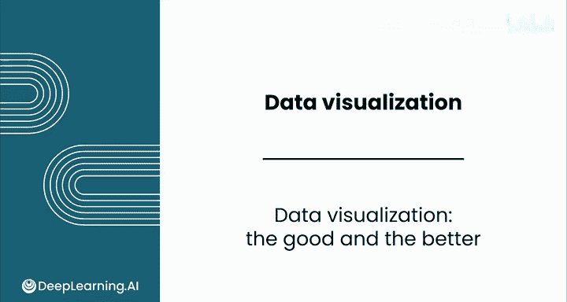
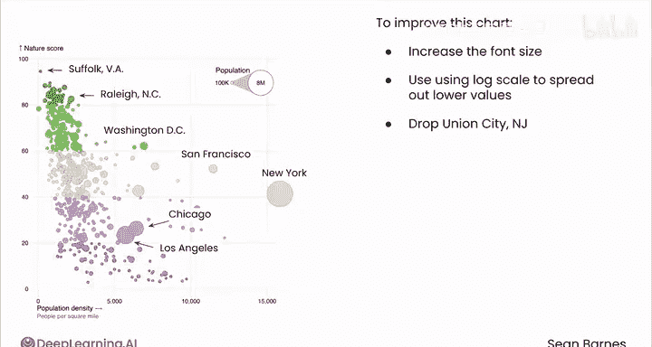

# 054：数据可视化案例优劣分析 📊

在本节课中，我们将以批判性的眼光，分析几个真实世界中的数据可视化图表。我们将逐一审视每个图表，思考它们试图传达的故事，并探讨如何改进它们以使其信息更突出、更清晰。

---

## 第一张图表：美国碳酸软饮料市场份额

上一节我们介绍了课程目标，本节中我们来看看第一张图表。这是一张展示美国碳酸软饮料市场份额的折线图。

**图表解读：**
*   **X轴**：时间，从2000年到2020年后，跨度约二十年。
*   **Y轴**：各饮料的市场份额百分比。
*   **图表类型**：由于是时间序列数据，选择折线图是合适的。
*   **类别编码**：不同软饮品牌通过颜色区分，且颜色大致符合各品牌的标志色，这是一个不错的细节。
*   **注解**：图表底部关于“销量（箱）”的注释提供了测量背景。
*   **整体趋势**：可口可乐始终占据主导地位，但中期有所下滑。百事可乐则呈现稳定下降趋势。胡椒博士和雪碧缓慢上升，而健怡可乐曾短暂上升后又开始下降。一个关键发现是，胡椒博士似乎正在超越百事可乐。

**以下是改进建议：**
*   将图表加宽以便于阅读。
*   添加网格线，便于观众更轻松地比较不同品牌的数据。
*   统一并优化坐标轴标签和标题，提高可读性。
*   改进图表标题，使其聚焦于核心洞察。例如，可改为：“**胡椒博士超越百事可乐，成为美国第二受欢迎的软饮**”。

---

## 第二张图表：不同年龄组每日活动时间分配

接下来，我们分析第二张图表。这张图表来自美国劳工统计局网站，是一个交互式图表，展示了2023年不同年龄组在选定活动上的日均时间分配。

**图表解读：**
*   **标题**：“2023年各年龄组在选定活动上的日均时间（年平均）”。标题设定了背景，但未点明关键洞察。
*   **X轴**：每日小时数，范围从0到12。
*   **Y轴**：列出不同的活动类别，无需额外标签。
*   **图表类型**：考虑到需要比较多个类别，分组水平条形图是合理的选择。
*   **类别编码**：颜色代表年龄组（例如，15-19岁为深蓝色，35-44岁为浅蓝色，75岁以上为绿色）。交互式功能允许观众选择相关年龄组，使图表更易解读。
*   **整体洞察**：个人护理和睡眠在所有年龄组中耗时最多。工作时间在中年组达到峰值后下降。休闲时间则随着年龄增长而增加。

**以下是改进建议：**
*   明确X轴标签，例如“日均花费小时数”。
*   考虑按年龄组而非活动来分组数据，这样可以更清晰地展示每个年龄组的典型一天。

---

## 第三张图表：居住地与自然环境可得性关系

最后，我们来分析一张气泡图。气泡图是散点图的一种变体，用于展示两个数值特征之间的关系。

**图表解读：**
*   **标题**：“您居住地的自然环境可得性”。相对清晰，但未分享关键洞察。
*   **X轴**：人口密度（每平方英里人数），范围从0到30000，跨度很大。
*   **Y轴**：自然指数得分，范围从0到100，得分越高表示自然环境可得性越好。
*   **图表类型**：散点图适用于展示两个数值特征（此处是人口密度和自然指数）之间的关系。
*   **类别编码**：
    *   **颜色**：采用了发散色标进行双重编码，绿色代表高分，紫色代表低分，棕褐色代表中间值。绿色与自然的关联是巧妙的。
    *   **气泡大小**：代表人口规模，城市越大，气泡越大。
*   **注解**：为少数大城市和一些异常值（如新泽西州联合市、弗吉尼亚州萨福克）添加了标签，提供了有用的参考点。
*   **整体趋势**：图表显示了一种关系：随着人口密度增加（向右），自然指数得分倾向于下降（向下），但存在变异性，并非完美相关。例如，华盛顿特区人口密度较高，但自然得分也相对较高；而新泽西州联合市则是密度极高、自然得分极低的显著异常值。

**以下是改进建议：**
*   首先，**增大字体**以提高可读性。
*   数据集中在图表左侧，近一半的X轴空间只属于两个城市。解决方法之一是使用**对数刻度**来展开较低的值。另一种选择是直接剔除新泽西州联合市这个显著异常值。
*   添加更多网格线以辅助精细比较。
*   考虑添加一条**趋势线**，使整体关系更加清晰。
*   优化标题，例如改为：“**人口密度较低的城市通常享有更好的自然环境可得性**”。

---

## 总结与专业建议

本节课中，我们一起学习了如何批判性地分析数据可视化图表。我们审视了三类图表（折线图、条形图、气泡图），评估了它们的有效性，并提出了具体的改进方案，旨在让数据故事更突出、更易懂。

记住，目标是让你的可视化作品令人印象深刻且专业。一个专业建议是：**建立个人“最佳数据可视化作品集”**。这在求职时将非常有用。

本课到此结束。完成练习评估后，请加入下一节课，学习如何利用大语言模型来辅助数据可视化。

我们下节课见。😊

