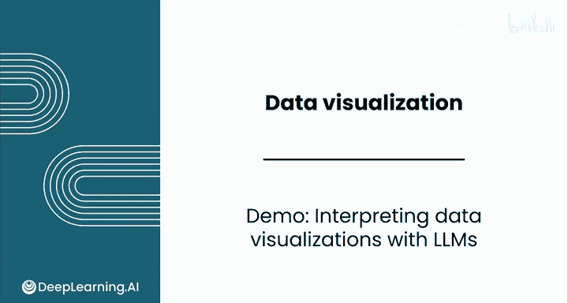

# 055：使用LLM解释数据可视化 📊



在本节课中，我们将学习如何利用大型多模态模型（LMM）来辅助解释和评估数据可视化图表。我们将看到，虽然这些模型功能强大，但人类的判断力仍然至关重要。

---

## 概述

之前我们介绍了大型语言模型（LLM），但事实上，像Claude 3.5 Sonnet和ChatGPT-4o这样的模型不仅仅是LLM，它们是**大型多模态模型**。这意味着它们能够理解和处理不同类型的输入，通常是文本和图像。这对于数据可视化工作来说非常有用，因为它们既能帮助你**解释图表**，也能协助**创建图表**。不过，这些模型有时会出错，需要你进行核查，但它们能极大地提升你的工作效率。

接下来，我们通过具体案例来看看它们是如何工作的。

---

## 案例一：请Claude解释图表

在本模块的前面部分，你见过这张关于人口密度与自然得分的可视化图表。


现在，我们让Claude来解读这张图表。操作很简单：我将图表的截图拖入聊天框，并输入提示语：“Walk me through this chart and explain the key insights.”（带我浏览这张图表并解释关键见解。）

以下是Claude的分析：

*   **图表概述**：该图表可视化了美国各城市和地区的人口密度、自然可达性与人口规模之间的关系。这个描述基本准确。
*   **坐标轴**：X轴表示每平方英里的人口密度，Y轴表示自然得分。
*   **数据点**：每个气泡代表一个城市或地区（根据图表标签，很可能是城市）。
*   **视觉编码**：气泡的大小表示人口规模，气泡的颜色对应自然得分。
*   **关键洞察**：它指出了人口密度与自然得分之间的**反比关系**——随着人口密度增加，自然得分趋于下降。
*   **异常值**：它识别出Union City是一个极端异常值，具有非常高的人口密度和非常低的自然得分。
*   **补充观察**：它评论说较大的气泡倾向于聚集在图表的右下角。这个说法不完全错误，但这些大城市彼此间并非紧密聚集，表述可以更精确一些。

你刚刚看到了Claude 3.5 Sonnet的能力。请记住，在你观看本视频时，很可能已有比这更先进的模型出现，因为模型能力正在快速迭代。

---

## 案例二：请ChatGPT评估图表

上一节我们介绍了如何用LLM解释图表，本节中我们来看看如何用它来评估和优化你自己的图表。我们将测试ChatGPT-4o的能力。

这次我们使用这张“观测到的鸟类数量与温度关系”的图表。图表中实际包含了三种鸟类数据。


我保存了这张图的图像并上传，同时使用了一个更复杂的提示语：

```
你是一位热衷于数据可视化的专家数据分析师。
评估此图表中每个需要改进的方面，并为如何修复问题提供具体建议。
请保持简洁，不要浪费我的时间。
```

由于提示语要求列出“问题”和“建议”，它给出了格式清晰的回答。以下是其输出要点：

*   **问题1：颜色区分度**：Bird 1和Bird 2的颜色难以区分。（实际上三种颜色可能都太相似了，有趣的是它只指出了其中两种。）
*   **问题2：图例位置**：图例覆盖了图表中的部分数据点，可能遮蔽信息。（这是一个有趣的观察。严格来说图例并未重叠任何数据点，可能只是觉得位置太近。）
*   **问题3：标记点大小与重叠**：标记点太大且排列密集，在某些区域难以看清单个数据点。（这在某些区域是事实，但整体上标记点并不算太大。问题主要源于数值为0的数据点重叠非常密集。）
*   **问题4：Y轴范围**：Y轴上限延伸到20，但大多数数据点集中在20以下。这造成了空间浪费，并降低了对相关数据的关注度。（我们确实有一些数据点超过了20，因此Y轴需要延伸到这个高度。）
*   **问题5：网格线**：网格线主导了视觉空间，分散了对数据点的注意力。（我认为网格线的透明度问题不大，它们是浅灰色的背景线。）

总体而言，这次尝试效果一般。LLM确实发现了一些主要问题，如相似颜色和数据重叠，但它也指出了一些并非问题的地方，并且其建议并不总是很出色。因此，它可以作为一双很好的“第二眼睛”，但最终，你的判断力对于创建优秀的可视化作品仍然极其宝贵。

---

## 案例三：请Claude评估同一张图表

测试不同的模型以了解哪个表现最佳是很好的做法，特别是在处理像解读复杂数据可视化这样的高级能力时。不同模型的表现可能不同。

我将同一张图表和相同的提示语复制给了Claude。


可以看到，它的反馈与ChatGPT有很多相似之处，例如都提到了过度绘制、颜色选择、Y轴尺度等问题。在许多情况下，这些评论有些吹毛求疵，图表本身其实可以接受。但关于数据点重叠和颜色选择的主要意见是极好的建议。


它指出的一个有趣点是**缺乏趋势线**。它表示难以看清每个物种的整体模式，并建议为每种鸟类添加一条平滑的趋势线。这是一个值得考虑的提议。

---

## 总结

在本节课中，我们一起学习了如何利用大型多模态模型来辅助数据可视化工作。通过三个具体案例，我们看到了LLM在**解释图表**（如识别关系、异常值）和**评估图表**（如指出设计缺陷）方面的应用。

关键要点如下：
1.  LLM可以作为强大的辅助工具，快速提供对图表的初步解读和潜在改进方向。
2.  不同模型（如Claude, ChatGPT）可能给出略有不同的反馈，值得尝试比较。
3.  **模型会犯错**，其建议可能不准确或不适用。你的专业判断和核查至关重要。
4.  在目前阶段，LLM在**解释**现有可视化方面似乎比**批判性优化**方面更为可靠，但它无疑是一个有价值的“第二双眼睛”。


因此，在进行数据可视化工作时，不要犹豫，随时可以将图表截图扔进Claude或ChatGPT，看看它们能帮你发现哪些洞察或问题。