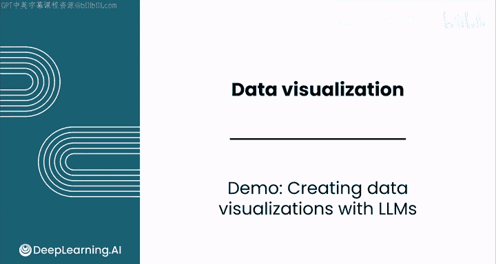
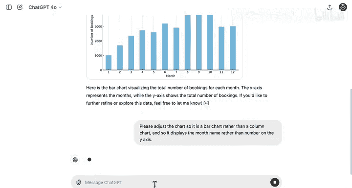
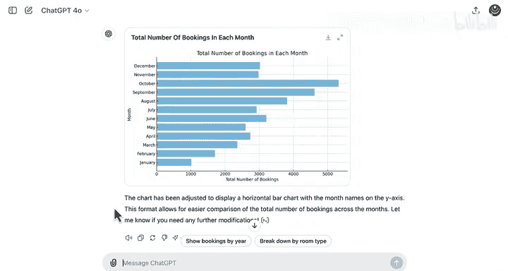
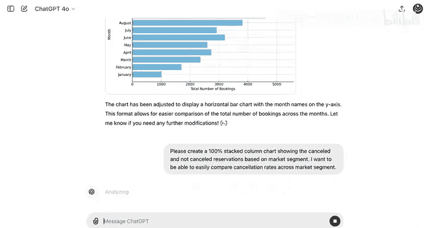
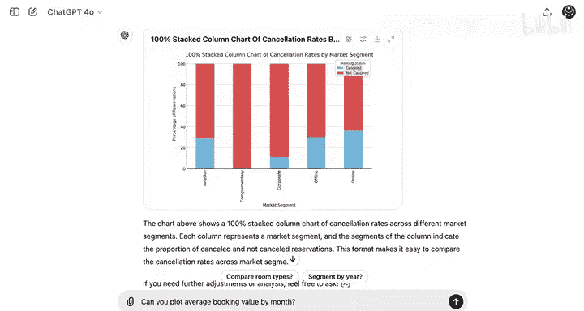
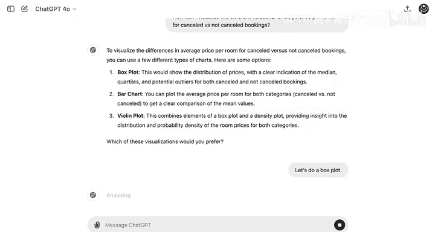
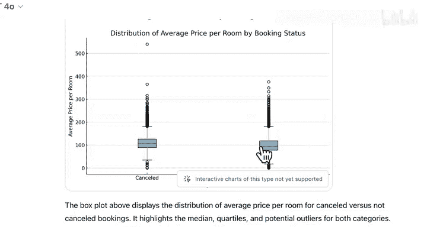

# 056：使用LLM创建数据可视化 📊



在本节课中，我们将学习如何利用大型语言模型（LLM），例如Claude或ChatGPT，来辅助我们创建数据可视化图表。我们将通过一个酒店预订数据的实际案例，演示从数据上传到生成多种图表的完整流程。

---

## 概述：LLM在数据可视化中的角色

上一节我们介绍了数据可视化的基本概念，本节中我们来看看如何借助LLM工具来高效地生成图表。LLM可以理解我们的自然语言指令，并调用其内置的代码能力来创建图表，这能极大提升数据分析的效率。

## 第一步：选择与准备工具


首先，我们尝试使用Claude来处理一个包含36,000行数据的酒店预订CSV文件。


然而，Claude提示文件过大，无法直接处理。这表明我们需要根据数据规模选择合适的工具。

因此，我们转而使用ChatGPT。它可以轻松处理整个36,000行的数据集，因为它并非每次提示都需要读取全部数据。

## 第二步：生成基础图表

我们将数据集上传至ChatGPT，并提出第一个可视化请求。

以下是第一个指令和生成的图表：

**用户指令**:
```text
help me visualize the total number of bookings in each of the 12 months.
```




生成的图表显示，全年预订量总体呈上升趋势，但在十一月和十二月出现锐减。

## 第三步：定制与优化图表

接下来，我们希望优化这个图表。具体需求是：X轴显示月份名称而非数字，并且将图表类型从柱状图改为条形图。





我们向ChatGPT发出调整指令。调整后的图表如下：


现在，Y轴显示了从一月到十二月的月份，条形则代表了每个月的总预订量。



## 第四步：探索更多可视化类型

为了深入分析，我们尝试创建更多维度的图表。

以下是几个后续请求和结果：

**1. 可视化各市场细分的取消率**

**用户指令**:
```text
visualize cancellation rates across market segments.
```


图表显示，大约三分之二的预订未被取消，这与我们在电子表格中核查的数据一致。

**2. 绘制每月平均预订价值**

**用户指令**:
```text
plot the average booking value by month.
```


图表表明，冬季月份的平均预订价值较低，在夏季旅游旺季达到峰值。

**3. 分析重复客户与预订状态的提前期**

**用户指令**:
```text
create a bar chart to visualize lead time by repeated guests and booking status.
```

这是一个跨多个分类变量的数值变量比较。生成的是一个分组条形图。



观察到一个已知模式：已取消预订的平均提前期往往更长。值得注意的是，图表用蓝色代表“已取消”，红色代表“未取消”，这与常规直觉相反。

**4. 比较已取消与未取消预订的每间房平均价格**

**用户指令**:
```text
How can I visualize the different values for average price per room for canceled versus not canceled bookings?
```

模型建议使用箱形图或小提琴图。我们尝试生成一个箱形图。


数值范围在0到550之间。箱形图中的中线代表中位数。可以看出，已取消预订的中位数价格略高于未取消的预订（大约高出10欧元），但两者的价格分布范围大致相似。

## 总结与后续步骤

本节课中我们一起学习了如何利用LLM作为工作流的一部分，它不仅可以帮助我们优化已有的可视化想法，还能为我们创建全新的图表。

你已经接近本模块的尾声。接下来，你将完成一个实践实验室，测试你使用LLM进行数据可视化的技能。

完成后，你将进行分级评估和分级实验。该实验将探索一个自行车共享服务的市场研究，相信你会享受创建大量酷炫图表来支撑你洞察的过程。

完成后，请跟随我进入本课程的最后一个模块，该模块将全面介绍你在数据分析生命周期中的角色。



