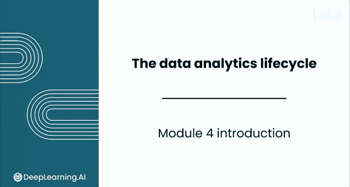
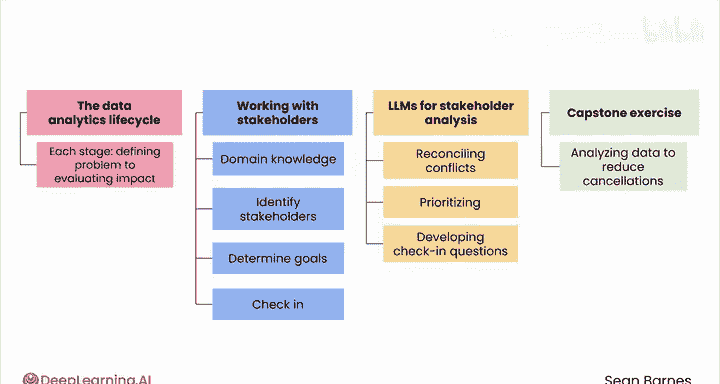

# 057：数据分析生命周期简介 📊

在本节课中，我们将学习数据分析生命周期的基本概念。这是一个结构化的框架，用于指导我们如何利用数据解决问题。我们将了解其各个阶段，并探讨如何通过与利益相关者有效协作来提升分析成果。

## 概述

欢迎来到本课程的最后一个模块——数据分析生命周期。在前面的学习中，你已经掌握了如何使用电子表格分析和可视化数据。现在，是时候将这些技能置于一个完整的实践框架中了。

在本模块中，你将系统性地学习数据分析生命周期。这是一个利用数据解决问题的结构化方法。你将涵盖从定义问题到评估解决方案影响的每一个阶段。你还将了解到，掌握与利益相关者协作的知识能显著提升你的工作成果。

## 数据分析生命周期

上一节我们介绍了本模块的整体目标，本节中我们来看看数据分析生命周期的核心内容。

数据分析生命周期是一个分阶段的过程，确保数据分析项目能够系统、有效地进行。其核心阶段通常包括：

以下是数据分析生命周期的关键阶段：
1.  **定义问题**：明确需要解决的核心业务问题。
2.  **数据收集与准备**：获取相关数据并进行清洗、整理。
3.  **分析与建模**：应用统计方法和模型探索数据、获取洞见。
4.  **结果解释与可视化**：将分析结果转化为易于理解的图表和报告。
5.  **评估影响与部署**：衡量解决方案的效果并将其付诸实践。

## 利益相关者协作

掌握了生命周期的阶段后，我们来看看另一个成功的关键因素：利益相关者协作。

你将学习如何识别你的利益相关者，确定他们的目标，并有效地与他们沟通。与利益相关者合作可能充满挑战。

以下是处理利益相关者关系的几个要点：
*   **识别利益相关者**：明确谁会受到项目影响或对项目有决策权。
*   **理解目标**：深入探究每个利益相关者的核心需求和期望。
*   **有效沟通**：建立定期、清晰的沟通机制，同步进展与发现。

## 实践与应用

理论需要结合实践。在本节中，你将练习使用大型语言模型进行利益相关者分析，包括协调冲突的需求、优先排序机会以及制定有效的沟通问题。

最后，你将以一个综合性的顶点练习结束本模块。一家电信公司委托你分析客户数据，以减少服务注销量。

在模块一至三中，你学习了许多作为数据分析师日常所需的硬技能。本模块则侧重于那些能让你脱颖而出的软技能，包括**适应性**、**沟通能力**和**战略性思维**。

## 总结

在本节课中，我们一起学习了数据分析生命周期的基本框架及其各个阶段。我们认识到，除了技术硬技能，与利益相关者的有效协作和软技能同样至关重要。

到本模块结束时，你将具备从头到尾自信地处理数据分析项目的能力。让我们开始吧。