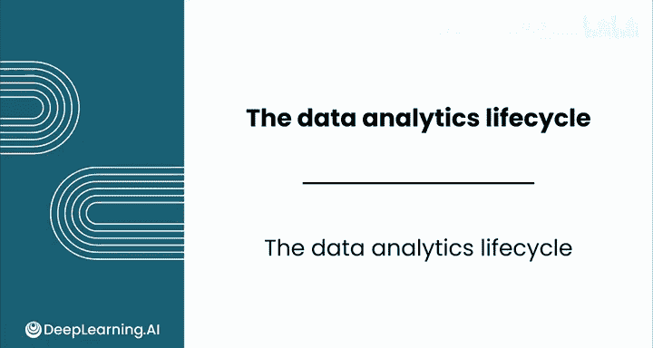
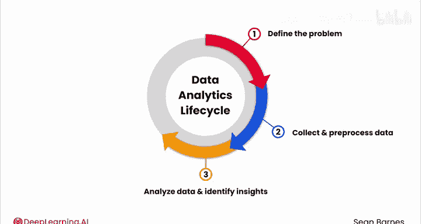
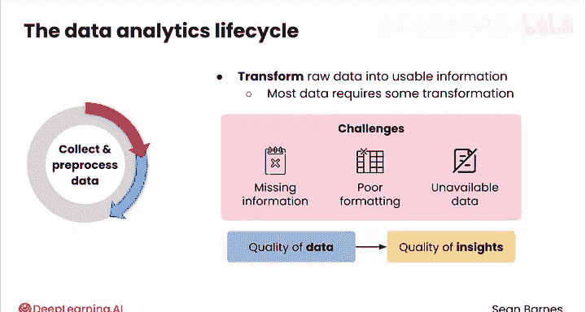
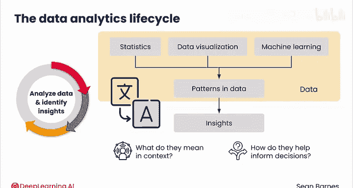
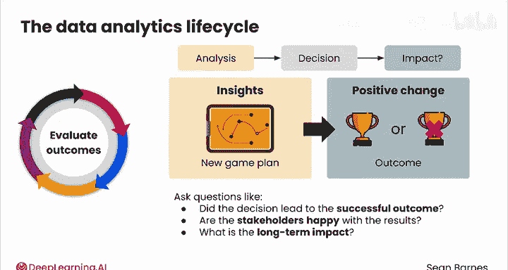

# 058：数据分析生命周期 📊

在本节课中，我们将要学习一个用于构建和管理数据分析项目的核心框架——数据分析生命周期。这是一个端到端的迭代过程，它能帮助你用相同的核心方法去构建截然不同的项目。

数据分析项目很容易因其复杂性而迷失方向。你如何应对各种需求、数据和公式？一个便捷的框架就是数据分析生命周期。

## 什么是数据分析生命周期？🔄

数据分析生命周期分为五个关键阶段。

1.  **定义问题**：你试图解决什么问题？
2.  **收集与预处理数据**：所需信息在哪里？如何为分析做准备？
3.  **分析数据并识别洞见**：需要进行何种分析？发现了哪些洞见？
4.  **分享结果**：如何传达你的洞见以帮助决策？
5.  **评估结果**：问题解决得如何？

你常常需要回顾之前的阶段。项目的成功不仅取决于分析本身，也同等程度地取决于围绕分析的各个阶段。每个阶段所花费的时间也因项目而异，你必须愿意调整你的方法。

接下来，让我们更详细地审视每个阶段。

## 第一阶段：定义问题 🎯

定义问题是分析的基础。其要点首先是缩小你的决策空间。当你排除了错误的方法，就能专注于最有成效的想法。其次，你要清晰地设定关于项目成功标准的期望。

以下是需要提出的一些问题。

*   业务目标是什么？
*   为实现这些目标需要做出哪些决策？
*   做出这些决策的利益相关者是谁？他们的需求是什么？
*   这个项目的成功标准是什么？

花时间把这一步做对。如果不这样做，你将因试图解决错误的问题而浪费时间。阿尔伯特·爱因斯坦有句名言：“如果我有**一小时**解决一个问题，我会花**55分钟**思考问题，用**5分钟**思考解决方案。”这是一个我奉行的信条。

## 第二阶段：收集与预处理数据 📥

在数据收集和预处理阶段，你将原始数据转化为可用的信息。正如你在模块1中所见，大多数数据在分析前都需要一些转换。在某些情况下，例如非结构化数据，所需的工作量是巨大的。缺失的信息或格式错误的列会使你的分析更具挑战性。有时你真正想要的数据可能无法获得，因此你不得不使用手头现有的任何数据。

你的洞见质量直接取决于你的数据质量。获取优质数据并将其处理成可用的形式，为富有成效的分析奠定基础。

## 第三阶段：分析数据并识别洞见 🔍

下一阶段是分析数据并识别洞见。你将使用统计学、数据可视化和机器学习等技术来发现数据中的模式。你还需要从这些模式中推导出洞见。在你的问题背景下，这些模式意味着什么？它们如何帮助告知利益相关者需要做出的决策？

识别洞见有点像将一种语言翻译成另一种语言。你所使用的数据语言，对于一些你将与之合作的项目经理、首席执行官和工程师来说可能不那么熟悉。你必须将分析转化为一个故事，使他人能够利用它做出更好的决策。

## 第四阶段：分享结果 📤

你的分析很有价值，但如果它只锁在你的电脑里就毫无用处。分享结果是创造影响力的方式。通过有效地传达你的发现，你赋予利益相关者做出明智决策的能力，从而实现项目目标。在正确的时机，以恰当的详细程度，向正确的人分享正确的发现，能将洞见转化为现实世界的影响力。

## 第五阶段：评估结果 📈

你已经到达数据分析生命周期的最后阶段：评估结果。你的分析帮助告知了一项决策，现在你需要评估其现实世界的影响。可以这样想：一位教练基于对对手球队的广泛分析设计了一个新的比赛计划，但该计划的真正考验是比赛本身的结果。它是否带来了胜利？同样，作为数据分析师，你的最终目标不仅仅是产生洞见，更是看到这些洞见转化为推动积极变化的行动。

在这个阶段，你应该提出以下问题：
*   决策是否导致了我在第一阶段定义的成功的成果？
*   利益相关者对结果满意吗？
*   长期影响是什么？

请记住，数据分析生命周期是迭代的。从一个决策的有效性评估中获得的洞见，可以为下一轮分析提供信息，从而创造一个良性改进循环。

我经常被问到：“实践中的数据分析师真的会为每个项目一步步遵循这个生命周期吗？”坦率地说，是的，我们确实如此。即使是经验丰富的数据分析师也会告诉你，当你面临新挑战时，要回归基础。

## 总结 ✨

本节课中我们一起学习了数据分析生命周期，这是一个包含**定义问题、收集与预处理数据、分析数据并识别洞见、分享结果、评估结果**五个阶段的迭代框架。理解并遵循这个生命周期，能帮助你有条不紊地开展数据分析项目，确保分析工作始终围绕核心目标，并最终产生实际影响力。在接下来的视频中，我们将更深入地探讨第一阶段——定义问题。