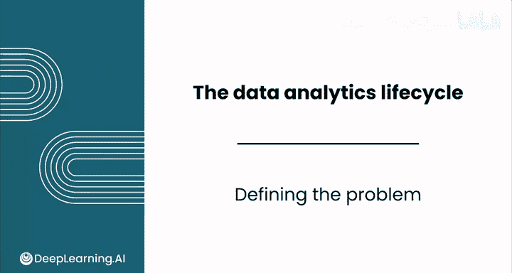
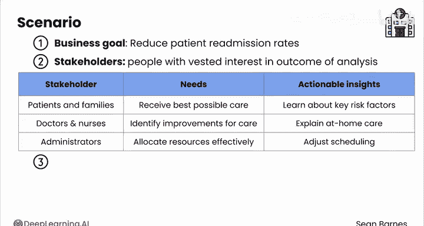

# 059：问题定义 🎯

在本节课中，我们将要学习数据分析流程中的第一步：如何清晰、准确地定义问题。这是确保后续所有分析工作方向正确、价值最大化的关键基础。

---

## 概述

利益相关者常常会请求你帮助解决一个定义模糊的问题。作为数据分析师，你的部分职责就是澄清真正的问题，以便将所有人的努力集中在正确的目标上。一个好的起点是提出正确的问题。

---

## 如何定义问题

上一节我们介绍了问题定义的重要性，本节中我们来看看具体如何操作。以下是定义问题的几个核心步骤。

### 明确业务目标

首先，需要明确业务目标。公司或组织希望实现什么？虽然大多数企业的目标是增加销售额、降低成本和提高客户满意度，但你需要找到更具体、可聚焦的目标。

一个例子是“提供更好的产品推荐”。最终，更好的推荐会提升销售额等高层级结果，但它本身是一个更直接、可衡量的结果，可以作为你的工作重心。

### 识别利益相关者及其需求

接下来，需要识别利益相关者及其需求。谁将使用你的分析结果？他们需要做出什么决策？什么信息对他们最有帮助？

以下是需要考虑的利益相关者类型：
*   **客户/用户**：他们希望获得更好的体验或解决特定问题。
*   **内部团队（如市场、产品）**：他们需要数据来优化策略或功能。
*   **管理层**：他们关注整体业务绩效和资源分配。

### 确定关键未知项

最后，确定关键未知项。这些是目前还没有答案的开放性问题。

以下是建立关键未知项的一些好问题示例：
*   哪些营销渠道最有效？
*   与客户取消订阅相关的因素是什么？
*   用户流失的主要原因有哪些？

---

## 实战案例：医院再入院率分析

现在，让我们通过一个案例来应用以上步骤。假设你是一家医院的数据分析师。

医院发现肺炎患者的再入院率有所上升。较低的再入院率更好，因为患者希望一次就解决问题，而重复就诊会给医护人员带来压力。医院希望了解导致此问题的因素。

### 第一步：确定业务目标

在这个案例中，医院的业务目标是 **降低患者的再入院率**。

### 第二步：考虑利益相关者及其需求

利益相关者是对分析结果有切身利益的人。医院的利益相关者包括患者及其家属、医生、护士和医院管理人员。

考虑他们各自的需求：
*   **患者及家属**：想知道如何获得最好的护理。
*   **医生和护士**：希望找出改善患者护理的潜在方法。
*   **医院管理人员**：希望有效分配资源以维持医院运营。

通过花时间了解你的利益相关者，你可以调整沟通方式，为他们提供最具可操作性的见解。例如，如果你发现“多10分钟的家庭护理教育能改善患者预后”，那么：
*   患者可以了解他们能够自行控制的关键再入院风险因素。
*   医生和护士可以多花几分钟解释家庭护理。
*   管理人员可以调整排班，允许医护人员在患者身上花费更多时间。

### 第三步：确定关键未知项

这些是尚未有答案的开放性问题。

针对此案例，以下是一些用于确立未知项的好问题：
1.  肺炎患者再入院最常见的原因是什么？
2.  在再入院患者的人口统计学特征、病史或治疗方案中是否存在任何规律？
3.  家庭护理中是否存在可能导致再入院的漏洞？
4.  可以实施哪些干预措施来降低再入院率？

你可能会觉得需要深入了解医院内部才能提出这些问题。虽然这确实有帮助，但你并不需要知道一切。关键在于与你的利益相关者合作，了解他们面临的挑战。随着时间的推移，你将能够提出更好的问题。你在医疗保健领域花费的时间越多，对医院的了解就越深入。但无论如何，与利益相关者确认你的方法总是有益的。

---

## 总结与过渡

本节课中，我们一起学习了如何通过明确业务目标、识别利益相关者及其需求、确定关键未知项这三个步骤来清晰定义一个问题。这是数据分析项目成功的基石。

现在，你已经明确了目标。在下一个视频中，你将深入数据收集和预处理的世界。我们稍后见。

