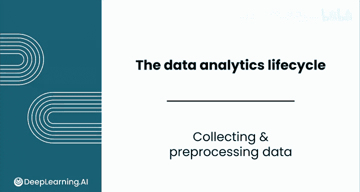
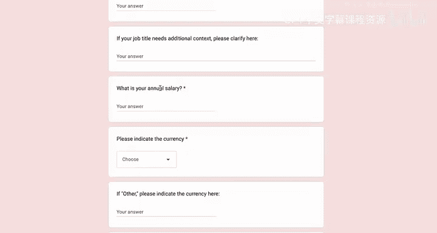

# 060：数据收集与预处理

在本节课中，我们将学习数据分析流程中的关键第一步：如何获取并准备数据。我们将探讨如何识别合适的数据源，以及如何通过预处理将原始数据转化为可供分析的整洁格式。

---

## 🧹 数据收集

上一节我们介绍了数据分析的起点是明确问题。本节中我们来看看如何为解决问题寻找合适的数据。

数据收集是指识别有助于解决问题的信息来源。这个过程可能涉及查询数据库、进行问卷调查，甚至从网络抓取数据。

选择正确的数据来解决问题可能具有挑战性。以下是具体步骤。

首先，回顾你的问题陈述。确定你关注的主要结果。它可能是销售额、评论、成本等。

然后，构思能将主要结果置于背景中的数据。例如，如果你的问题是关于客户留存率，你关注的主要结果可能是客户取消服务的比率。

有了这个结果背景，你就可以使用客户人口统计数据、购买历史和用户参与度指标。

一旦知道需要何种数据，就构思潜在的数据来源。这可能包括内部数据库、公开可用的数据集，甚至是通过调查或实验自己收集的数据。

并非所有数据源都同等重要。需要考虑数据的可访问性（你是否有权限访问它）及其质量（是否准确和最新）。你可能无法收集到最初构思的所有数据，应优先考虑最有可能产生有价值见解的来源。

你还需要确保收集的数据能使项目保持在预算和时间范围内。如果不确定应优先考虑哪些数据源，可以咨询领域专家。他们可以识别出通常用于回答类似行业问题的数据类型。

---

## 🔧 数据预处理

你收集的原始数据很少能让你立即开始分析。预处理是将原始数据转换为可供分析的数据所需进行的工作。

以下是数据预处理的一些常见步骤。

首先，**格式化**：确保数据采用易于分析的一致格式。

其次，**清洗**：移除错误、重复项和异常值。

然后，**处理缺失值**：填补空白或移除不完整的数据。

最后，**转换**：转换数据类型、聚合值或创建新特征。

---

## 📈 一个真实世界的例子

我想向你展示一个真实世界的例子。这是一个公开的调查，用于收集自我报告的管理者薪资信息。

每个人通过谷歌表单提交他们的薪资信息。对于某些选项，如年龄范围或专业经验年限，你可以从一组选项中选择。但对于其他信息，如职位、行业、薪资或地点，信息只是纯文本。

这是该调查结果的电子表格，由“Ask a manager”组织定期发布。这些是2019年的结果，比近期的数据更混乱一些。

每一行（或观察）是一个回复，每一列是一个问题，例如“你多大了？”、“你在哪个行业工作？”等等。

仅通过查看这个电子表格，你就能发现某些列内的信息看起来不一致。例如，你可以看到有些薪资数字包含了货币单位，有些则没有。这个在数字后面有美元符号，这个在前面有美元符号，而这个有空格且完全没有货币符号。

你还可以看到地点的提交方式有很大差异。在这种情况下，它是城市、州和国家，用斜杠而不是逗号分隔；而在这种情况下，它只是一个州的某个区域。

此外，还有一些看起来不合法的行。例如，这里有几行只有部分信息：年薪3美元，专业经验一年或更少，这看起来不像一个合法的提交。同样，对于这个条目，他们只报告了年薪1美元以上。

如果你想按地点分析这些数据，你必须做相当多的工作来标准化薪资和地点，并移除不合法的行。

理想情况下，你应该提前考虑这些潜在问题，并在表单设计中加入约束。例如，“Ask a manager”组织后期版本的表格会要求填写美国州名，并为货币提供更多选项。

预处理数据可以非常有成就感，因为你看到数据从混乱到整洁的戏剧性变化。这也是为什么清洁视频在网上如此受欢迎的原因。

请跟随我进入下一个视频，看看你如何使用这些干净整洁的数据来进行有用的分析。

---

## ✨ 总结

本节课中我们一起学习了数据收集与预处理的核心步骤。我们了解到，数据收集始于明确问题并识别相关数据源，而数据预处理则通过格式化、清洗、处理缺失值和转换等步骤，将原始数据转化为可供分析的整洁格式。这是确保后续分析准确有效的基础。