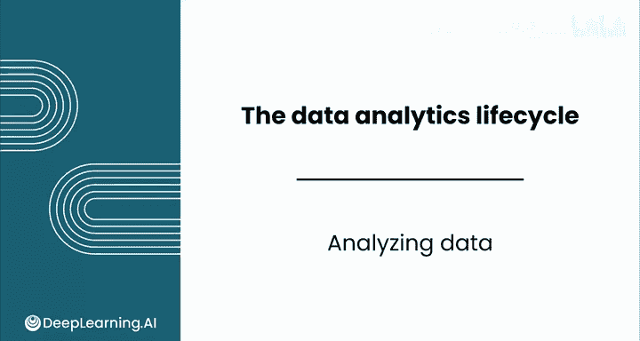
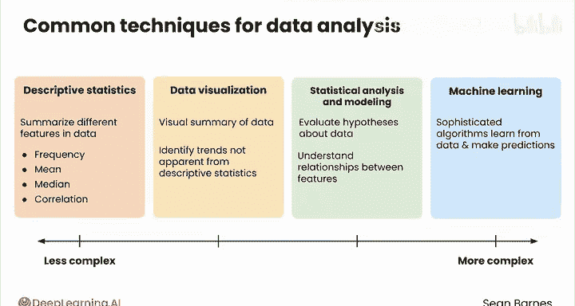
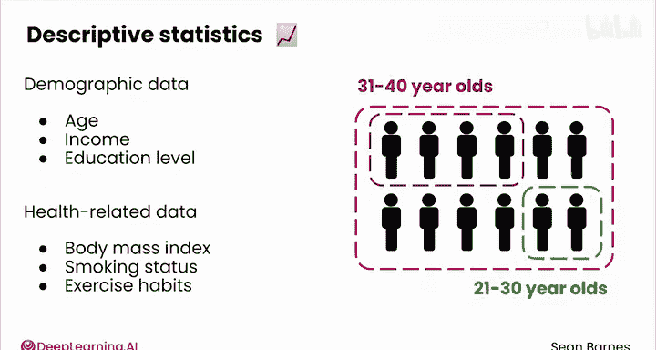
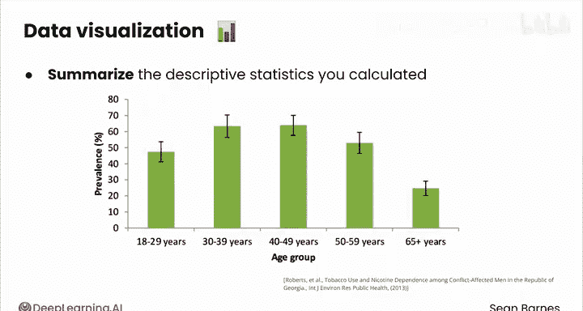
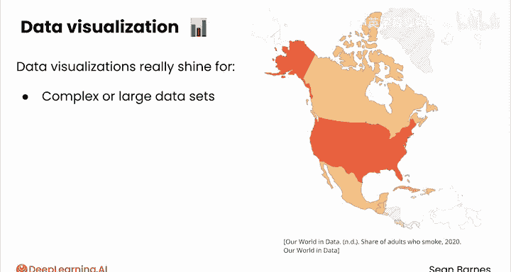
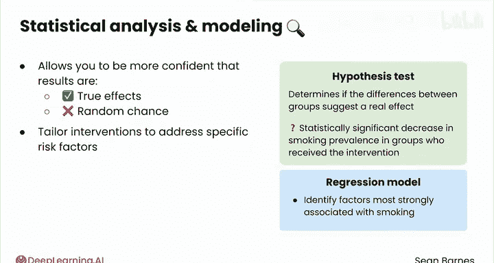
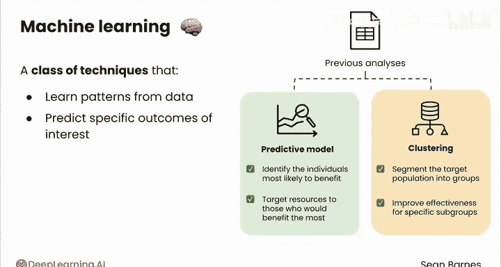
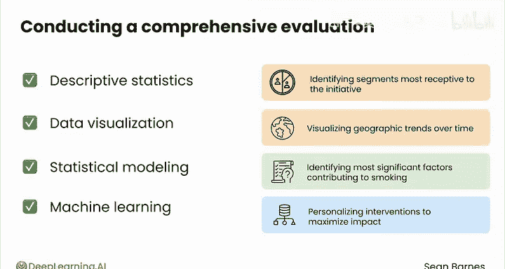

# 061：数据分析方法概览 📊

在本节课中，我们将学习数据分析的核心方法。数据经过预处理后，分析阶段是将原始数据转化为洞见的关键环节。根据数据类型和待解决的问题，我们可以选择多种分析方法。

## 描述性统计 📈

上一节我们介绍了数据预处理，本节中我们来看看如何通过描述性统计来总结数据特征。描述性统计使用**频率、均值、中位数或相关性**等度量来概括数据的不同特征。在本课程中，你已经使用了许多核心的描述性技术。

## 数据可视化 🖼️

常言道，一图胜千言。数据的可视化总结通常能帮助你发现仅靠描述性统计不易察觉的趋势。

## 统计分析、建模与机器学习 🤖

统计分析和建模允许你评估关于数据的假设或理解特征之间的关系。你将在本系列的下一课程中探索许多这类技术。
机器学习使用复杂的算法从数据中学习并进行预测。这些方法的复杂度通常递增，但每种方法本身都可能非常强大。很多时候，仅使用描述性统计和可视化就足以很好地解决你的问题。

---

假设你是一名数据分析师，正在为一个公共卫生组织工作。你当前的项目是评估一项针对21至30岁人群的反吸烟倡议的有效性。

以下是为此项目可能执行的一些分析：

你可以从描述性统计开始，分析目标人群的人口统计数据（如年龄、收入和教育水平）和健康相关数据（如身体质量指数、吸烟状况和运动习惯）。

你可以执行细分分析，以评估数据中子群体的特征。例如，你可以计算每个年龄组的吸烟率，以便更好地了解21至30岁年龄组与其他年龄组的比较情况。

数据可视化可以帮助总结你计算的描述性统计量。例如，你可能希望用条形图绘制不同年龄组的吸烟率，以便进行轻松比较。

你也可以创建折线图来追踪吸烟率随时间的变化趋势。对于复杂或大型数据集，数据可视化确实能大放异彩。对于这个项目，你可以创建一张地图，显示目标人群吸烟率的地理分布。这张地图能让你快速识别特定州或地区的热点区域。

统计分析帮助你评估关于数据的具体问题。它让你更有信心，确信观察到的结果是真实效应，而非随机因素所致。你可以进行假设检验，以确定组间差异是否足够显著，能够表明是真实效应而非随机变异。你可以检验接受干预的群体中，吸烟率是否存在统计学上的显著下降。

你也可以开发一个回归模型，以识别与吸烟关联最强的因素。此分析的见解有助于调整干预措施，以针对特定的风险因素。

对于更复杂的建模，你可以使用机器学习。机器学习算法从数据中学习模式，以预测感兴趣的具体结果。根据从先前分析中学到的知识，你可能会考虑训练一个预测模型，以识别最有可能从干预中受益的个体。这个模型可以帮助将资源定向到那些受益最大的人群。

你也可以使用聚类算法将目标人群划分为具有相似特征的群体。这种方法可能有助于你提高干预措施对特定亚群的有效性，而不是采用“一刀切”的方法。

通过结合描述性统计、数据可视化、统计建模和机器学习，你可以对公共卫生干预计划进行全面评估。你的工作使该组织能够就未来的计划做出数据驱动的决策，包括识别对反吸烟倡议接受度最高的人群细分、可视化随时间变化的地理趋势、识别导致吸烟率的最重要因素，以及个性化干预措施以最大化其影响。

对于每个项目，请考虑采用多方面的分析方法。尝试所有这些类别中的方法，为下一步的成功做好准备。

---

本节课中我们一起学习了数据分析的四大核心方法：描述性统计、数据可视化、统计分析/建模以及机器学习。我们通过一个公共卫生项目的实例，看到了如何综合运用这些方法，将数据转化为可指导决策的深刻洞见。掌握这些方法，是成为一名优秀数据分析师的关键。