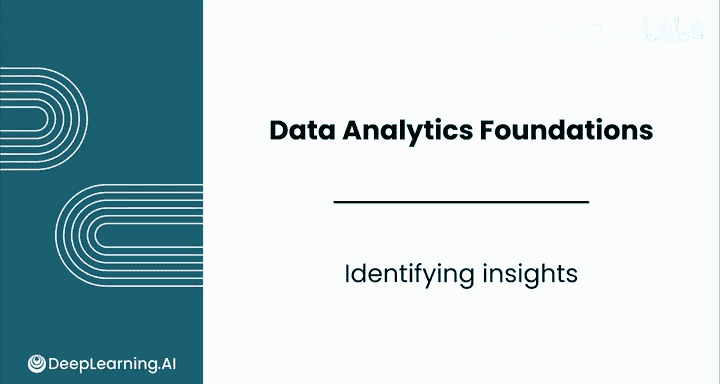
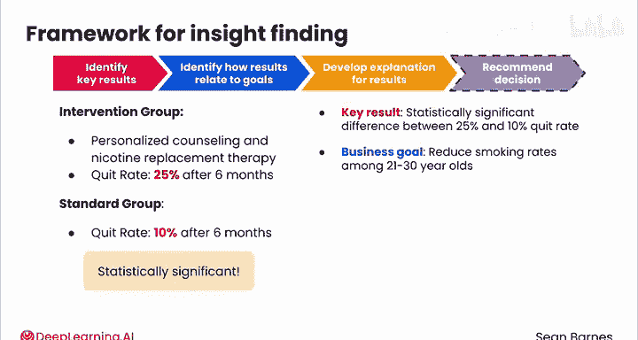

# 062：洞察识别 🎯

在本节课中，我们将学习数据分析的核心目标：如何从数字结果中识别出有价值的洞察，并将其转化为支持商业决策的证据。

所有分析工作的最终目的，都是为了识别洞察。这意味着我们需要理解数字背后的含义，并明确它们如何帮助你做出决策。

---

## 洞察识别框架 📋

以下是一个可用于识别洞察的框架。我们将分步解析这个框架，并通过一个练习来加深理解。

### 第一步：识别关键结果

首先，需要从分析结果中提取出最关键的数据发现。

### 第二步：关联业务目标

接着，需要思考这些关键结果与组织的业务目标有何关联。

### 第三步：解释结果

然后，为观察到的结果提供一个合理的解释。

### 第四步：提出建议（如适用）

最后，如果情况允许，基于洞察提出具体的决策建议。

---

## 实践练习：公共卫生项目 🧪

上一节我们介绍了洞察识别的四步框架，本节中我们来看看如何应用它。我们将通过一个假设的公共卫生项目案例进行练习。

假设你进行了一项对照实验。一部分参与者接受了干预措施（包括个人咨询课程和尼古丁替代疗法），而另一部分参与者仅收到标准教育材料。

你发现，干预组参与者的戒烟率显著高于标准组。具体数据是：干预组在六个月后的戒烟率为 **25%**，而标准组的戒烟率为 **10%**。此结果具有统计显著性，这意味着你可以确信这一发现是真实效应，而非巧合。

那么，你如何从这一结果中识别出洞察呢？让我们套用刚才看到的洞察识别框架。

---

### 应用框架解析结果

以下是应用四步框架对上述结果进行分析的过程：

**第一步：识别关键结果**
关键结果是：干预组 **25%** 的戒烟率与标准组 **10%** 的戒烟率之间存在统计显著性差异。

**第二步：关联业务目标**
该公共卫生组织的业务目标是降低21至30岁人群的吸烟率。

**第三步：解释结果**
基于你的证据，可以得出结论：与标准做法相比，所提供的干预措施能更有效地帮助减少吸烟。

**第四步：提出建议**
你可以为该组织推荐几种基于此洞察的行动方案：
*   投资资源，向所有21至30岁的吸烟者提供此项干预。
*   进一步研究该干预措施的长期效果是否依然积极。
*   识别从干预中受益最大的人群子集。
*   推广该干预措施益处的公众认知。

---

## 总结与展望 📈

本节课中，我们一起学习了洞察识别的完整流程。你已经看到，数据分析不仅仅是计算数字，更重要的是将研究发现转化为能够为特定商业决策提供证据的洞察。

在下一个视频中，你将学习如何有效地传达这些洞察，并确保它们触达正确的受众。我们稍后见。