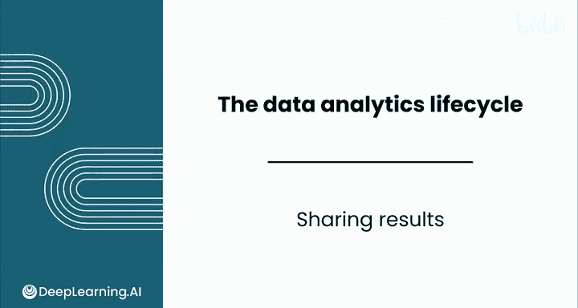
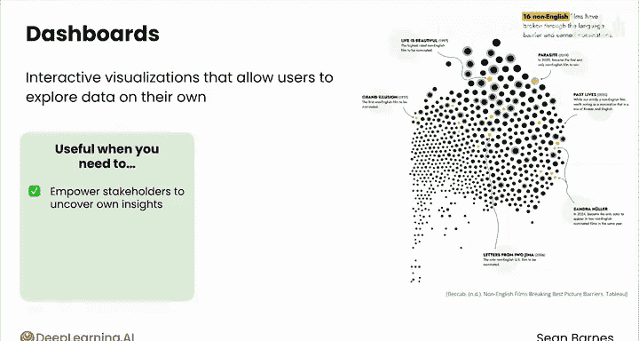
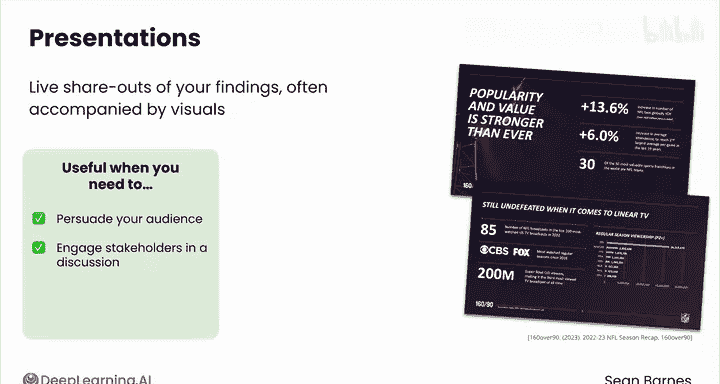
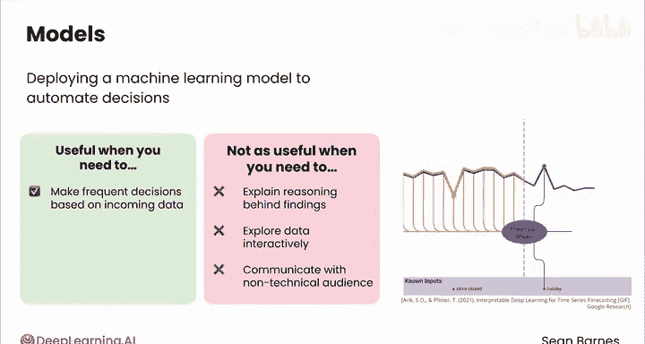
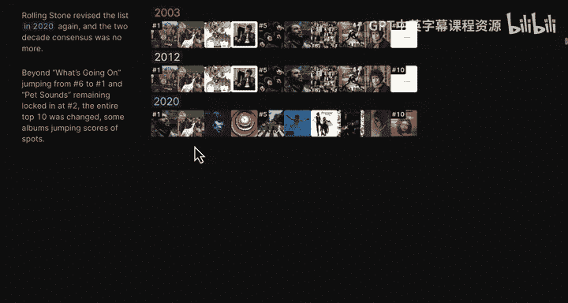
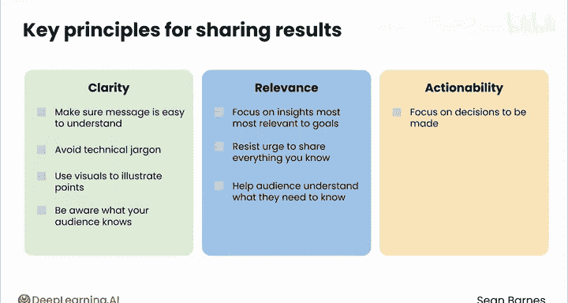

# 063：成果分享 📊

在本节课中，我们将学习如何有效地向利益相关者分享数据分析的成果。完成分析并获得一系列有价值的见解后，关键的一步是将这些发现清晰地传达出去。我们将探讨不同的分享形式、选择依据以及确保沟通有效的核心原则。

---

## 选择分享形式

上一节我们介绍了分享成果的重要性，本节中我们来看看如何选择最合适的分享形式。在决定如何分享结果时，需要考虑两个主要因素。

首先，**何种方式最适合你要传达的见解**。复杂的数据需要可视化。如果你需要沟通多个见解，应该将它们进行总结。数字应该结合其意义进行情境化说明，新数据可以与历史数据进行对比。

其次，**你的利益相关者有何需求**。利益相关者的技术知识水平各不相同。具有深厚技术背景的人可能希望了解更多细节，而技术经验较少的人则可能受益于减少专业术语的详细讲解。利益相关者可能有时间限制，或偏好特定的信息接收方式。他们对业务决策的控制程度也各不相同。

基于这些问题，你应该选择一个合适的格式来分享你的结果。

以下是几种常见的分享形式及其适用场景：

**报告**
报告是你发现的书面总结，通常包含可视化图表。当你需要提供详尽的解释、记录你的方法论或向技术型受众呈现复杂发现时，报告非常有用。当你需要快速沟通，或面向可能没有时间或专业知识阅读长篇报告的非技术型受众时，报告就不那么有用了。

**仪表盘**
仪表盘是一种交互式可视化工具，允许用户自行探索数据。当你希望赋能利益相关者，让他们自己发掘见解、提供便捷的当前信息访问渠道或跟踪一段时间内的绩效时，仪表盘非常有用。当你需要提供详细解释、记录方法论或交互性没有用处时，仪表盘就不那么有用了。

**演示文稿**
你经常会发现自己需要进行演示，即现场分享你的发现，通常伴随着视觉材料。这是讲故事的绝佳机会，当你需要说服听众、让利益相关者参与讨论或向大型团体展示时，演示文稿非常有用。当听众需要重新接触信息，或不同听众需要不同深度的解释时，演示文稿就不那么有用了。

**机器学习模型**
你还可以考虑部署一个机器学习模型，用于自动化决策。当你需要基于传入的数据频繁做出决策时，模型非常有用。当你需要解释发现背后的推理过程、交互式探索数据或与非技术型受众沟通时，模型就不那么有用了。

---

## 探索创新形式

除了上述常见形式，你还可以尝试许多其他的沟通方式。我最喜欢的形式之一是“滚动叙事”，这有点像报告的交互式版本。

这里有一个来自 Pudding.cool 的优秀例子：《什么让一张专辑成为有史以来最伟大的专辑？》。你可以看到2003年的排名，它将专辑分为前10名、第11至250名和第251至500名。你可以看到故事的展开，这创造了一种真正互动的体验，同时你也能获得关于所有这些伟大音乐的见解。在这个例子中，你实际上可以比较三个不同时间点的前十名专辑，看看2020年有哪些新专辑进入了前十名。

我鼓励你访问 Pudding.cool 查看更多引人入胜的例子。

---

## 核心沟通原则

无论你选择何种方式分享结果，都需要牢记几个关键原则。

**清晰性**
确保你的信息易于理解。避免使用技术术语，并利用可视化图表阐明你的观点。要清楚你的受众知道什么，可能不知道什么。

**相关性**
专注于与你的利益相关者目标最相关的见解。通常，你对自己数据的了解程度远超需要沟通的范围。克制住分享你所知道的一切的冲动。相反，帮助你的受众理解他们需要知道什么。

**可操作性**
记住，要将重点放在需要做出的决策上。如果合适，提供基于证据的建议。

遵循这些原则，你可以确保你的工作对业务产生真正的影响。

---

## 总结与行动号召

本节课中，我们一起学习了如何有效地分享数据分析成果。分享你的结果至关重要。试着克制住将分析结果“扔过墙”然后继续下一个项目的冲动，留下利益相关者自己去琢磨一切意味着什么。致力于围绕你的见解构建最有效的叙事，这有助于确保最终的决策是基于你的辛勤工作和专业知识做出的。