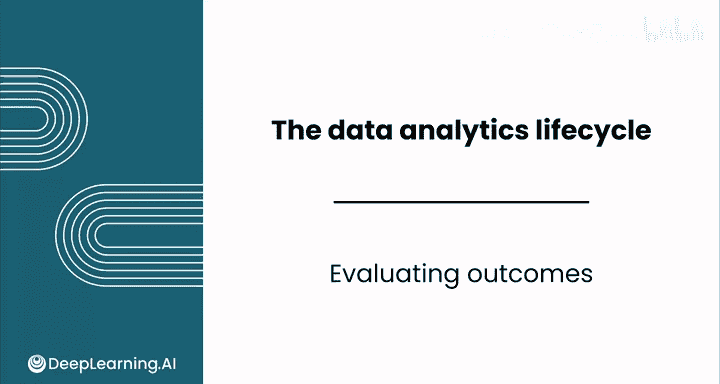
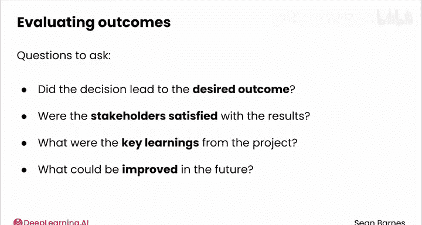
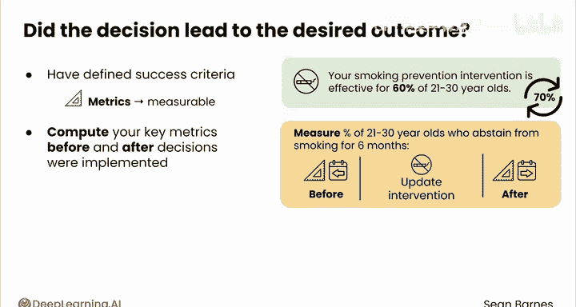
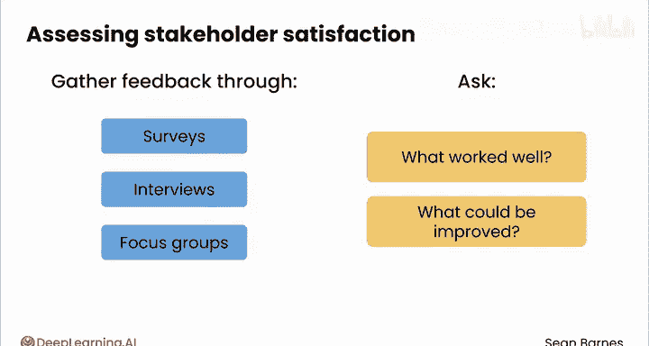
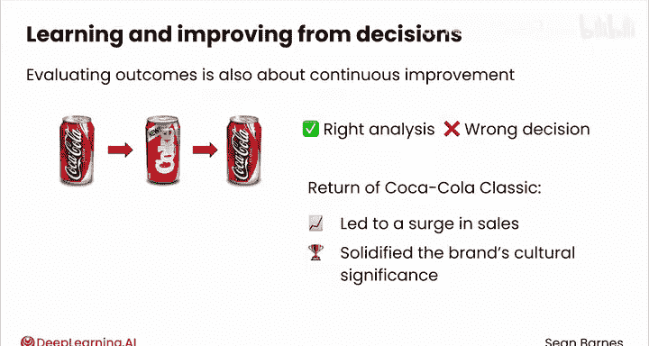

# 064：数据分析生命周期 - 效果评估 🎯

在本节课中，我们将学习数据分析生命周期的最终阶段——效果评估。我们将探讨如何衡量决策的影响、评估利益相关者的满意度，并从项目中汲取关键经验，以实现持续改进。

---

## 概述

效果评估是数据分析生命周期的最后一步。在这个阶段，你需要评估工作的实际影响，判断决策是否达到了预期目标，并从中学习以指导未来的项目。

---

## 评估决策是否达到预期效果

为了评估决策是否带来了期望的结果，你需要在项目开始前就明确定义成功的标准。这些标准通常是可直接测量的，因此常被称为**指标**。



例如，你的吸烟预防干预措施可能对60%的21至30岁人群有效。你的目标可能是通过更新干预措施，将这个指标提升到70%。



为了评估效果，你应该计算决策实施前后的关键指标。这些数值的差异衡量了决策的影响。

**公式示例：**
```
效果 = 决策后指标值 - 决策前指标值
```

例如，你可以测量在更新干预措施前后，21至30岁人群中能坚持至少六个月不吸烟的百分比。这个百分比是上升、下降还是保持不变？如果上升，就证明你的决策产生了积极效果。

这种评估可能需要严谨的统计分析。你还应该在一段较长的时间内持续监测相关指标，以评估积极效果的可持续性。有可能一个指标改善了，而另一个关键指标却保持不变甚至下降。

例如，戒烟率的提升可能只是暂时的，一年后就会趋于平稳。

---

## 评估利益相关者满意度

为了评估利益相关者的满意度，你需要通过调查、访谈或焦点小组等方式收集他们的反馈。即使是电梯里的简短交谈也可能很有效。





询问他们对结果的看法、哪些方面做得好、哪些方面可以改进。这种定性反馈为了解决策的影响提供了宝贵的见解。

---

## 从项目中学习

效果评估不仅仅是衡量成功或失败，更是关于持续改进。有时，数据分析师可能进行了错误的分析，或者即使分析正确，也可能做出了错误的决策。

这些不理想的结果仍然是绝佳的学习机会。

一个著名的从错误决策中学习的例子是“新可乐”的故事。1985年，面对市场份额下降，可口可乐公司用更甜的新配方“新可乐”取代了经典配方。尽管大量口味测试表明消费者更喜欢新口味，但公众反应强烈，对原配方产生了怀旧情绪。

**核心概念：**
```
正确分析 + 错误决策 = 学习机会
```

这次巨大的市场反弹迫使可口可乐在77天后重新推出了经典配方，称为“可口可乐经典”。尽管公司短期内遭到了公众嘲笑，但最终变得更加强大。经典可乐的回归带来了销售激增，并巩固了品牌的文化意义。



通过承认并从错误中学习，可口可乐将一场潜在的灾难变成了宝贵的学习机会。这提醒我们，即使是出于好意的、基于数据的决策也可能产生意想不到的后果，而适应和从失败中学习的能力对于长期成功至关重要。

花时间反思你的工作，你将能识别出可以改进的领域。这种自我反思将使你成为一名高效的数据分析师。

---

## 总结

本节课中，我们一起学习了数据分析生命周期的最后阶段——效果评估。我们探讨了如何通过对比决策前后的关键指标来量化影响，如何收集利益相关者的反馈来评估满意度，以及如何从所有结果（包括不理想的结果）中汲取经验，实现个人和项目的持续改进。

至此，我们完成了对整个数据分析生命周期的介绍。拥抱这个迭代的过程，可以确保你的项目不断进步。完成本课的练习评估后，希望你能加入下一课的学习，下一课将重点讲解如何与利益相关者协作。