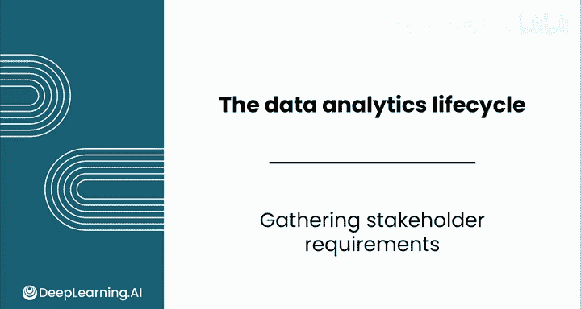
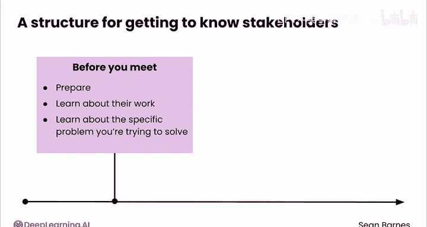
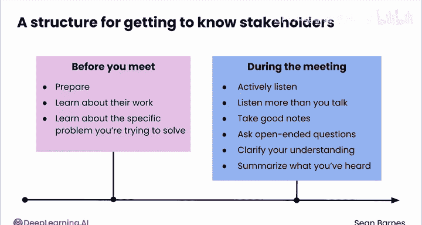
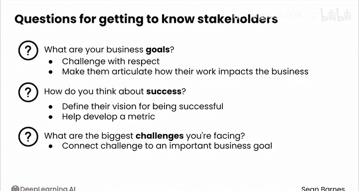
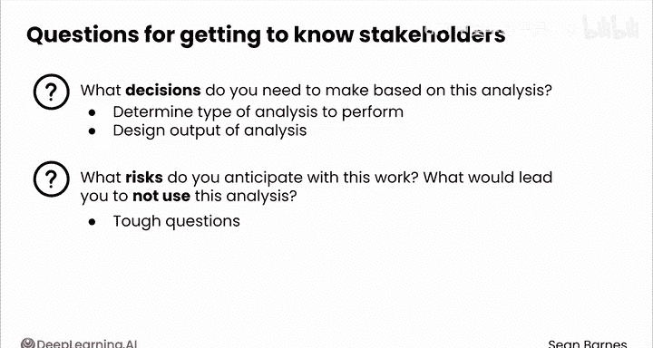

# 065：收集利益相关者需求 📋

在本节课中，我们将学习如何有效地与利益相关者沟通并收集他们的需求。这是数据分析项目成功的关键第一步，能确保你的工作与业务目标保持一致。

---

当我最初加入Netflix时，我热爱电影和电视剧，但对这些内容是如何制作出来的知之甚少。学习如何将数据引入这个创意世界既令人兴奋又让人紧张。我唯一确定的是，我需要沉浸到影视制作的世界中。

我接触了负责真人影视制作不同环节的利益相关者，包括视觉特效和后期制作。我从他们身上学到了很多关于他们领域如何运作的知识，以及他们面临的挑战。这些挑战激发了我关于如何将分析引入他们决策过程的想法。

我之所以能为制作团队开发出有效的见解，是因为我花时间去理解他们的工作。随着时间的推移，我获得了关于真人影视制作的更专业的知识，即领域知识。我开始更有信心地提出合作想法。

早期的成功在我的团队和利益相关者之间建立了信任，利益相关者也更了解我们的能力。这发展成了一个高产的合作伙伴关系，至今仍在持续产出成果。

利益相关者沟通和领域知识的获取是双向的。你了解业务，业务也了解你能为他们提供什么。

我给你的建议是从源头吸收领域知识，也就是从实际工作的人那里。阅读和会议可以补充你的知识，但没有什么能替代高质量的、传统的相处时间。观察、倾听、提问，随着时间的推移，你将能够共同抓住产生重大影响的机会。

---

上一节我们了解了与利益相关者建立联系和获取领域知识的重要性，本节中我们来看看如何具体操作。我有一个有用的框架给你。

**会前准备**
在与利益相关者会面之前，尽你所能去了解他们的工作以及你试图解决的具体问题。这项准备工作将帮助你在会议期间提出有见地的问题。

**积极倾听**
积极倾听利益相关者要说的话。关注他们的目标和痛点。多听少说，并做好笔记，因为相信我，你之后会忘记细节。

**提出开放式问题**
不要只问是或否的问题。鼓励利益相关者详细阐述并提供细节。

例如，不要问“你认为干预措施有效吗？”，而应该问“你认为哪些因素促成了我们看到的干预结果？”

**确认理解**
确保你澄清了对利益相关者所说内容的理解。提出后续问题。在对话结束时，复述你听到的内容，以确保你们达成共识。

**保持谦逊**
最重要的是，以谦逊的态度进行对话。这些人都是他们所在领域的专家，他们花了大量时间学习如何工作。所以请从这个假设出发。避免抱着“你是来拯救局面”的态度。

---

在沟通过程中，提问是至关重要的一环。以下是帮助你了解待解决问题的几个最相关的问题：

**你的业务目标是什么？**
有时这是一个直接的问题，有时则不然。带着尊重去挑战你的利益相关者，或者让他们阐述他们认为自己的工作如何影响业务，这是为你自己的工作带来清晰度并最终增加价值的好方法。

**你如何定义成功？是否有用于评估成功的具体指标？**
利益相关者可能会说他们没有指标，但你仍然需要让他们定义他们对成功的愿景。你也可以借此机会帮助他们制定一个指标。

**你面临的最大挑战是什么？**
假设你的一个利益相关者说他们花了太多时间在重复性任务上。问问自己：我能将这个挑战与重要的业务目标联系起来吗？如果能，很好。如果不能，你可能需要进一步探索以找到真正的问题所在。

**你需要基于此分析做出哪些决策？**
这个问题将帮助你决定执行哪种类型的分析。它也可能帮助你理解如何设计分析输出，以便你的利益相关者能轻松识别正确的见解。

**你预计这项工作存在哪些风险？什么情况会导致你不使用这个分析？**
这些都是许多人可能不会问的棘手问题。但如果你不问，你可能会发现自己陷入一个希望当初问了的境地。最终，你要对自己如何花费时间负责。所以这是你帮助确保时间被妥善利用的机会。

---

与利益相关者保持一致是一个持续的过程，并非一劳永逸。通过花时间理解利益相关者的需求，你可以确保你的工作符合他们的期望。

在本节课中，我们一起学习了如何通过有效沟通和提问来收集利益相关者的需求。关键在于积极倾听、提出开放式问题、确认理解并保持谦逊的态度。掌握这些技巧，将为你的数据分析项目奠定坚实的基础。