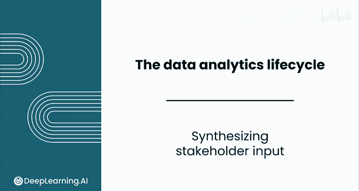
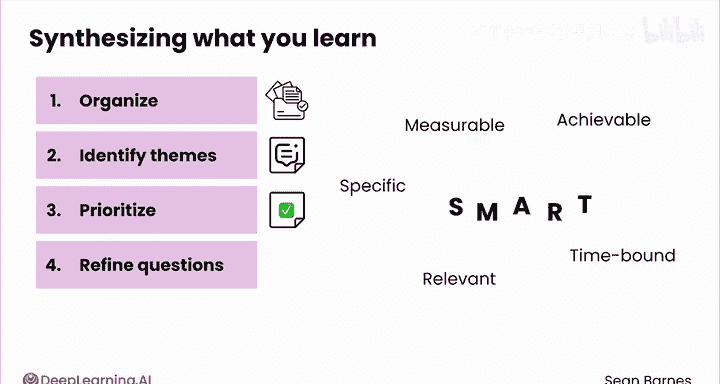
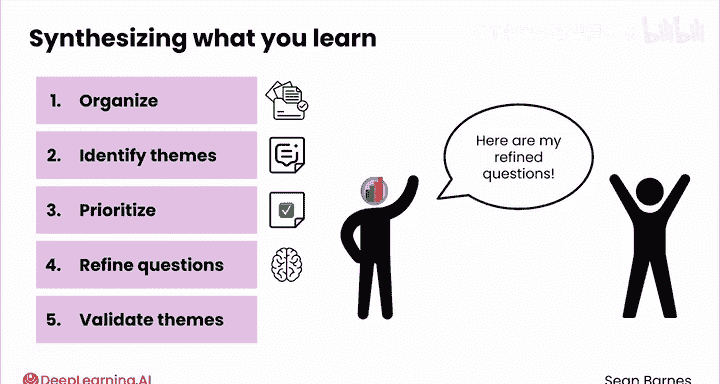
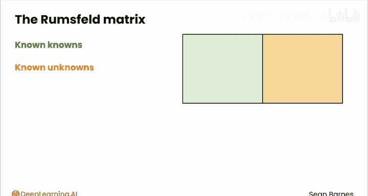
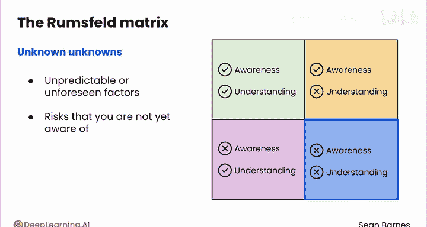
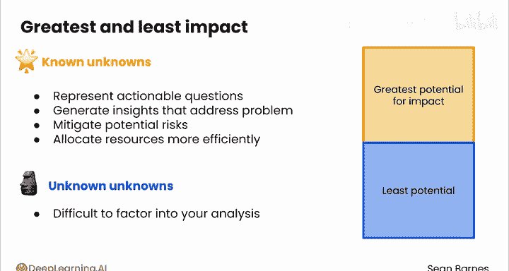
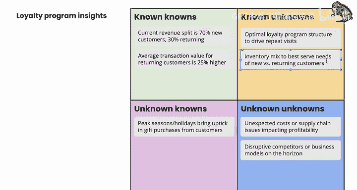

# 066：整合利益相关者输入 📊

在本节课中，我们将学习如何系统性地整理和分析从利益相关者那里收集到的信息。这个过程对于将模糊的需求转化为清晰、可执行的数据分析问题至关重要。

你已经从利益相关者那里收集了大量信息。现在，如何理解这一切？利益相关者的需求可能相互冲突，关键的利益相关者有时也难以准确表达他们的真实需求。无论如何，你需要找到一种方法来理清头绪。

以下是你可以遵循的一个流程，用以整合从利益相关者那里学到的东西。

## 第一步：整理信息

首先，整理你收集到的信息。将笔记、访谈记录和文档汇编到一个地方。

## 第二步：识别主题

然后，识别主题。寻找反复出现的想法。利益相关者提到的主要关切点、目标和挑战是什么？

有时仅通过回顾笔记很难识别主题。你可以尝试将不同的主题写在便利贴上，并将相关笔记归类到每一堆中，以观察哪些内容突出。或者，你也可以利用大型语言模型来整合主题。

## 第三步：确定优先级

一旦确定了主题，就需要确定优先级。并非所有信息都同等重要。确定哪些见解与业务目标最相关。如果你只能解决一个主题，那会是哪一个？为什么？

## 第四步：完善业务问题

基于你的整合分析，完善你的业务问题。确保它们是**具体的、可衡量的、可实现的、相关的、有时限的**。这就是**SMART框架**。

## 第五步：验证主题

最后，验证你的主题。与利益相关者分享你完善的业务问题，并获取他们的反馈。这确保你没有遗漏任何重要内容。这相当于对话中的积极倾听：你复述你认为利益相关者所说的内容，并确认你的理解是正确的。

---

## 使用拉姆斯菲尔德矩阵

你可以使用的一个工具是**拉姆斯菲尔德矩阵**。这是一个根据认知和确定性将信息分为四个象限的框架：已知的已知、已知的未知、未知的已知，以及最棘手的未知的未知。

未知的类别听起来可能有点令人紧张，但这个框架可以帮助你确定需要进一步调查的领域的优先级。

让我们详细了解一下每个类别。

### 已知的已知

**已知的已知**是你确信自己知道某些事情的领域。这个象限包含事实、信息和见解，这些是你和你的利益相关者都意识到并理解的。它们是决策的基础。

### 已知的未知

**已知的未知**是你确信自己不知道某些事情的领域。这个象限包括你意识到但尚未找到答案的问题或不确定性。它们是你需要通过数据收集和分析来填补的知识空白。

### 未知的已知

**未知的已知**代表你拥有但不知道自己拥有的知识。这个象限包括你或你的利益相关者潜意识中拥有但未明确表达的信息。它们可能基于直觉、经验或轶事证据。

### 未知的未知

**未知的未知**意味着你不知道自己不知道的事情。这些实际上是盲点，是不可预测或未预见到的、可能影响你分析的因素。它们是你尚未意识到的风险。

---

## 聚焦“已知的未知”

作为一名数据分析师，**已知的未知**类别通常具有最大的潜在影响力。

原因如下：
*   **已知的未知**代表了你可以通过数据分析来回答的可操作问题。
*   通过专注于这些问题，你可以生成直接解决当前业务问题的见解。
*   识别和解决已知的未知可以帮助你减轻与项目相关的潜在风险。
*   通过优先处理已知的未知，你可以更有效地分配资源（如时间、预算和专业知识），专注于能产生最有价值见解的领域。

在大多数情况下，你不应花大量时间在未知的未知上。将它们纳入你的分析是很困难的。

---

## 应用示例：异域宠物店

让我们看一个如何应用拉姆斯菲尔德矩阵的例子，使用你在之前模块中看到的异域宠物店场景。

假设该店计划开发一个忠诚度计划以增加回头客。你已经采访了利益相关者并收集了以下一组见解。让我们对它们进行分类。

以下是分类过程：
1.  **当前收入构成为70%新客户，30%回头客。** 这是一个事实，所以它属于**已知的已知**。
2.  **意外成本或供应链问题影响盈利能力。** 这是一个可能影响分析结果的不可预测因素，所以它是**未知的未知**。
3.  **优化忠诚度计划结构以推动重复访问。** 这是一个已识别的问题，所以它是**已知的未知**。
4.  **潜在的颠覆性竞争对手或商业模式。** 这是一个可能影响分析结果的不可预测因素，所以它是**未知的未知**。
5.  **回头客的平均交易价值高出25%。** 这是一个事实，所以它属于**已知的已知**。
6.  **旺季和节假日会带来新客户的礼品购买激增。** 这是来自销售团队的见解，你可能尚未意识到，所以它是**未知的已知**。
7.  **优化库存组合以最好地满足新客户与回头客的需求。** 这是一个已识别的问题，所以它是**已知的未知**。

通过这个分类，你可以清晰地看到：
*   **已知的已知**是分析的基础事实。
*   **已知的未知**（如优化忠诚度计划结构、优化库存组合）是可以通过数据分析直接解决、并为业务带来影响的关键机会。
*   其他类别（未知的已知、未知的未知）则需要通过持续沟通、探索性分析或风险监控来管理。

---

## 总结

本节课中，我们一起学习了如何整合利益相关者的输入。

记住，整合利益相关者输入不仅仅是总结他们说了什么，更是关于提取见解、连接信息点。这个过程将帮助你制定出可操作的业务问题。

通过遵循**整理、识别、排序、完善、验证**的流程，并借助**拉姆斯菲尔德矩阵**等工具进行结构化思考，你可以确保数据分析工作始于清晰的方向，并紧密围绕核心业务目标展开。