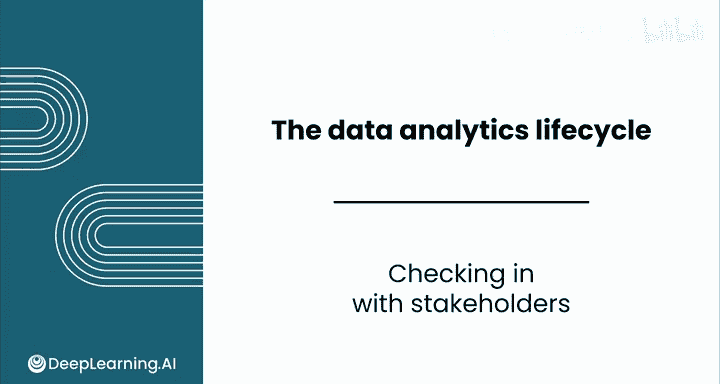
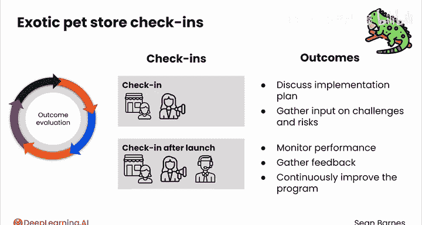

# 067：利益相关者沟通与跟进 📊

在本节课中，我们将要学习数据分析生命周期中一个至关重要的环节：与利益相关者进行持续沟通与跟进。许多初学者在完成问题定义阶段后，会急于投入数据收集、预处理和分析工作。然而，有效的沟通是确保项目成功的关键。

## 持续沟通的重要性 🤝

上一节我们介绍了数据分析生命周期的起点是“发现问题”。本节中我们来看看，为什么在后续阶段与利益相关者保持沟通至关重要。

利益相关者不会在你埋头工作时凭空消失。定期与他们沟通核对，对项目成功有诸多益处。

以下是定期沟通核对的主要好处：

*   **确保方向一致**：确认你的工作方向与项目目标相符。这里的“方向一致”是一个比较宽泛的概念，其核心含义是**你与利益相关者对项目的理解处于同一层面**。
*   **避免后续返工**：通过早期寻求反馈，可以预防后期出现方向性错误，从而减少重复劳动。
*   **建立信任关系**：定期沟通能建立信任，并表明你重视利益相关者的意见。
*   **共同解决障碍**：利益相关者的意见能帮助你应对工作中的阻碍，让你能更快地解决潜在问题。正所谓“三个臭皮匠，顶个诸葛亮”。
*   **持续展示价值**：展示你的进展，可以在整个项目过程中持续提供价值，并证明你工作的影响力。

与利益相关者沟通，能让你的工作进度持续可见，而不是等到最后才分享结果。

## 如何进行有效的沟通核对 📅

了解了沟通的重要性后，我们来看看具体应该如何执行每一次沟通核对。

每次与利益相关者沟通前，你都需要做好准备，包括一份简洁的进展总结以及你希望讨论的具体问题。这种方法能确保讨论聚焦高效。

以下是有效沟通核对的三个关键步骤：

1.  **征求反馈**：积极倾听他们的想法，不要带有任何防御心态。
2.  **明确后续步骤**：确定下一步行动，以推动项目继续前进。
3.  **营造协作氛围**：这一步能创造协作氛围，因为你表明了你计划及时处理他们的反馈。

那么，如何确定沟通的方式和频率呢？以下是三个需要考虑的因素：

*   **项目复杂度**：更复杂的项目可能需要更频繁的沟通核对。
*   **利益相关者可用性**：协调沟通时间时，要考虑利益相关者的日程安排，尽量不要因频繁占用他们的时间而造成负担。
*   **沟通偏好**：有些利益相关者可能偏好正式会议，而另一些可能更习惯非正式的邮件更新或快速电话沟通。

## 实践案例：异宠商店 🦎

理论需要结合实践。让我们通过一个异宠商店的案例，来看看上述原则如何在实际中应用。

假设这个项目的利益相关者包括：作为主要决策者的商店店主、一位市场经理以及客户服务代表团队。

我们来探讨在生命周期的每个阶段，你如何利用沟通核对，以及应该寻求什么样的成果。

*   **问题定义阶段**：与店主的初次会议可能产生一些潜在解决方案的头脑风暴，例如建立一个忠诚度计划，同时收集关于商店整体目标、目标客户和预算限制的信息。随后与店主和市场经理的跟进会议，可能会形成一个更精确的问题陈述：**通过忠诚度计划提高客户留存率和终身价值**。
*   **数据收集与预处理阶段**：与客户服务代表的沟通核对，可以让你收集关于客户的定性反馈，包括常见的痛点以及他们对忠诚度计划的建议。另一次与店主和市场经理的沟通核对，则可以专注于识别可用的客户数据。
*   **分析与洞察发现阶段**：与店主和市场经理的沟通核对，让你可以分享从客户数据分析中得出的初步发现，例如忠诚度计划的潜在投资回报率。这也是一个围绕任何意外挑战共同解决问题的机会。
*   **结果分享阶段**：你需要提供一个全面的发现展示，包括对忠诚度计划结构、潜在奖励和沟通策略的建议。这是收集对拟议计划反馈的时机。
*   **成果评估阶段**：与店主和市场经理沟通核对，讨论忠诚度计划的实施计划，收集关于潜在挑战和风险的意见。在计划启动后，与所有利益相关者沟通核对，以监控其表现、收集反馈并持续改进计划。

通过在数据分析生命周期中始终与利益相关者保持互动，这家宠物商店可以确保其忠诚度计划是基于充分信息制定的、得到有效实施，并最终成功实现其提高客户留存率和终身价值的目标。

你可以想象，由于这些持续的沟通，店主、市场经理和客户成功团队会感到多么受支持。他们会觉得，在业务经历重大变革时，他们拥有一位得力的合作伙伴。

## 总结与展望 🎯

本节课中我们一起学习了在数据分析项目中与利益相关者保持沟通的核心价值与方法。

在整个数据分析项目中与利益相关者保持沟通核对，有助于确保你的工作方向正确。通过促进开放沟通，你建立了信任，最终确保你的分析能够产生可操作的见解，从而推动有影响力的决策。

在下一个视频中，你将看到如何通过领域知识来充分利用这一过程。我们下节课见。

