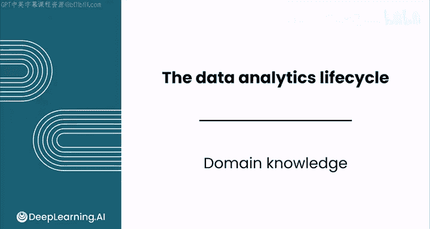
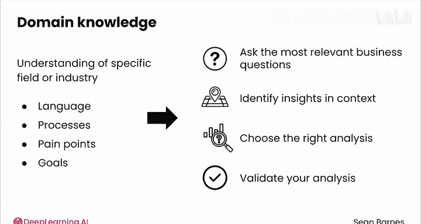

# 068：领域知识 🧠

在本节课中，我们将学习领域知识在数据分析中的重要性，以及它如何帮助你更有效地与利益相关者沟通，并产出更具商业价值的洞察。

---

当你熟悉所在行业时，你就能充分利用利益相关者的见解。

与利益相关者共享一套通用词汇，并能在问题发生前进行预测。

你可以通过构建领域知识来培养这种直觉。

让我们看看领域知识为何以及如何成为你工作中的关键。

---

## 什么是领域知识？

领域知识是对你所处特定行业的理解。

它意味着了解业务的语言、流程、痛点以及目标。

---

## 领域知识的四大作用

上一节我们定义了领域知识，本节中我们来看看它在数据分析中具体能发挥哪些关键作用。

以下是领域知识帮助你的四个主要方面：

1.  **提出最相关的业务问题**
    这就像知道在谷歌上搜索什么。正确的搜索查询才能带来正确的结果。

2.  **识别洞察与背景**
    一个数字对他人可能只是一个数字，但凭借领域知识，你知道它代表什么以及它如何影响业务。

3.  **选择正确的分析方法**
    不同行业面临不同的数据挑战，领域知识能指导你为已识别的业务问题选择正确的分析路径。

4.  **验证你的分析**
    确保你的洞察在问题背景下是合理且有意义的。

---

## 总结与过渡

领域知识让你比那些仅仅依赖技术技能的人更具优势。

它让你能够真正将你的工作与业务联系起来。

---

这为我们关于利益相关者沟通的课程画上了句号。数据分析需要技术技能，但你的软技能才能真正让你脱颖而出。

如果你能创造一个包容的环境，让利益相关者在你身边感到自在，你将赢得信任并发现更多创造影响的机会。

接下来是一个实践练习，将引导你完成一个音乐案例研究。你可以运用数据分析生命周期，来练习你的利益相关者沟通和战略思维技能。

完成实践练习和评估后，请加入下一节课，学习如何利用大语言模型进行利益相关者分析。