# 069：使用LLM进行利益相关者分析演示

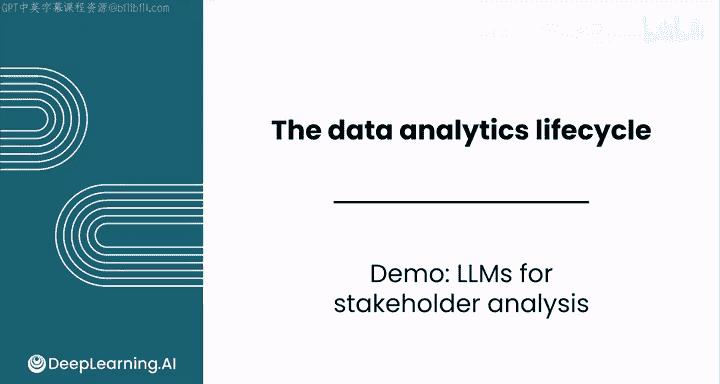

在本节课中，我们将学习如何利用大型语言模型（LLM）作为数据分析师的“思考伙伴”，特别是在定义问题和与利益相关者协作时。我们将通过一个具体案例，演示LLM如何帮助分析不同利益相关者的观点，并指导后续的数据分析工作。

## 🎯 概述：LLM作为数据分析的协作工具

LLM是数据分析师的优秀思考伙伴。本节将展示如何在定义问题以及与利益相关者协作时，在实践中使用LLM。

我们将通过两个用例来探索其应用。

## 📧 用例一：分析与对比利益相关者观点

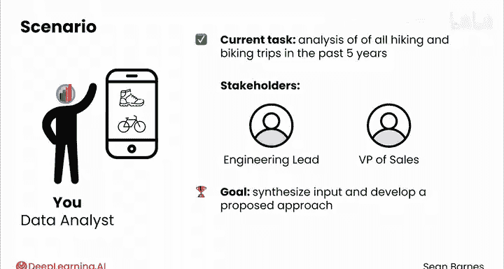

假设你在一家科技公司工作，其旗舰产品是一款允许用户追踪徒步和骑行旅程的应用程序。

你目前正在分析过去五年用户所有徒步和骑行旅程的数据。两位利益相关者——工程负责人和销售副总裁——给你发来了电子邮件，表达了他们对应用程序未来方向的看法。你的目标是综合他们的意见，并根据邮件内容，提出你的分析如何促成业务影响的建议方案。

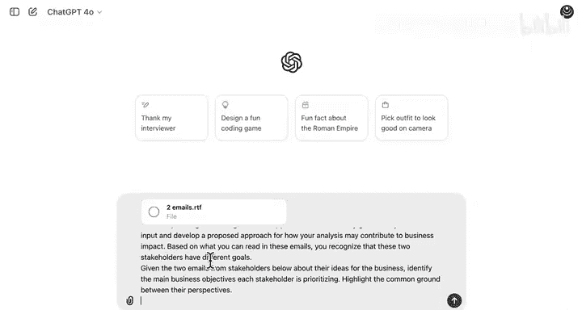

从邮件中，你认识到这两位利益相关者有着不同的目标。让我们探索如何使用LLM来比较和对比两封邮件的关键点。

我们将使用一个LLM（在本例中是ChatGPT），首先提供关于公司的初始背景，然后提供描述两封邮件内容的上下文，最后上传每封邮件的文本。

以下是操作步骤：
1.  复制关于公司的初始背景信息。
2.  解释利益相关者是谁。
3.  要求LLM总结每位利益相关者关于应用程序未来方向的观点。
4.  要求LLM突出双方的共同点。

你可以在下方的下载区获取两封邮件的文本文件。

LLM识别出，工程负责人的目标是通过添加新功能来**增强用户体验**。它还总结了一些关于如何实施这些改变的想法，例如：
*   实施新的排行榜系统以促进竞争。
*   根据位置和偏好推荐附近的路线。
*   与可穿戴设备集成。

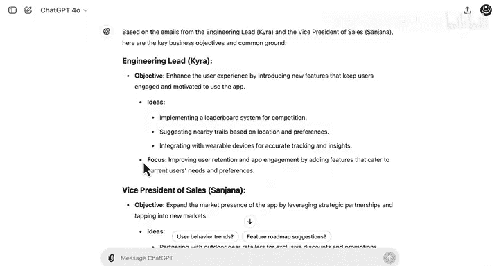

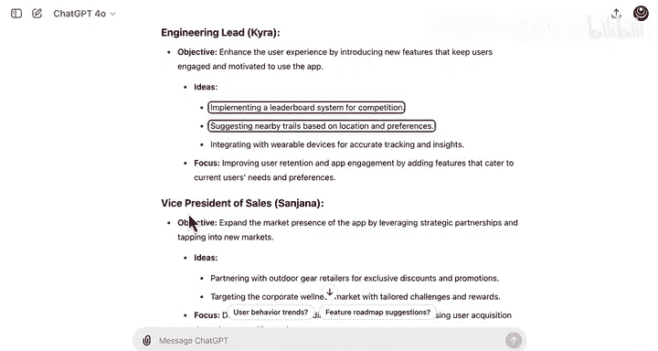

另一方面，销售副总裁Sojana则专注于**扩大应用程序的市场影响力**。她可能最感兴趣的一些想法包括：
*   与户外装备零售商合作提供折扣和促销。
*   通过定制挑战和奖励来瞄准企业健康市场。

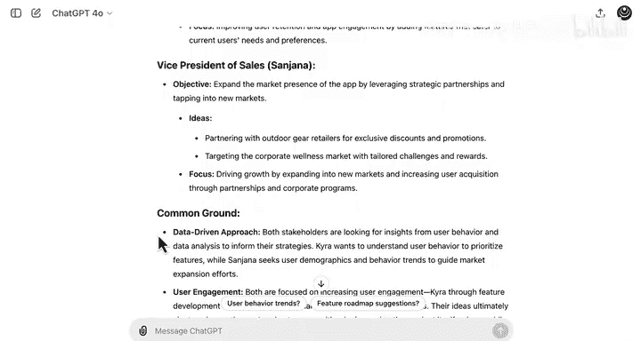

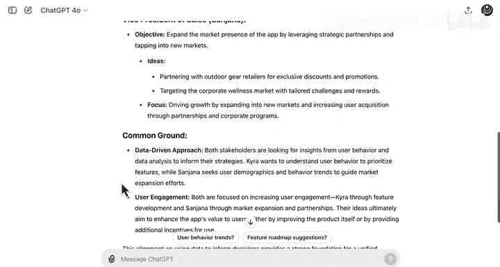

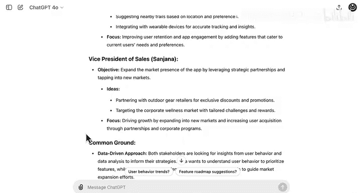

因此，两位利益相关者中，一位似乎更专注于**留住现有用户**，另一位则更专注于**获取新会员**。

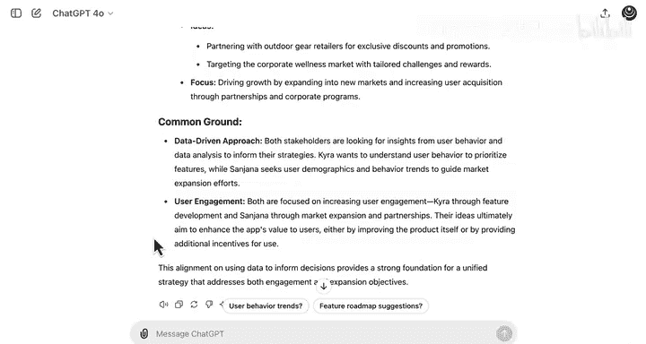

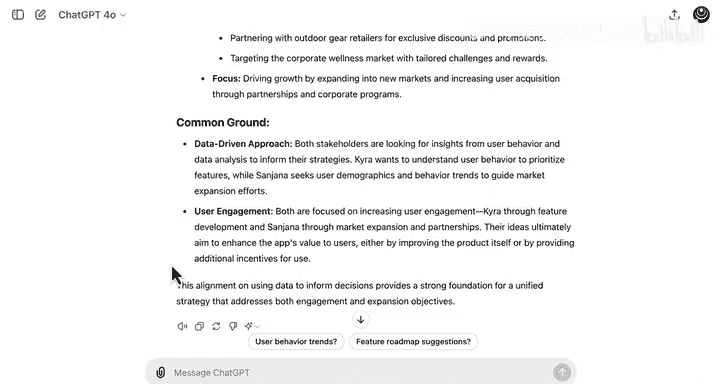

最后，LLM还提供了一个关于**共同点**的部分。两位利益相关者都希望获得数据驱动的见解来帮助制定策略。他们也似乎都关注用户参与度，但一位关注留存，另一位关注获客。

## 🔍 深入探索：基于目标制定业务决策

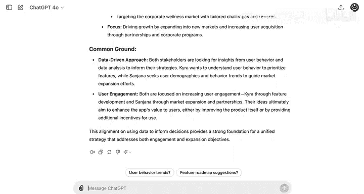

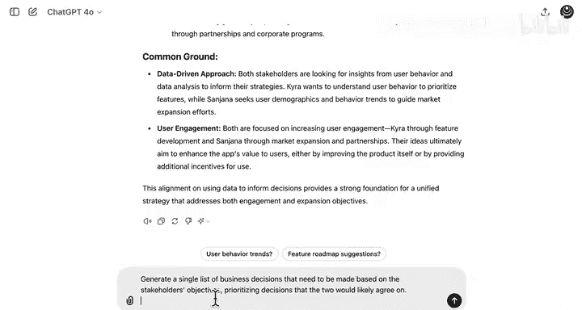

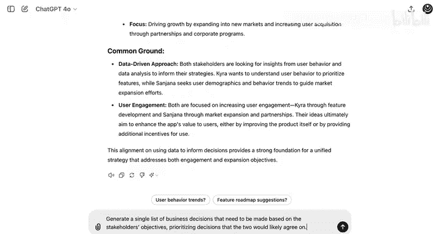

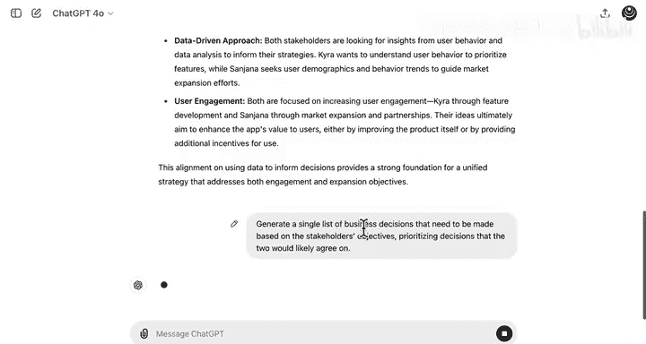

接下来，我们希望了解基于这些优先级可能做出哪些类型的业务决策。以下是一个可以帮助实现这一点的提示词。

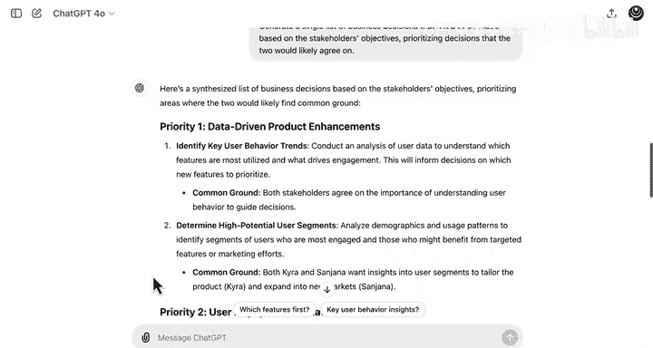

我们将要求LLM根据利益相关者的目标，生成一份需要做出的业务决策清单，并优先列出双方可能都同意的决策。

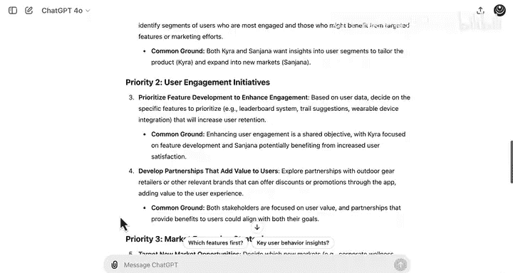

LLM给出了一个优先级列表：
1.  **数据驱动的产品增强**
2.  **用户参与度提升计划**
3.  **市场扩展优先级**
4.  **集成与技术增强**
5.  **监控与反馈**

这是一个有趣的优先级列表。列表顶部的第一个优先级显然与两位利益相关者都一致，因为他们都对数据驱动的产品增强感兴趣。但随着列表向下看，很明显其中一些优先级对某一位利益相关者更相关。

因此，根据这个优先级列表，你可能会利用这些信息将精力集中在更多与产品或用户参与度相关的计划上。你可以考虑为这里列出的前两个优先级撰写提案，然后征求利益相关者的反馈，看看他们最认同哪一个。

## 🧩 用例二：利用LLM构建Rumsfeld矩阵

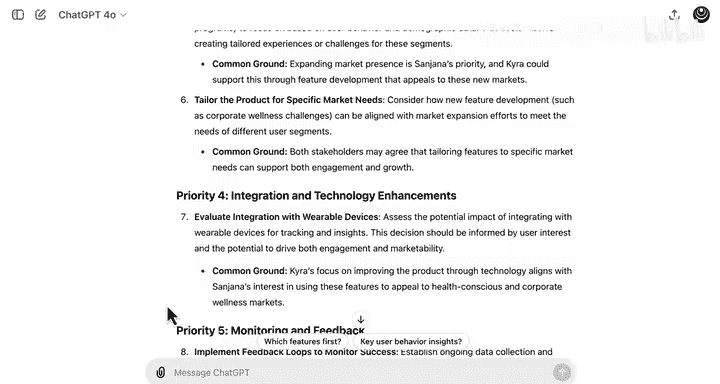

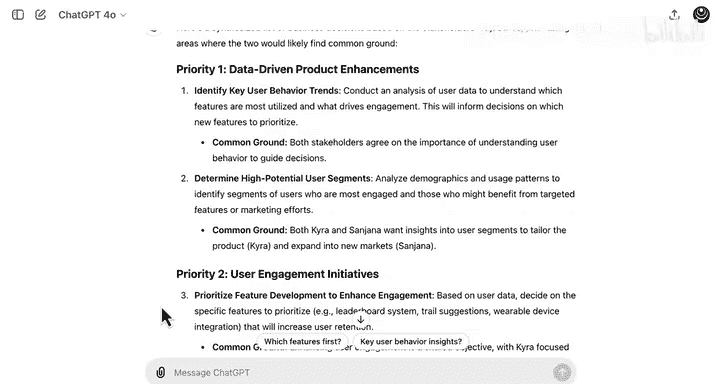

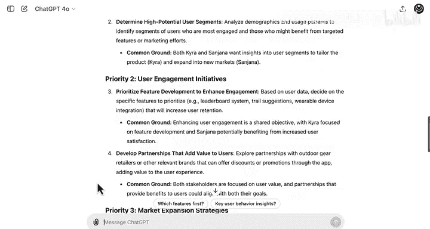

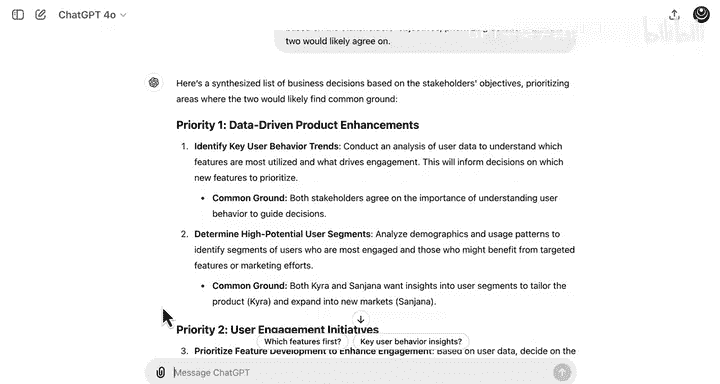

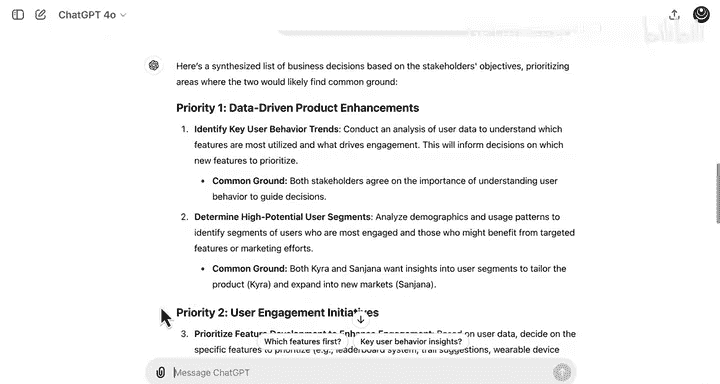

假设你已经解决了上述的小分歧，并确定最重要的业务问题是**提升用户体验**。领导团队已经开会讨论了每个人的目标，并且你拿到了会议记录。

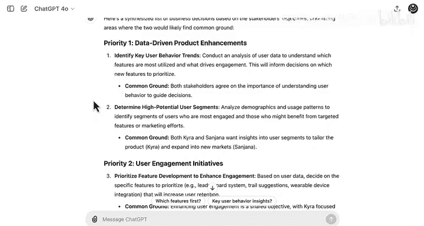

一个很好的下一步是创建一个**Rumsfeld矩阵**，以更好地理解问题。让我们尝试用LLM来完成这个任务。

创建一个新的对话，生成一个提示词，要求LLM为我创建一个Rumsfeld矩阵，同时上传会议记录的文档。

LLM将会议记录中的各个陈述分类到矩阵的四个象限中。我们可以重点关注 **“已知的未知”** 象限，这通常能提供关于潜在分析的最多信息。

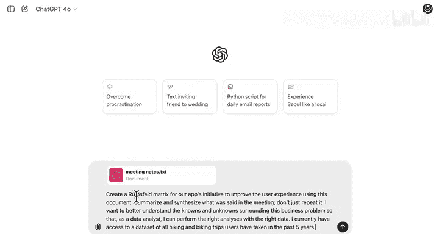

它谈到了：
*   获客渠道对用户留存的潜在影响。
*   用户初始下载之外的动机。
*   整体市场趋势和竞争对手洞察。

这些都代表了你可以运行的具体潜在分析。

LLM还总结了它认为这些信息如何影响你作为数据分析师的工作。特别是，它谈到：
*   按获客渠道细分用户。
*   探索未知的用户动机，这些都是需要重点分析的明确领域。
*   如何利用数据集分析用户旅程，以调查参与模式，特别是与功能使用相关的模式，以及这些模式如何与留存率相关联。

所有这些想法似乎都与工程和销售领导感兴趣的内容非常吻合。

## 📈 最终步骤：确定数据分析工作的优先级

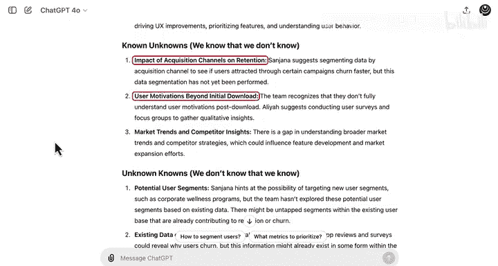

最后，让我们通过给出这个最终提示词，要求LLM为数据分析工作提供一些优先级建议。

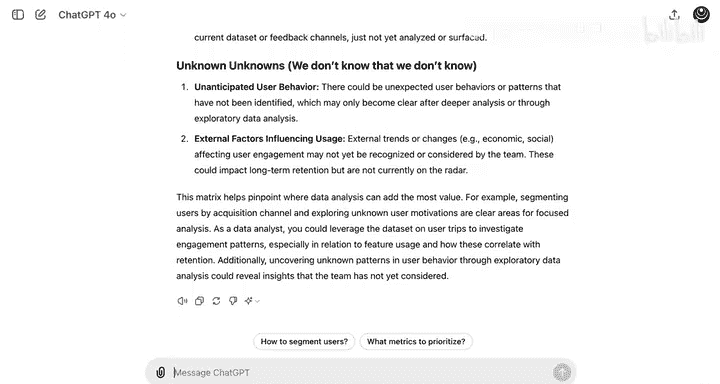

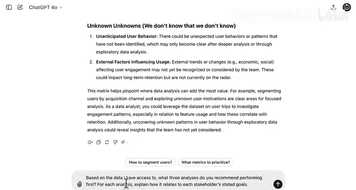

我们将要求它根据我所能访问的数据，建议一些分析方向。

这看起来是一个非常有帮助的总结。它提供了三个潜在的分析方向，这些方向与上一步中从“已知的未知”象限识别出的机会非常吻合。

LLM还指出了每项分析的目的，并将其与最关心结果的具体利益相关者联系起来。

例如，在第一个例子中，它建议尝试**识别不同获客渠道如何影响用户留存和参与度**。它还为你提供了可以进行的分析方法的建议。这些都是你在本课程中已经见过的不同类型分析的例子，例如细分用户或比较指标。

最后，它还就这些分析如何帮助指导用户体验改进提供了指导。这些见解可能与工程负责人最相关，他最感兴趣的是如何实际实施你从分析中推荐的更改。

## 🎓 课程总结与展望

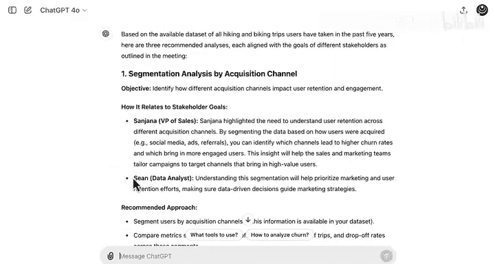

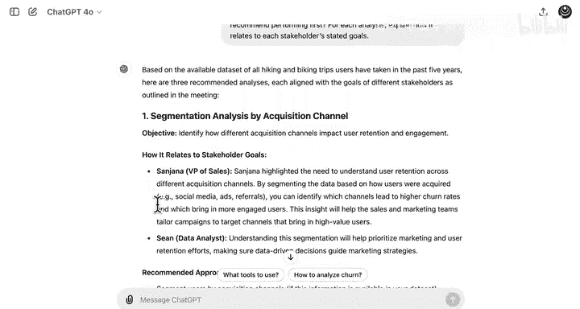

在本节课中，我们一起学习了如何将LLM作为强大的协作工具，应用于数据分析的初始阶段，特别是利益相关者分析和问题定义环节。我们演示了如何利用LLM：
1.  **对比不同利益相关者的观点**，识别共同点和分歧。
2.  **生成基于目标的业务决策优先级列表**，指导分析方向。
3.  **构建Rumsfeld矩阵**，系统化地梳理已知与未知，聚焦分析机会。
4.  **提出具体的数据分析建议**，并将其与利益相关者关切点关联。

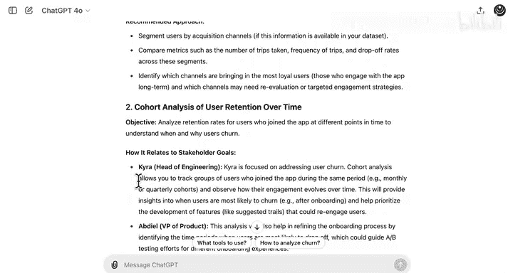

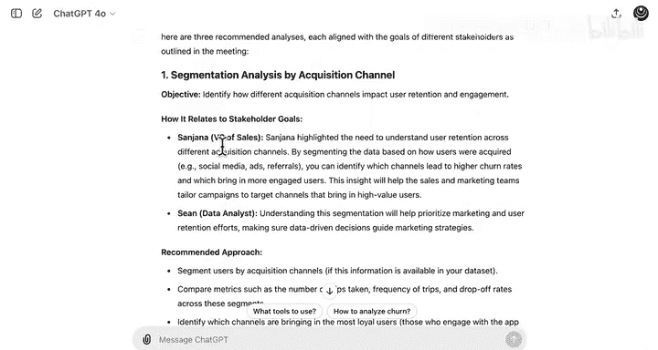

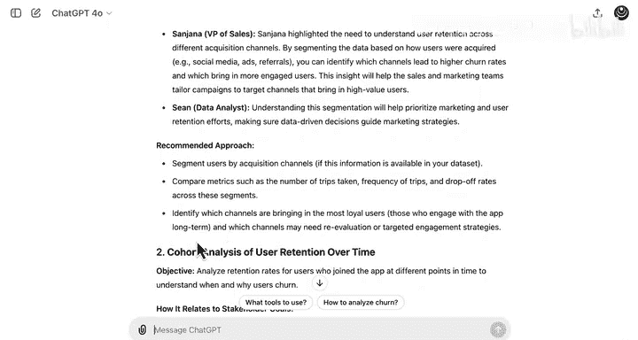

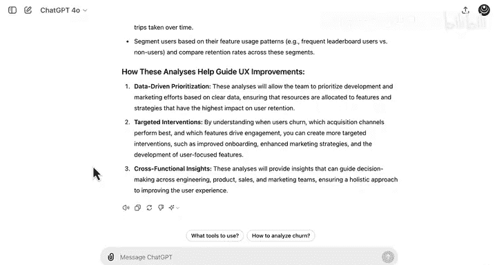

能够省去大量阅读和书写工作，并为你的工作获得“第二意见”，这种感觉很棒。相信你在未来的数据分析工作中，会发现比这两个更多的用例。

保持好奇心，探索如何让工作更轻松。

现在，你已经完成了本模块的学习。接下来将有几个机会来测试你的技能，首先是关于使用LLM的练习实验。我也很期待你完成本模块的评分实验——一个案例研究，你将在其中看到数据分析生命周期在一家小型面包店的实际应用。

完成评分实验和评估后，你将进入本课程的顶点项目，在那里你将运用在整个课程每个模块中学到的所有技能。你将探索一家通信公司的客户流失数据集。我相信你会享受探索导致客户取消服务的因素。

完成评分实验、评估和顶点练习后，我将在最后一个视频中与你见面，讨论你作为数据分析师的下一步。你能行的。