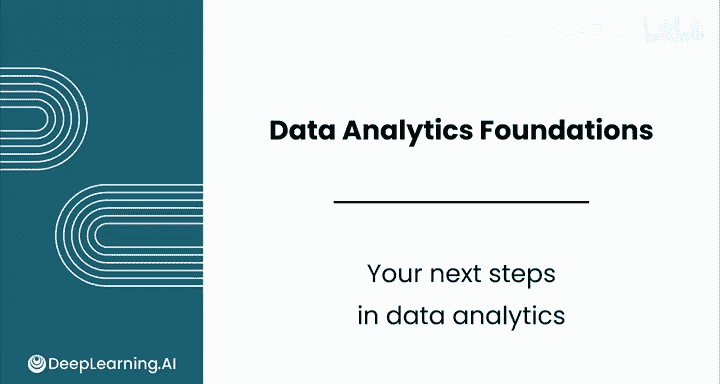

# 070：数据分析的下一步 🚀

在本节课中，我们将回顾数据分析基础课程的核心成就，并展望后续学习路径，特别是应用统计学在数据分析中的重要性。

---

祝贺你完成顶点项目及本课程。你已迈入数据分析领域至关重要的第一步。我期待看到你未来的成就。

自学习“祖母的异国宠物店”案例以来，你已取得长足进步。从掌握电子表格公式到创建精美的数据可视化，你已为从事数据分析工作做好了准备。

数据分析领域仍有大量知识有待学习。这份工作最吸引我的一个方面是，即使从业多年，我每天依然能学到新东西。因此，我希望你能加入本系列的下一个课程——《数据分析应用统计学》。

在下一门课程中，你将实践核心统计方法，包括：
*   **模拟**
*   **置信区间**
*   **假设检验**

以下是这些方法的核心概念示例：
*   计算**样本均值**的公式可表示为：`x̄ = (Σx_i) / n`
*   创建**置信区间**的代码思路可能是：`confidence_interval = mean ± (z * standard_error)`

完成下一门课程时，你将能自信地在专业岗位上应用这些技术。

再次祝贺你完成本课程。我们下一门课程《数据分析统计学》再见。

---

本节课中，我们一起回顾了数据分析基础课程的学习成果，明确了掌握**电子表格操作**与**数据可视化**是重要的入门技能。同时，我们展望了后续学习方向，认识到**应用统计学**是深化数据分析能力的关键，其核心方法如**模拟**、**置信区间**与**假设检验**将成为你解决更复杂业务问题的有力工具。