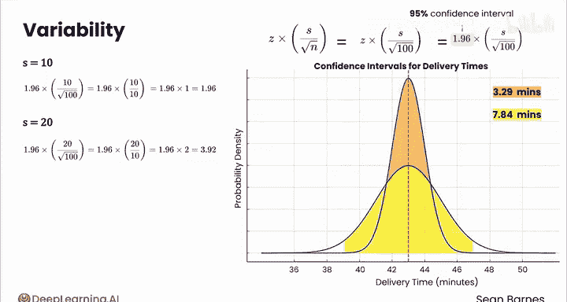
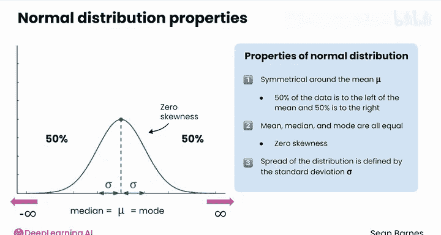
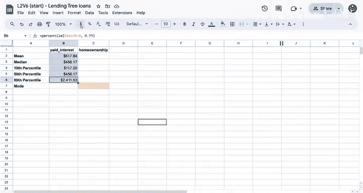
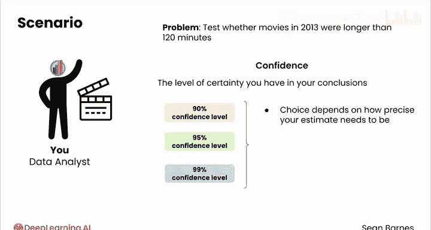

# 071：应用统计学导论 🎯

在本课程中，我们将学习应用统计学的基础知识。统计学是数据分析的核心，它帮助我们理解数据中的不确定性，并基于数据做出明智的决策。

欢迎来到数据分析系列的第二门课程——应用统计学。如果你已经学习了之前的数据分析基础课程，那么你已经学会了如何使用电子表格等工具来分析、可视化数据并与他人沟通。在本课程中，你将学习构成严谨分析基础的统计技术。

多年前我读本科时，统计学曾是我的主修专业之一。有些人可能认为统计学是一堆枯燥的数学，但我发现它在商业和日常决策中极具应用价值。例如，当你考虑服用一种新的维生素补充剂时，你可能会查阅新闻或相关研究，看它是否有效。如果这些研究提到了P值或其他数字，你应如何解读？又该如何判断是否应该相信该研究的结论，从而决定是否服用该补充剂？这就是统计学的应用。我很高兴再次欢迎肖恩·瓦兹作为讲师来讲解这些内容。

感谢安德鲁。我也是统计学的坚定信徒，我认为它是最有用的数学分支之一。我将数据视为窥探真相的窗口。世界以某种方式存在，而作为数据分析师，你的工作就是利用数据，透过这扇窗口更好地理解世界。

你的分析中总是存在一定程度的不确定性，因为世界充满了巨大的复杂性。统计学帮助你推理并处理这种不确定性。世界是不确定的，意味着我们并不总是知道深层的潜在真相。这所学校比那所学校更好吗？住在这里更好还是更差？我们不知道许多重要的事实和决策。有时，世界会给我们一些数据片段，暗示着潜在的真相。统计学这门学科为我们提供了严谨的工具，帮助我们做出关于这些潜在真相的合理判断，从而辅助我们做出决策——有时是小的个人决定，有时是具有重大影响的决定。我们常常试图让世界看起来简单，但现实可能相当复杂。

本课程将介绍核心的统计技术，帮助你在不确定性的背景下做出理性决策。

以下是本课程的核心学习路径：

首先，你将学习如何量化和可视化**样本**（即你感兴趣群体的一个子集）中的变异性。接着，你将利用**样本分布**来更好地理解你感兴趣的完整**总体**。在后续模块中，你将运用推断统计学的两大支柱——**置信区间**和**假设检验**——来估计你感兴趣总体的不同方面。

那么安德鲁，你如何看待生成式AI在统计学领域所扮演的角色？

我认为，不幸的是，目前如果让生成式AI自行其是，它远不如我们人类分析师做得好。如果你将电子表格复制粘贴到大型语言模型中，它或许能写一些代码来进行基本分析。但要理解上下文、知道如何灵活处理，我发现生成式AI有时可以作为一个有用的思考伙伴或头脑风暴伙伴。例如，我应该用这种假设检验还是那种？它作为头脑风暴伙伴实际上相当有用。

然而，最佳实践是将其作为思考伙伴、编码伴侣或沿途的顾问，来帮助你思考关键的业务问题。我认为它不能解决所有问题，但它确实是一个极好的工具，能让数据分析工作变得更轻松。最终，你才是专家，而生成式AI工具的存在是为了帮助你在工作中表现得更好。

在本课程中，你将完成关于森林防火、音乐播放列表创建、心脏病预防等实践项目。你将运用统计学来量化每个案例中涉及的不确定性和风险。在生成式AI实验课中，你将获得提示技巧，并练习判断对于特定任务，使用大型语言模型还是电子表格等其他工具更为合适。

如果你熟悉电子表格软件（包括计算描述性统计数据和创建图表）以及LLM提示的基础知识，我相信你会学得很好并享受这门课程。如果你已经学习了数据分析基础课程，那么你已处于成功并享受乐趣的绝佳位置。

在医疗领域，“stat”一词意为“尽快”。我认为这里有太多令人兴奋的内容，让我们“尽快”开始下一课的学习吧。

---

**本节课总结**：我们一起学习了应用统计学在数据分析中的核心地位。课程明确了学习路径：从理解样本变异性开始，到利用样本推断总体，最终掌握置信区间和假设检验这两个关键工具。我们还探讨了生成式AI作为辅助工具的角色，并预览了将通过实践项目应用这些知识。