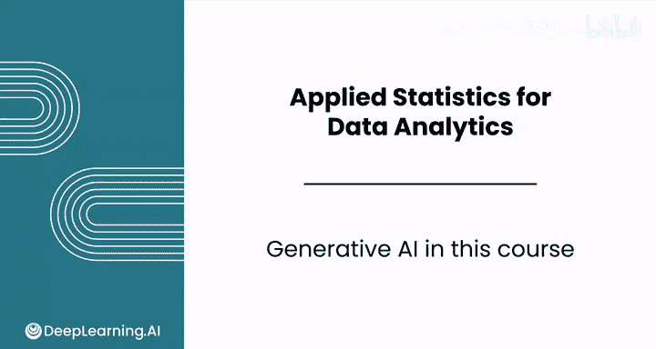
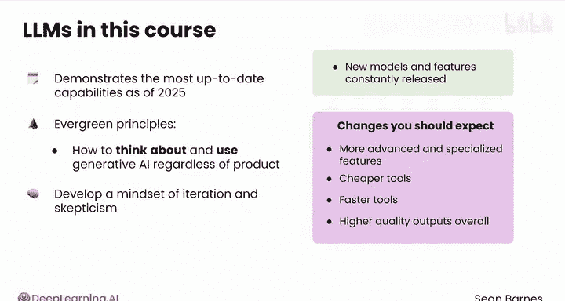
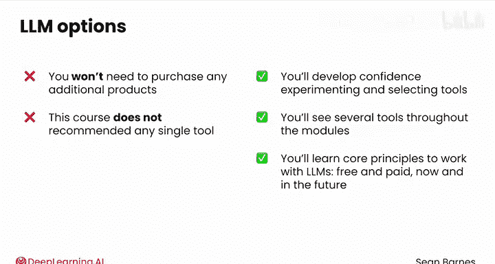

# 072：生成式AI导论 🧠

在本节课中，我们将要学习生成式人工智能（特别是大型语言模型）在本课程中的核心作用、应用方式以及学习哲学。我们将了解如何利用这些工具提升数据分析工作的效率，并建立正确使用它们的心智模型。

---

本课程的一个关键要素是学习使用生成式人工智能，特别是像ChatGPT、Claude、Gemini等大型语言模型。

有效使用这些大型语言模型将帮助你简化工作流程，并在工作中脱颖而出。

在本课程中，你将学习如何使用大型语言模型来排查电子表格错误、创建自定义条件格式、设计和运行模拟实验、解读推断性统计结果，并让其为你运行统计分析。

你还将探索大型语言模型的关键局限性，学习何时为特定任务选择大型语言模型，以及何时使用其他工具（如电子表格）。

大型语言模型在不断发展，这给教学和学习都带来了挑战。我想借此机会分享我们团队关于本课程中生成式人工智能的教学理念。

首先，本课程展示了截至2025年的最新技术能力，我们预计在未来数月和数年内会有更多变化。

本课程旨在传授经久不衰的核心原则，即如何在工作中思考和使用生成式人工智能，无论你使用哪个具体产品。

你将培养一种迭代和审慎的思维模式。新的模型和功能在不断发布。

以下是你在近期应该预期到的一些变化。

以下是近期可能出现的变化趋势：
*   **更先进和专业的生成式AI工具**：例如能够替你操作应用程序的工具。
*   **更便宜的工具**：使用成本有望降低。
*   **更快的工具**：处理速度将不断提升。
*   **更高质量的输出**：整体输出效果会越来越好。

跟上这个领域的快速发展是具有挑战性的。但请放心，在本课程中，你将发展出必要的元认知技能，以驾驭这些技术进步并将其应用于你的工作。

本课程也会展示一些大型语言模型的付费功能，但你无需购买任何额外的产品来完成课程作业。

让你了解现有的选项（包括付费选项）非常重要，这样你才能在工作中充满信心地进行实验，并选择最适合的工具。

作为一名数据分析师，本课程不推荐任何单一的工具。你将在各个模块中看到多种工具。请记住，你将学到的核心原则将使你做好准备，无论是现在还是将来，都能自如地运用各种免费和付费的大型语言模型。

你将在本模块的第三课中首次接触到大型语言模型的演示和动手实验。

现在，请和我一起观看下一个视频，了解本模块所有令人兴奋的主题。我们视频中见。

---

本节课中，我们一起学习了生成式AI在本课程中的定位、其核心应用场景（如排查错误、运行分析），以及面对技术快速迭代时应持有的迭代与审慎思维。我们明确了课程目标是掌握**经久不衰的使用原则**，而非特定工具，为后续的实际操作打下了坚实的基础。