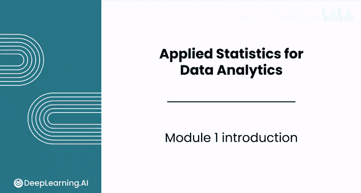
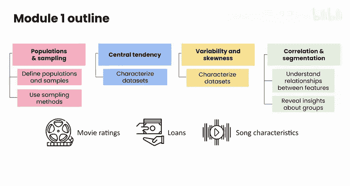

# 073：数据分析应用统计学基础 🧮

## 概述

在本节课中，我们将要学习数据分析应用统计学的基础知识。我们将探索构成严谨统计分析的核心概念，包括如何定义总体与样本、描述数据集的集中趋势与变异性，以及理解特征间的关系。这些技能是数据分析师职业生涯的基石。

---

## 模块一：简介

欢迎来到数据分析应用统计学的第一个模块。

在整个课程中，你将学习作为数据分析职业基础的核心统计概念、分析方法和可视化技术。

上一节我们介绍了课程的整体目标，本节中我们来看看本模块的具体学习内容。

在本模块中，你将探索构成严谨统计分析的基本组成部分。

以下是本模块你将学习到的核心技能：

*   学习如何定义**总体**、**样本**和**抽样方法**。
*   使用**集中趋势**、**变异性**和**偏度**的度量来描述数据集的特征。
*   使用**相关性**来理解特征之间的关系。
*   运用**细分**方法来揭示数据中不同群体的洞察。

你将把这些概念应用到现实世界的场景中，例如分析电影评分、识别最盈利的贷款以及分析歌曲特征。

此外，你将通过电子表格工具进行动手实践，基于在《数据分析基础》课程中已学到的技能，使你的分析更加高效。

无论你是统计学的新手，还是希望复习相关技能，本模块都将为你提供强大的技术，以从数据中提取有意义的洞察。

到本模块结束时，你将在数据分析师职业生涯中实施统计分析时感到更加自信和有能力。

---

## 总结

本节课中我们一起学习了数据分析应用统计学模块一的简介。我们明确了本模块的学习目标，即掌握定义数据、描述数据特征、分析关系以及进行数据细分的基础统计技能，并将在后续课程中通过实际案例和工具练习来巩固这些知识。

请与我一起进入下一个视频，正式开始学习。