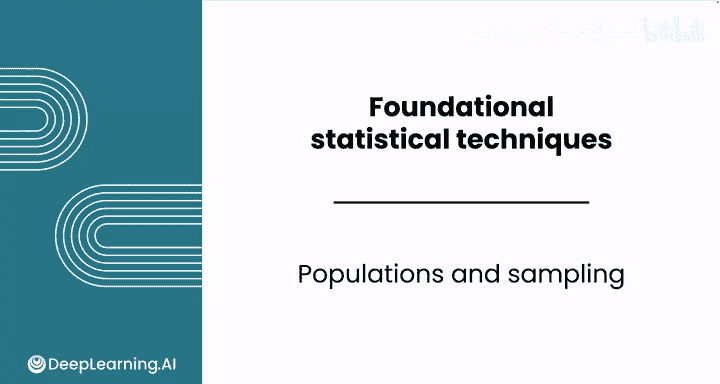
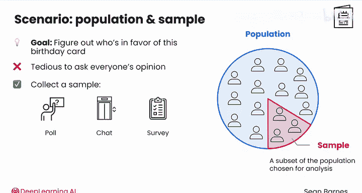
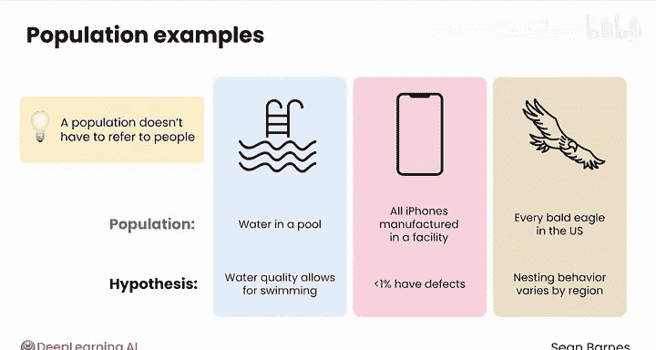
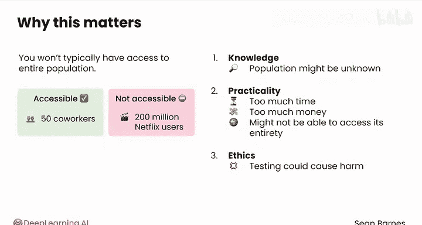
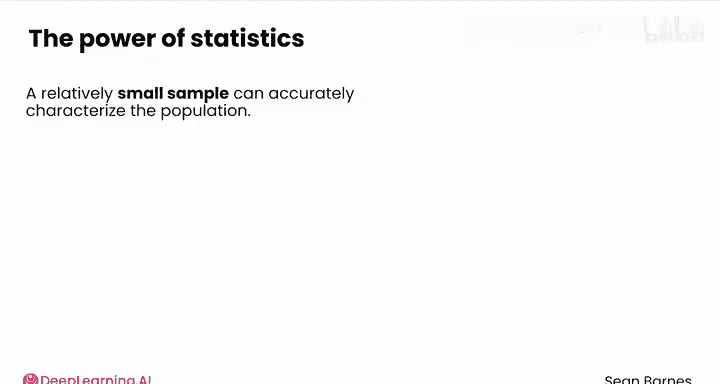
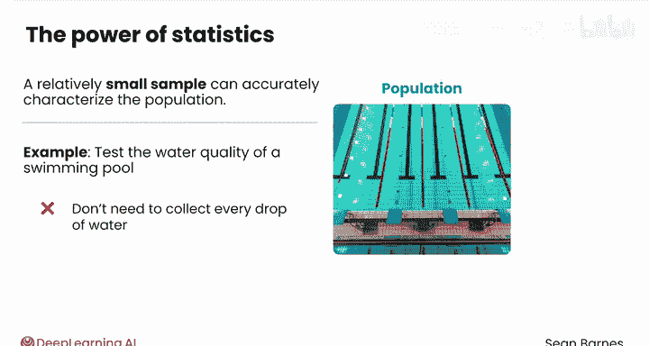
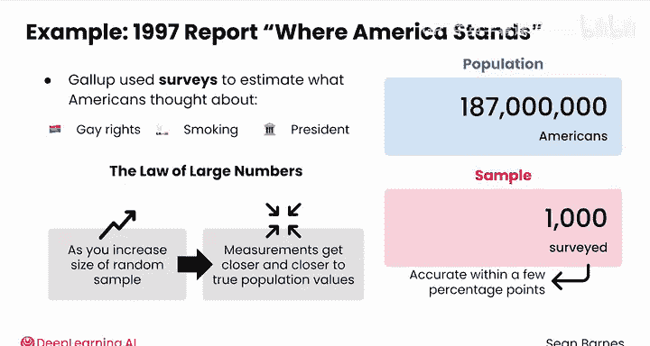

# 074：总体与抽样 📊

在本节课中，我们将学习数据分析的两个核心概念：**总体**与**抽样**。理解这两个概念是进行任何数据分析的基础。

---

假设你在一家拥有50名员工的小公司工作，你想发起一个有趣的新生日传统：让公司的每个人发送一张电子生日贺卡。

你有一个假设：公司的大多数同事会支持这个想法。但如何验证这个假设是否正确？你可以询问几位同事。你试图通过询问少数人来验证关于所有人的假设。

换句话说，你正在从**总体**中抽取一个**样本**。总体和样本这两个定义，几乎构成了你作为数据分析师将要进行的每一项分析的基础。

## 定义总体与样本

上一节我们引出了总体和样本的概念，本节中我们来更精确地定义它们。

*   **总体**：是你所持有假设的**所有**个体或观察对象的集合。
*   **样本**：是从总体中**选取**出来用于分析的子集。

在生日贺卡的例子中，你假设大多数同事会支持发送电子贺卡。因此，**总体**就是你公司的所有员工。这是新传统将影响的人群。

以下是一些不属于此总体的人群示例：
*   公司的客户
*   你的家人

他们的意见最终不会影响决策。

## 为何使用样本？

你想弄清楚谁支持、谁反对生日贺卡的想法。逐一当面询问每个人的意见会很繁琐。因此，你可以收集一个**样本**。

样本是你为分析而选择的总体子集。有许多方法可以对这个总体进行抽样，例如：
*   会议投票
*   电梯闲聊
*   问卷调查

这些样本中的每一个都只是总体的一个切片。假设你最终询问了10个人，其中9人喜欢这个主意。这是一个相当好的迹象，表明这个想法可能行得通。

## 总体的多样性

需要注意的是，总体不一定指人。总体可以是：
*   游泳池里的水（如果你的假设是水质适合游泳）
*   某个工厂生产的所有iPhone（如果你的假设是生产缺陷率低于1%）
*   美国的每一只白头海雕（如果你的假设是它们的筑巢行为因地区而异）

## 为何不总是调查总体？

总体与样本的区分很重要，因为你通常无法接触到整个总体。对于50名同事，你或许能得到所有人的回复；但要调查每一位Netflix用户（超过2亿），则几乎不可能。

大多数总体无法或不应被完全调查，主要有三个关键原因：
1.  **认知局限**：总体可能未知。例如，在政治民调中，你可以调查所谓的“可能投票者”，但你最终并不知道谁会真正去投票。
2.  **实际限制**：接触整个总体可能耗时过长、花费过高，或者你根本无法接触到其全部。例如，你可能想测试工厂生产的每一部iPhone，但这可能会给每部手机的生产增加一小时。
3.  **伦理考量**：例如，如果你想知道某种水果对狗是否有毒，测试这个想法可能会造成伤害。

## 抽样的力量

好消息是，通过统计学的力量，即使是一个相对较小的样本（如果收集得当），也能准确地描述总体特征。

例如，你想测试游泳池的水质。你不需要收集每一滴水。即使对于一个奥运会规格的游泳池，500毫升（大约一瓶水的量）也足够了。

1997年，民意调查公司盖洛普发布了一份名为《美国立场》的报告。盖洛普使用调查来估计当时所有1.87亿美国人对数百个议题（如同性恋权利、吸烟、总统）的看法。

你认为他们调查了多少人来获得对所有1.87亿美国人的准确答案？答案是：**1000人**。这就足够了。

这种令人惊讶的有效性源于**随机抽样**和统计理论的力量，特别是被称为**大数定律**的概念。

该定律指出，随着你**增加随机样本的容量**，从该样本中得到的测量值会**越来越接近**如果你能测量整个总体将会得到的真实值。

但大数定律存在**收益递减**效应。从100人增加到200人，准确性会大幅提升；但从2000人增加到2100人，几乎没有什么差别。如果操作正确，1000人的样本可以提供与真实值相差仅在几个百分点以内的准确结果。

## 总结与展望

本节课中我们一起学习了：
*   **总体**是你感兴趣的全部对象集合。
*   **样本**是从总体中选取的子集，用于进行分析。
*   由于认知、实际和伦理限制，我们通常无法研究整个总体。
*   通过**随机抽样**和**大数定律**，一个精心选取的较小样本可以有效地推断总体特征。

可以将总体视为**真相**——世界真实的样子。在你的50名同事中，确实有一定数量的人支持发送生日贺卡。你的样本是窥视那个真相的一扇窗。你询问了10位同事，其中9人支持。这暗示了大家可能怎么想，但它不是完整的真相。

在下一个视频中，我们将一起学习如何确定你想要研究的总体。