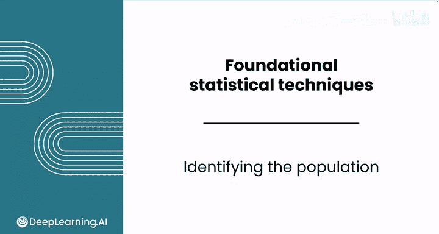
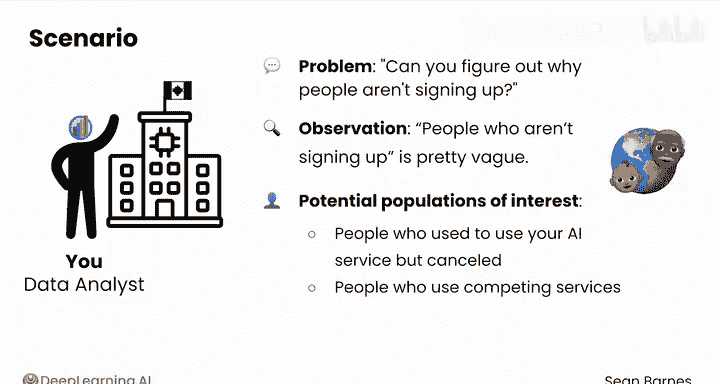
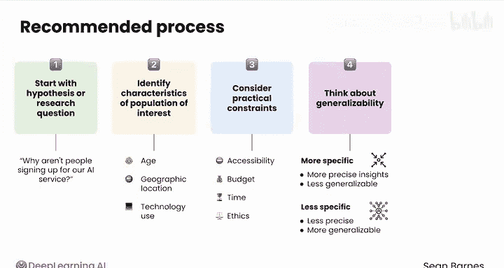

# 075：识别总体 🎯

在本节课中，我们将学习数据分析中的一个关键初始步骤：如何清晰定义和识别你的研究总体。明确总体是确保后续数据收集和分析有效性的基础。

## 概述

在收集样本之前，你需要明确你试图从中取样的对象是什么。这听起来可能有些抽象，但核心思想是：分析不同的总体可以为你带来不同的洞察。

## 为何识别总体至关重要？🤔

让我们通过一个例子来探索。假设你是一家在加拿大开发AI服务公司的数据分析师。

你的老板向你提出了一个问题。她说我们需要增加用户基数。你能找出人们不注册的原因吗？你当然会说，可以。

然而，在深入审视这个问题时，你会发现“不注册的人”这个描述非常模糊。每个不使用你服务的人构成了一个庞大的群体，涵盖了全球数亿人，从婴儿到祖父母。

或者，你可能感兴趣的是那些曾经使用过你的AI服务但取消了的人。又或许，你想专注于那些使用竞争对手服务的用户。

**每一种不同的总体定义，都将导向截然不同的分析洞察。** 如果你关注前用户，你可能会了解到关于用户留存的信息。如果你转而研究竞争对手的用户，你可能会更好地理解你缺失了哪些功能。

## 如何定义你的总体？📝

以下是一个你可以使用的流程，用于明确你的相关总体。

1.  **从假设或研究问题出发。**
    在本案例中，问题可能是：“为什么人们不注册我们的AI服务？”

2.  **识别定义你感兴趣总体的关键特征。**
    对于一个AI服务，这可能包括诸如年龄（我们对所有年龄段感兴趣，还是仅针对特定人群？）、地理位置（我们是进行全球研究，还是仅关注特定市场？）以及技术使用情况（我们是否只关注已经使用其他AI服务的人？）等因素。

3.  **考虑实际限制。**
    虽然理想情况下你可能希望收集整个总体的数据，但这通常不可行。你可能需要根据可及性、预算、时间或伦理限制来限定你的总体范围。

4.  **思考结论的可推广性。**
    这意味着你希望你的结论具有多广泛的适用性。你的总体定义越具体，你的洞察可能越精确，但将其推广到其他群体的可能性就越小。一个不那么具体的总体则会导致不那么精确但更具可推广性的结果。

5.  **与相关方协商。**
    确保你定义的总体与业务目标保持一致。将此步骤放在最后，以便你可以提出一个具体的想法供审查。

通过遵循此流程，你和你的相关方可能会将总体定义为：**在加拿大，年龄18至49岁，目前使用至少一项AI服务（但不包括我们的服务）的成年互联网用户。**

这个清晰定义的总体可以指导从抽样方法到结果解读的一切后续工作。

## 总结与过渡

现在，你已经了解了如何识别你的总体。但正如你所知，你不太可能获得全部数据。有许多方法可以对你的总体进行抽样。

在下一节视频中，我们将一起看看抽样中的“黄金标准”：概率抽样方法。