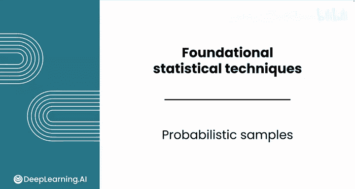
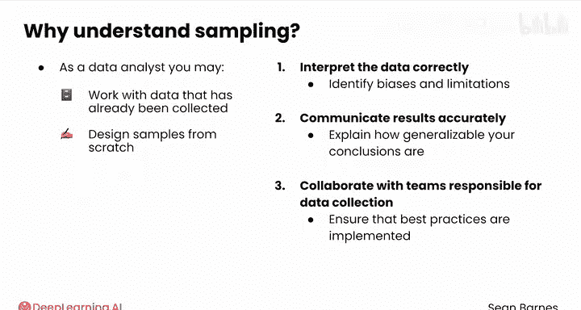
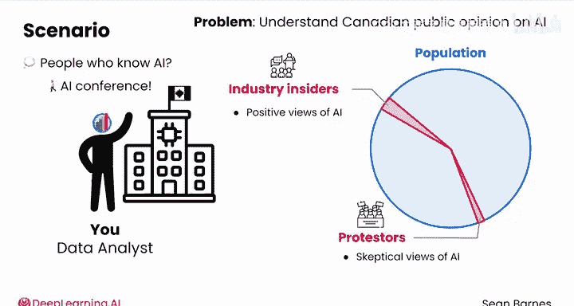
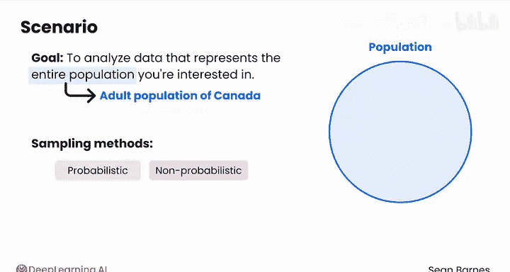
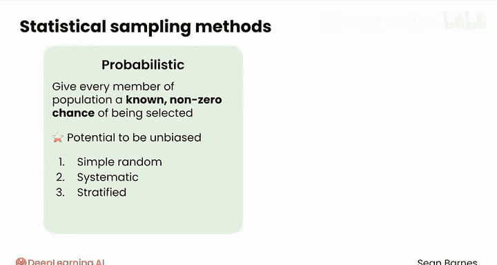
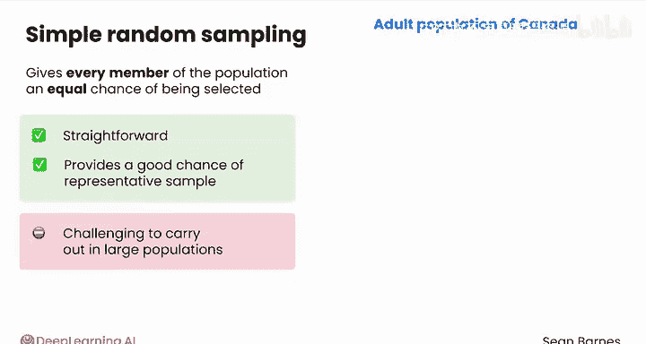
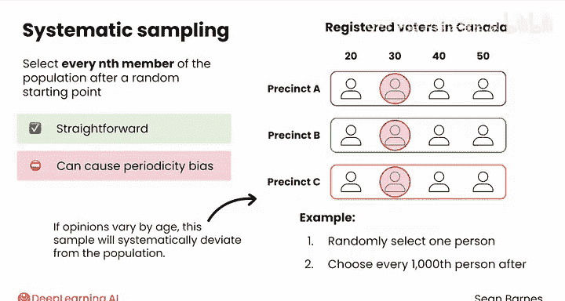
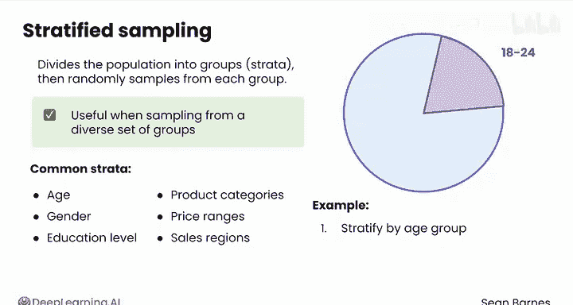
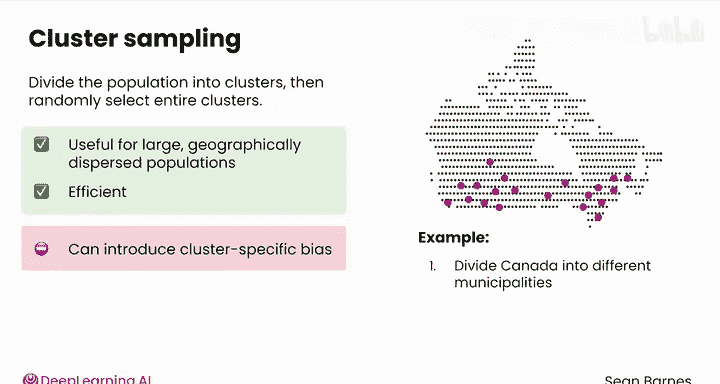

# 076：概率抽样方法



在本节课中，我们将学习数据分析中一个至关重要的技能——抽样。抽样是从总体中选取一部分个体进行研究的过程，它帮助我们以较低的成本和较高的效率了解总体特征。然而，抽样方法的选择直接影响结果的代表性和准确性。本节将重点介绍四种核心的概率抽样方法。

---

## 抽样为何重要

作为数据分析师，根据团队规模，你可能需要处理已收集的数据，也可能需要从头设计一个样本。无论如何，理解抽样原理都至关重要，原因如下：

首先，理解抽样能帮助你正确解读数据，识别数据中潜在的偏见和局限性。其次，它能让你准确地传达你的结果。具体来说，你将能够解释你的结论有多大的**可推广性**，即它们能在多大程度上准确地反映你所研究的总体。最后，你还能与负责数据收集的团队有效协作，确保最佳实践得以实施。

让我们通过一个例子来探索抽样。假设你在加拿大一家人工智能公司工作，你的CEO向你提出了一个新问题：她希望了解加拿大公众对人工智能的看法，以指导公司的战略规划。你会如何收集这些数据？

---

## 一个抽样案例



你的第一反应可能是去寻找了解人工智能的人。于是你前往一个人工智能会议，在那里你遇到了许多热情的业内人士。

你采访了100名与会者，其中95人对人工智能表达了极为积极的看法。前景似乎一片光明。

然而，当你离开会场时，你注意到外面有一群抗议者。他们的标语展示了对人工智能潜在负面影响的担忧。你采访了其中的50人，几乎所有人都对人工智能持怀疑态度。

你记录下了两种截然不同的观点，但这两个群体中的任何一个能准确代表公众对人工智能的整体看法吗？很可能不能。这些都是样本，但它们并不是很好的样本。

作为一名数据分析师，你的目标是分析能够代表你所关注的**整个总体**的数据。在这个案例中，总体是加拿大的成年人口，而不仅仅是那些积极的支持者或反对者。统计学对于如何做到这一点有很多论述，所以让我们来讨论一些具体的抽样方法。

---

## 抽样方法的两大类别

抽样方法主要分为两大类：**概率抽样**和**非概率抽样**。本节我们先来看概率抽样方法。





概率抽样方法赋予总体中的**每一个成员**一个已知的、非零的被选中进入样本的机会。这些方法有潜力做到**无偏**，这意味着你的样本能够真实地代表总体。这正是你的目标。

以下是四种最重要的概率抽样方法。

---

## 四种核心概率抽样方法

以下是四种核心的概率抽样方法，每种方法都有其特定的应用场景和优缺点。

### 1. 简单随机抽样
这种方法给予总体中每个成员**同等的**被选中机会。它简单直接，有较大机会获得一个具有代表性的样本，但在大规模总体中实施起来可能具有挑战性。

**公式/代码示例：**
假设总体有N个个体，要抽取n个样本。
```python
# 伪代码示例：从1到N中随机抽取n个不重复的数字
import random
sample_indices = random.sample(range(1, N+1), n)
```



在人工智能意见调查的例子中，一个简单随机样本可以这样操作：给每个加拿大成年人分配一个从1到约3000万（加拿大总人口）的编号，然后随机抽取1000个编号。接着，你可以打电话给每个被抽中编号的人，询问他们对人工智能的看法。这听起来很困难，对吗？并非每个加拿大人都有电话号码，而且这种方式拨打大量电话可能成本高昂。



### 2. 系统抽样
在系统抽样中，你从一个随机起点开始，然后**有规律地**选择总体中的成员（例如，每第k个成员）。

**公式/代码示例：**
抽样间隔 `k = N / n`（取整）。随机起点 `start = random.randint(1, k)`，然后选择 `start, start+k, start+2k, ...` 的个体。
```python
import random
k = N // n
start = random.randint(1, k)
sample_indices = [start + i*k for i in range(n) if (start + i*k) <= N]
```

例如，你可能有一份加拿大所有注册选民的名单。随机选择一个人，然后选择名单上在他之后的每第1000个人。这种方法很直接，但如果你的名单中存在某种**周期性模式**，则可能导致周期性偏差。例如，如果选民按选区排序，然后在选区内按年龄排序，那么抽样可能只选中年龄相似的人。如果对人工智能的看法因年龄而异，这个样本就会系统性地偏离总体。

### 3. 分层抽样
这种方法根据**共享的特征**将总体划分为不同的组或“层”，然后在每个层内进行随机抽样。当你希望确保从多样化的群体中抽样时，这种方法非常有用。

**公式/代码示例：**
假设将总体分为L层，第i层有 `N_i` 个个体。决定从每层抽取 `n_i` 个样本（通常按比例分配）。
```python
# 假设 strata 是一个字典，键为层标识，值为该层所有个体的ID列表
samples = {}
for stratum, population_list in strata.items():
    samples[stratum] = random.sample(population_list, n_i)
```

常见的分层依据包括：对于人，可以是年龄、性别、教育水平；对于产品，可以是产品类别、价格区间、销售区域。在人工智能的例子中，你可以按年龄组（18-24岁、25-29岁等）进行分层，然后从每个年龄组中抽取10个人。

### 4. 整群抽样
这种方法适用于**大规模、地理上分散**的总体。你将总体划分为多个“群”（通常是按地理区域划分），然后随机选择整个群。





**公式/代码示例：**
假设总体被划分为C个群。随机选择c个群，然后调查这些被选中群内的所有个体或再进行二次抽样。
```python
clusters = [cluster_1, cluster_2, ..., cluster_C] # 每个元素是一个群的个体列表
selected_clusters = random.sample(clusters, c)
sample = []
for cluster in selected_clusters:
    # 可以调查整个群，或在群内再随机抽样
    sample.extend(random.sample(cluster, samples_per_cluster))
```

在人工智能的例子中，你可以将加拿大划分为不同的市镇，然后随机选择其中的10个作为你的样本群。你将派遣团队到每个被选中的市镇内随机采访一些人。你可以看到，与随机抽样每一个可能住在国家最偏远角落的加拿大成年人相比，只派遣团队去10个地区会容易得多。

---

## 本节总结



本节课我们一起学习了数据分析的基础——概率抽样。我们首先理解了抽样对于正确解读数据、传达结果和指导数据收集的重要性。接着，通过一个调查加拿大公众对AI看法的案例，我们引出了核心的四种概率抽样方法：**简单随机抽样**、**系统抽样**、**分层抽样**和**整群抽样**。每种方法都有其独特的操作方式、适用场景以及需要注意的潜在偏差。

掌握这些方法，是确保你的数据分析工作建立在具有代表性样本基础上的第一步。在下一节中，我们将继续探讨另一大类抽样方法——非概率抽样。