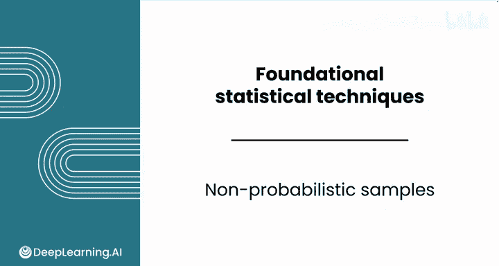
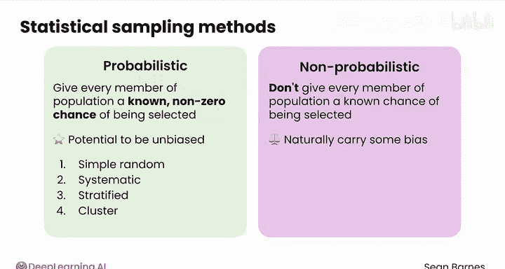
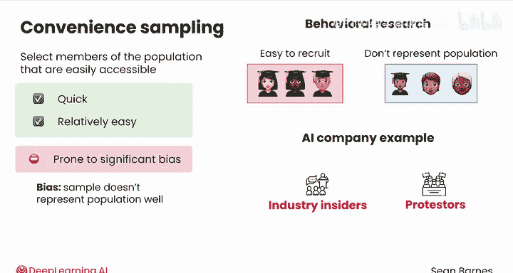
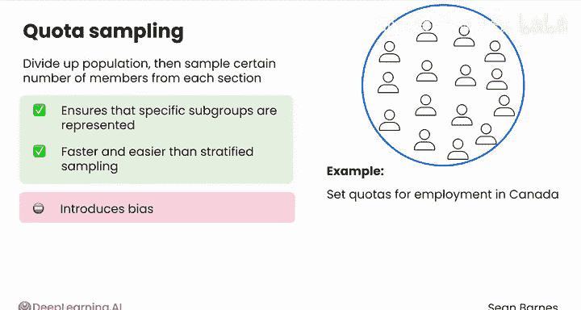
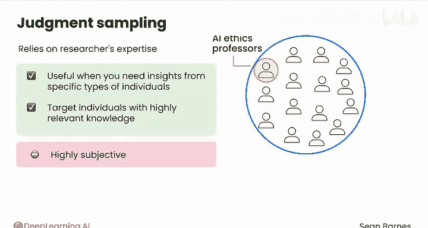
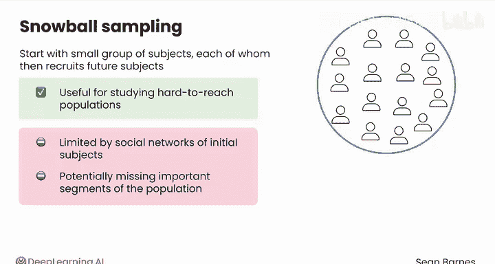

# 077：非概率抽样 📊

在本节课中，我们将要学习非概率抽样的概念、常见方法及其优缺点。当预算、时间或人力限制使得概率抽样不可行时，非概率抽样是一种实用的替代方案。

非概率抽样通常不如概率抽样严谨，但执行起来往往更实际。非概率抽样方法不会给予总体中的每个成员一个已知的被选中机会。这些方法通常源于实际限制，并且天然带有一定的偏差。

以下是数据分析师需要了解的几种核心非概率抽样方法：方便抽样、配额抽样、判断抽样和滚雪球抽样。

## 方便抽样 🏃‍♂️

在方便抽样中，你选择总体中容易接触到的成员。其优点是快速且相对容易执行。然而，它容易产生显著的偏差。偏差意味着你的样本不能代表总体。一个常被引用的方便抽样例子是行为研究，因为许多研究者在大学工作，他们可以轻松招募学生来完成实验，但这些学生并不能很好地代表整体人口。例如，他们通常比平均年龄更年轻。

在上一视频的AI公司例子中，仅调查一个会议的参与者和抗议者就是一种方便抽样，因为它只涉及一个地点。

## 配额抽样 📊

配额抽样根据某些特征将总体划分成不同部分，然后从每个部分抽取一定数量的成员。你可以将其视为分层抽样的非概率版本。它通常用于确保特定的亚群体得到代表。与方便抽样类似，它比分层抽样更快、更容易，但会引入偏差。

在AI公司的例子中，你可能会设定配额以匹配加拿大的就业人口统计数据，其就业率为87%。因此，你可能会采访87名就业者和13名非就业者。但如果没有随机抽样，采访者可能会根据他们的选择无意中使结果产生偏差。

## 判断抽样 🧠

判断抽样依赖于研究者的专业知识来选择样本。当你需要从特定类型的个体那里获得见解时，这种方法可能很有用。其好处是你可以针对具有高度相关知识的人。缺点是它非常主观。

对于AI公司，使用判断抽样可能意味着特意选择采访AI伦理学教授、科技记者和政策制定者，基于他们的观点特别有价值的信念。

## 滚雪球抽样 ⛄

滚雪球抽样从一小群受试者开始，每个受试者再从他们的朋友、家人和同事中招募未来的受试者。你的样本量会像滚雪球一样增长。这种方法对于研究难以接触的群体特别有用。

例如，无证移民可能很难找到进行采访，但你可以从几个联系人开始，然后由他们转介其社区中的其他人。其主要缺点是，你的样本仅限于初始受试者的社交网络，可能会遗漏总体中的重要部分。

在AI公司的例子中，滚雪球抽样可用于研究那些选择不使用AI工具的人的观点。你可以从几个这样的个体开始，并请他们转介其他有相同习惯的人。

## 总结与预告 📝

本节课中我们一起学习了四种主要的非概率抽样方法：方便抽样、配额抽样、判断抽样和滚雪球抽样。我们了解了每种方法的操作方式、适用场景及其固有的偏差风险。

你已经多次听到“偏差”这个术语。它是抽样中最大的问题之一。在下一个视频中，你将探索几种常见的偏差类型以及如何减轻它们。我们下节课见。