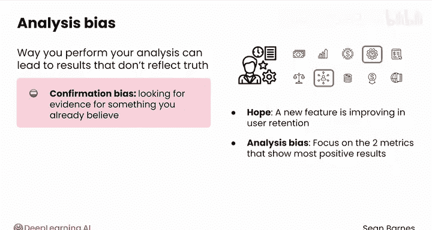

# 078：偏差类型 🎯

在本节课中，我们将要学习数据分析中一个至关重要的概念：**偏差**。偏差会导致样本无法准确代表总体，进而影响分析结果的可靠性。我们将系统地介绍偏差的定义、主要类型以及如何在实际工作中识别和减轻它们的影响。

---

## 什么是抽样偏差？

当你的样本不能很好地代表你感兴趣的总体时，就会发生抽样偏差。

这与偏见会负面影响人与人之间的互动类似，抽样中的偏差同样会导致糟糕的决策。让我们看看它是如何发生的。

偏差在抽样中的一个正式定义是：**样本与总体之间存在系统性差异，这种差异造成了现实情况的不准确描绘**。

这里的“系统性”非常重要。它意味着问题以一种可预测的、很可能可以预防的方式发生。

例如，如果你随机采访加拿大人对人工智能的看法，其中一个人碰巧比普通人回答得更积极，这只是一种正常的随机现象。你预期观点会存在一些差异。

相比之下，如果你前往一个满是人工智能研究人员的会议，你有理由相信这些人中的大多数会比普通加拿大人更看好人工智能。这就是一种系统性偏差。

偏差通常是偏离概率抽样方法的结果。

---

## 主要偏差类型

上一节我们介绍了偏差的基本概念，本节中我们来看看偏差的几种主要类型：**抽样偏差、测量偏差、应答偏差和分析偏差**。

抽样偏差出现在研究者决定如何对总体进行抽样时。测量偏差和应答偏差发生在数据收集过程中。而分析偏差则出现在寻找洞察的阶段。

以下是几种关键的偏差类型：

### 抽样偏差

抽样偏差非常常见，它发生在样本不能准确代表目标总体时。

如果一位研究员在人工智能会议上采访与会者以及场外的抗议者，就会遇到这种偏差。这两个极端群体不太可能充分代表大多数加拿大人的观点。

**选择偏差**是抽样偏差的一种常见形式。当样本以非随机方式选择，导致样本与目标总体不匹配时，就会发生选择偏差。结果，总体中的某些群体在样本中被**过度代表**或**代表不足**。

在人工智能会议的例子中，强烈的支持者和严厉的批评者被过度代表，而对人工智能不太熟悉的人则代表不足。

**避免选择偏差的方法**：
*   使用概率抽样方法。
*   避免对任何特定群体进行过度抽样或抽样不足。
*   同时，应透明说明你的样本可能存在的局限性。如果你知道样本引入了选择偏差，请解释这种偏差如何影响你的结论。

**无应答偏差**是另一种常见的抽样偏差类型，在人员样本中很常见。

例如，智能手机应用可能会在用户使用一段时间后请求用户评分，但用户可以忽略通知而不是真正去评分。因此，留下评论的人并非一个随机样本，他们通常对应用持积极看法，因为他们愿意接受提示并投入时间撰写评论。

**应对无应答偏差的方法**：
*   考虑发送后续提醒。
*   甚至可以提供小额激励以鼓励参与。

---

### 测量与应答偏差

在收集数据时，我们可能会遇到测量偏差和应答偏差。

**测量偏差**主要有两种类型。第一种是**工具偏差**，它源于设备故障或调查问卷设计不佳。

例如，2020年，Fitbit因其部分智能手表的心率传感器问题而免费更换。但工具偏差也可能像提出“你同意菠萝属于披萨吗？”这样的诱导性问题一样简单。

**避免测量偏差的方法**：
*   确保使用高质量的工具和措辞得当的调查问卷。
*   如果可能，进行多次测量。

另一种测量偏差是**观察者偏差**。当进行测量的人让自己的期望影响他们所看到的事物时，就会发生这种偏差。

例如，假设你的公司正在为其一款应用推出深色模式。如果你作为一名数据分析师，期望这个功能获得好评，那么当你采访用户样本时，你可能会不自觉地关注他们的正面反馈。

**应对观察者偏差的方法**：
*   如果可能，尝试让多个人进行测量。

**应答偏差**通常出现在人员样本中。本质上，人们在回答问题时可能不会完全坦诚。

像“你赚多少钱？”或“你上次把薯条蘸蛋黄酱是什么时候？”这样的问题，即使在匿名调查中，也可能引发不真实的回答。

**减轻应答偏差的方法**：
*   可以尝试强调诚实回答的重要性。
*   或者将问题设计得尽可能客观。

---

### 分析偏差

你已经对总体进行了抽样并收集了数据，但产生偏差的可能性并未结束。如果不小心，你进行分析的方式也可能导致结果不能反映真相。

最大的陷阱是**确认偏差**：寻找证据来支持你已经相信的事情，而不是客观地看待所有证据。

例如，产品经理可能希望一个新功能正在提高用户留存率。他们可能承受着一些压力，需要证明这个功能值得开发。他们可能分析了10个指标，但选择只关注显示最积极结果的那两个。

当然，拥有一个假设或目标是完全可以的，但要保持开放的心态，让数据自己说话，即使它讲述的不是你希望听到的故事。

---

## 总结与展望

本节课中我们一起学习了数据分析中的核心偏差类型。偏差通常无法完全避免，大多数样本都会包含一定程度的偏差。

然而，通过遵循最佳实践，在大多数情况下，你可以减轻其影响。

至此，你已学完本课的核心内容。到目前为止做得很好！你已经掌握了**总体与抽样**的核心概念，这些是所有统计学的基础。

完成本课的练习评估后，请加入下一节课，学习如何通过**集中趋势、变异性和偏度**的度量来刻画样本的特征。我们下节课见。😊