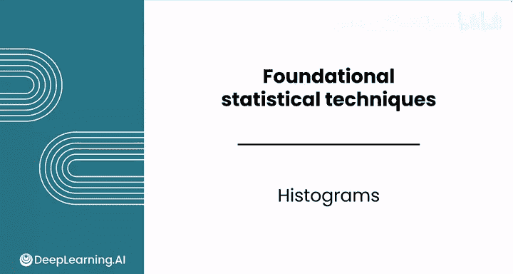
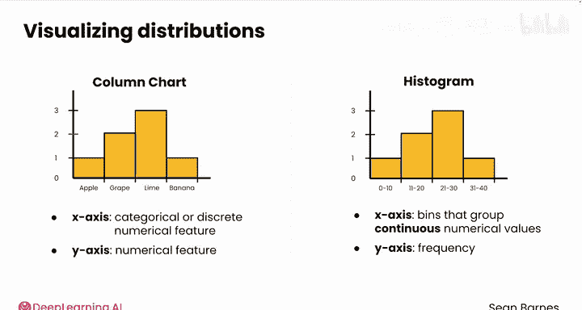
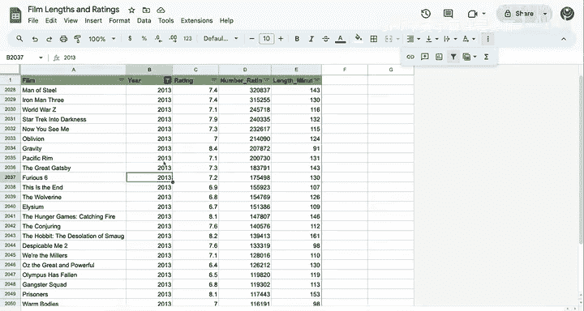
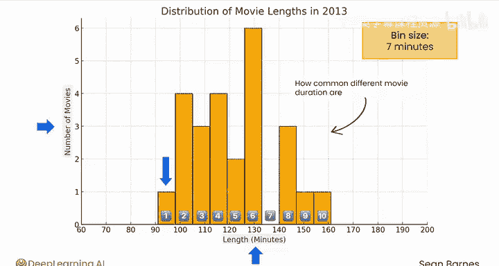
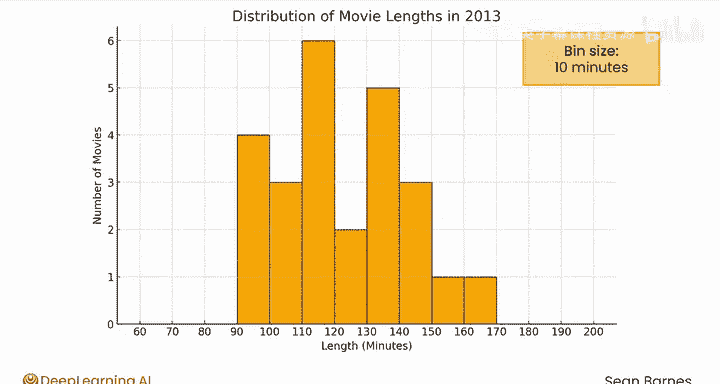
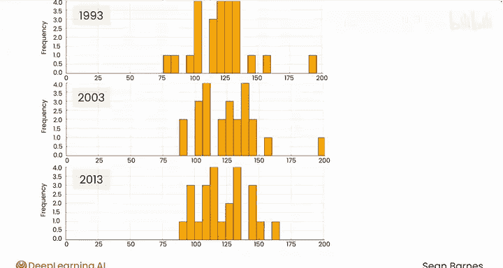

# 079：直方图 📊

在本节课中，我们将学习如何通过直方图来可视化数据的分布。直方图是一种强大的工具，能帮助我们快速理解数据集中不同数值出现的频率。

## 概述

收集样本后，通过可视化其分布来开始分析通常很有用。分布能告诉你总体或样本中不同数值出现的频率。描述性统计的核心就是刻画数据的分布特征。

## 什么是直方图？

直方图是一种用于可视化数据分布的工具。它将数值数据聚合到不同的“箱子”中，并可视化这些箱子内数值的频率。

**公式/代码表示**：`直方图 = 聚合(数值数据, 箱子) + 可视化(频率)`

箱子的目的是通过显示常见数值范围的出现情况，使整体分布更容易观察。

## 直方图与柱状图

上一节我们介绍了直方图的基本概念，本节中我们来看看它与柱状图的区别。

直方图是柱状图的一个特殊版本。
*   在柱状图中，你试图比较不同类别之间的数值特征。因此，你将**分类或离散的数值特征**放在X轴，将**数值特征**放在Y轴。
*   在直方图中，你关注的是可视化**连续数值特征**中不同值的频率。X轴上绘制的是将连续数值变量分组为类别的箱子，Y轴上是频率。

**频率**是指落入特定箱子的数据观测值的数量。Y轴有时也可能绘制观测值的**比例**，而不是原始频率。

## 实战：分析电影时长

现在，让我们用一些真实数据来实践。你是否感觉电影变得越来越长了？也许这只是我的注意力问题，但我最近多次听到这个假设。假设你想弄清楚电影的典型时长是多少，以及它们是否随着时间的推移而变长。

你抽样了2013年最受欢迎的25部电影。你可以做什么来描述这个电影时长的分布？

以下是2013年最受欢迎的25部电影的时长数据。如果你想自己探索数据，可以在视频附带的下载选项卡中找到电子表格。数据中的列包括：电影名称、上映年份（均为2013年）、评分（满分10分，来自国际电影数据库IMDB）、IMDB评分数量以及电影时长。我个人的最爱是《钢铁侠3》。

你刚刚了解到，分布代表了样本数据中数值出现的频率。你这里有一个电影样本。那么，你应该检查哪些值来回答这个问题？答案就是电影的时长。

## 解读直方图

以下是一个直方图，它可视化了不同电影时长的常见程度。X轴是电影的时长（分钟），Y轴显示具有该时长的电影数量。

请注意，时长是一个连续数值特征，它被分组为7分钟的箱子，因此这个直方图有10个箱子。任何长度在91到98分钟之间的电影都由这个柱子表示。

这是相同的数据，但这次使用的是10分钟箱宽的直方图，虽然数据的整体情况相似，但这样更容易解释。

这些箱子大小使得我们可以更容易地说出类似“大约一半的电影不到两小时”这样的结论。

请注意，箱子太少会过度简化数据，而箱子太多则难以识别任何整体模式。选择一个合适的箱子大小，要牢记优秀数据可视化的原则。

## 优秀直方图的原则

以下是创建有效直方图的一些关键原则：
*   **清晰的标签**：确保坐标轴有明确的标题。
*   **合适的刻度**：选择能清晰展示数据范围的刻度。
*   **颜色的良好运用**：使用颜色来增强可读性，而不是造成干扰。
*   **描述性标题**：为图表提供一个能概括其内容的标题。
*   **可读的字体大小**：确保你的受众能够轻松阅读所有文字。

## 比较多个分布

多个直方图也可以并排绘制，以比较不同的分布。

这里顶部是1993年电影的分布，中间是2003年，底部是2013年。它们都使用相同的箱子大小以便于比较。

关于时长随时间的变化，你能说些什么？这有点难以断定，也许有一个微小的右移，但整体看起来相当一致。不过，看看那些200分钟的电影吧！你能猜出它们是什么吗？在1993年，那是《辛德勒的名单》。在2003年，是《指环王：王者归来》。

## 总结

本节课中，我们一起学习了直方图。直方图有助于可视化连续数值特征的分布。它通过将数据分组到箱子中并显示每个箱子的频率，让我们能够快速把握数据的整体形态、中心趋势和离散程度。记住选择合适的箱子大小和遵循良好的可视化原则，是制作出清晰有效直方图的关键。