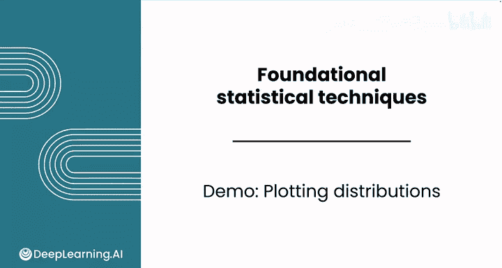
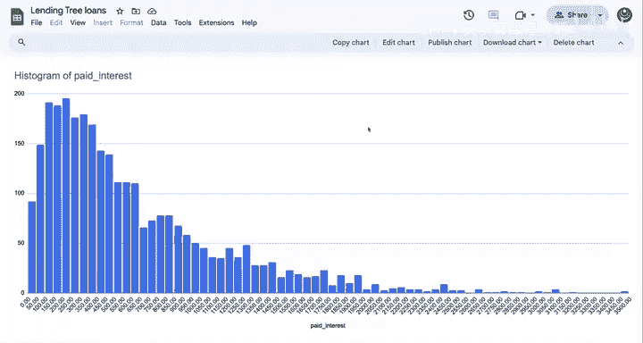
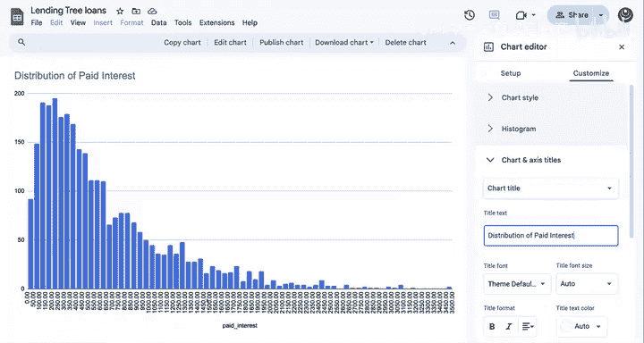
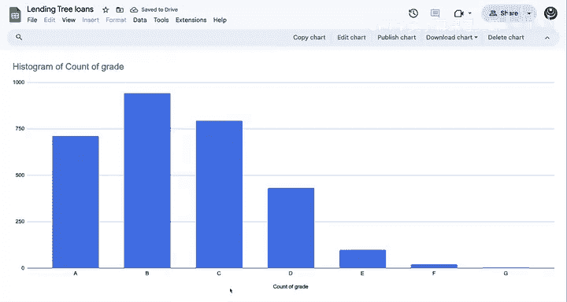
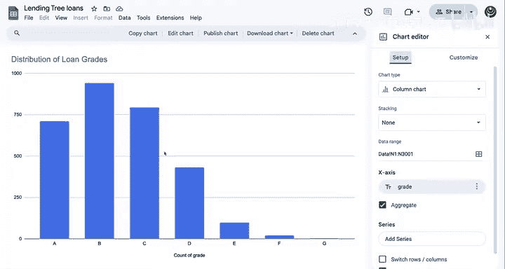

# 080：绘制分布图 📊

在本节课中，我们将学习如何使用直方图和柱状图来绘制数据的分布。我们将使用一个贷款数据集作为示例，通过可视化来理解数据的分布特征。

上一节我们介绍了如何解读直方图，本节中我们来看看如何实际绘制分布图。

本模块的演示使用LendingTree贷款数据集的一个子集。该数据集包含通过LendingTree平台发放的数千笔贷款。每一行代表一笔特定的贷款。每一列包含借款人的特征信息，例如他们的职位和年收入，以及贷款信息，例如贷款金额。

请记住，如果您想跟随演示操作，可以在下载选项卡中找到电子表格和解决方案。

假设您正在考虑成为该平台的贷款人。在做出任何承诺之前，您希望更好地了解所涉及的风险。您可以对现有贷款进行统计分析，以尝试识别每笔贷款的风险水平以及哪些因素似乎会影响风险。作为潜在的贷款人，您可能对“已付利息”这一列（P列）感兴趣。这个特征本质上代表了贷款人赚取的金额。

现在，让我们创建一个直方图来可视化这个特征的分布。

图表默认显示为直方图，因此您无需将其更改为其他图表类型。

如果您想自定义条形宽度，可以按照以下步骤操作：选择“自定义”选项卡，然后选择“直方图”。“桶大小”是您可以更改直方图中柱宽设置的地方。“桶”就是“区间”的意思。要更改桶大小，请选择下拉菜单，然后选择“50”。桶大小变小了，因此您在图表中可视化的数据具有更细的粒度。

您可能希望将此图表移动到它自己的工作表。您可能希望进一步自定义此图表，以便开发出清晰的数据可视化。

**已付利息的分布**。大多数贷款的已付利息金额在50美元到600美元之间，但您可以看到在尾部有更多高已付利息贷款的示例。

对于离散特征，您需要使用柱状图而不是直方图。您已经在数据分析基础中学过这种可视化方法。让我们看看柱状图如何显示数据的整体分布。

该数据集中存在的一个分类特征是“贷款等级”。等级是根据借款人的信用历史和其他一些因素给予每笔贷款的质量评分。作为潜在的贷款人，了解平台上好贷款和坏贷款的分布对您很有用。

现在，让我们创建一个新图表来总结这种分布。

此处的默认图表不太合理，您期望看到等级作为X轴标签，然后是每个类别的计数，但您看到的并非如此，因此您需要更改图表类型。选择一个柱状图。

请注意，X轴上的等级没有按顺序排列，这使得可视化分布变得困难，因此您可以返回您的工作表，然后添加一个筛选器。

然后将“等级”列从A到Z排序。现在您可以看到X轴标签已适当排序。

现在您可以将此图表移动到它自己的工作表。然后您可以重命名该工作表，以便跟踪您创建的图表位置。现在，再次，您可以通过更新标题来自定义此图表。

**贷款等级的分布**。现在让我们回到图表设置。

您可能会注意到“聚合”选项已被勾选。这是默认开启的，它的作用是计算数据集中每个等级的频率，而不是尝试单独显示每个值。

很好。现在您可以看到许多贷款属于较高的等级A、B和C。这可能会激励您作为投资者，但值得进一步调查这些条款。

在直方图方面做得很好。请在下一个视频中加入我，学习如何通过计算描述性统计量来补充这种可视化方法。

---

本节课中我们一起学习了如何使用直方图和柱状图来可视化数据的分布。我们了解了如何为连续变量（如已付利息）创建和自定义直方图，以及如何为分类变量（如贷款等级）创建排序清晰的柱状图。这些图表是理解数据集基本特征的重要工具。