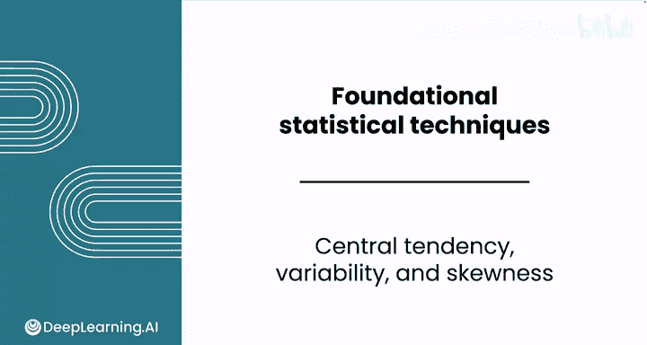
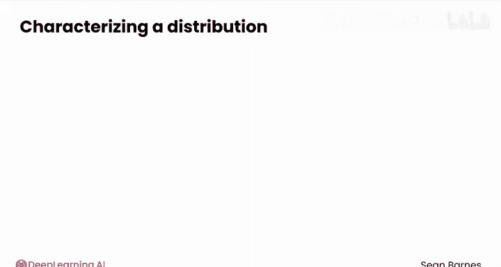
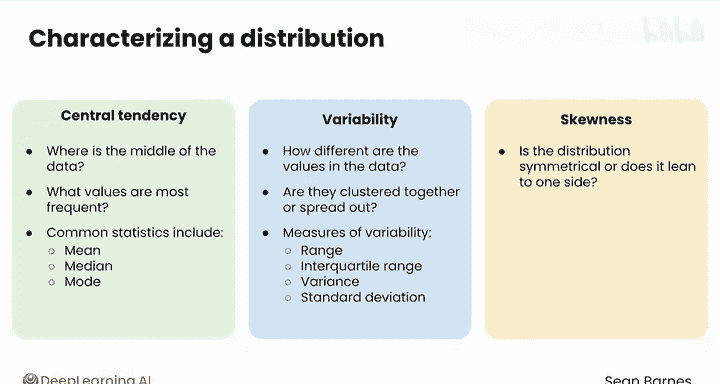
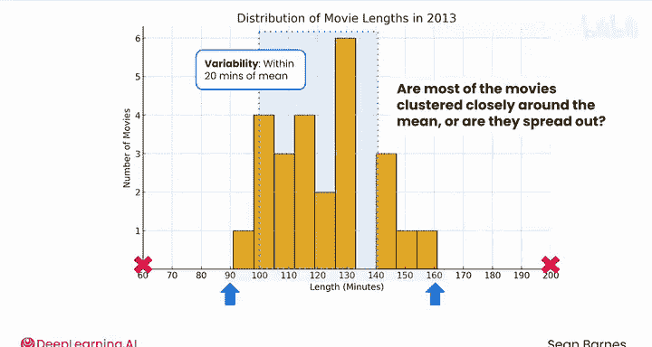
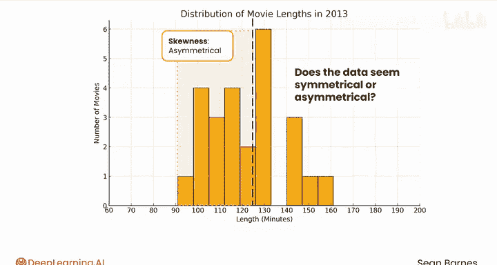

# 081：集中趋势、离散度与偏态

在本节课中，我们将学习如何描述样本数据。数据可视化之后，我们需要用统计量来刻画数据的特征。我们将重点介绍三类核心的描述性统计量：集中趋势、离散度和偏态。

***

## 📍 集中趋势：数据的中心在哪里？

上一节我们提到了描述数据的重要性，本节中我们来看看如何定位数据的“中心”。集中趋势度量的是数据的中心位置，它回答的问题是：数据的中间值在哪里？哪些值出现得最频繁？

以下是三种最常见的集中趋势统计量：

*   **均值（Mean / Average）**：所有数据点的算术平均值。
    *   **公式**：`均值 = (所有数据点之和) / (数据点数量)`
*   **中位数（Median）**：将数据从小到大排序后，位于正中间的值。
*   **众数（Mode）**：数据集中出现频率最高的值。

***

## 📏 离散度：数据是集中还是分散？

了解了数据的中心后，我们还需要知道数据围绕这个中心的分布情况。离散度度量的是数据的波动或分散程度，它回答的问题是：数据值之间的差异有多大？它们是紧密聚集在一起还是分散得很开？

以下是几种常用的离散度度量指标：

*   **极差（Range）**：最大值与最小值之差。
    *   **公式**：`极差 = 最大值 - 最小值`
*   **四分位距（Interquartile Range, IQR）**：第三四分位数与第一四分位数之差，反映了中间50%数据的分布范围。
*   **方差（Variance）**：各数据点与均值之差的平方的平均值。
*   **标准差（Standard Deviation）**：方差的平方根，是最常用的离散度度量，单位与原始数据一致。

***

## ⚖️ 偏态：数据分布对称吗？

最后，我们来观察数据分布的形状是否对称。偏态描述了数据分布不对称的方向和程度。它回答的问题是：分布是对称的，还是向某一侧倾斜？

你可以通过比较**均值**和**中位数**来近似判断偏态：
*   若均值 ≈ 中位数，分布大致对称。
*   若均值 > 中位数，分布可能**右偏**（正偏），即右侧有长尾。
*   若均值 < 中位数，分布可能**左偏**（负偏），即左侧有长尾。

此外，偏态也可以在电子表格中直接计算。

***

## 🎬 实例分析：电影时长数据

现在，让我们回到电影时长的数据实例中，直观地理解上述概念。

**对于集中趋势（均值）**：想象你要用手指尖托起这个分布图保持平衡。你需要找到数据的“质心”。在X轴上，平衡点看起来大约在120到130分钟之间。

**对于离散度**：观察电影时长在X轴上的分散情况。大部分电影时长是紧密聚集在均值附近，还是分散得很开？如果均值在120分钟左右，那么大部分电影的时长在均值左右20分钟的范围内，这大约是平均时长的六分之一，因此数据相对集中。当然，样本中也有60分钟或200分钟的电影。

**对于偏态**：这个分布看起来对称吗？如果在均值处画一条垂直中线，你会发现一些不对称性。左侧（时长较短）的电影似乎更多一些，但这种偏斜并不极端。

***

除了本节课重点讲解的这三类统计量，在数据分析基础中你还学习过其他有用的描述性统计量，例如最小值、最大值和频数，请不要忘记它们。

现在你已经对这些统计量有了直观理解，接下来我们将进入下一节视频，学习如何具体计算集中趋势的各个指标。

***

## 📝 总结

本节课中，我们一起学习了描述样本数据的三大核心统计特征：
1.  **集中趋势**（如均值、中位数、众数），用于定位数据的中心。
2.  **离散度**（如极差、方差、标准差），用于衡量数据的分散程度。
3.  **偏态**，用于判断数据分布形状的对称性。

通过电影时长数据的实例，我们直观地观察了这些统计量所代表的含义。掌握这些概念是进行深入数据分析的基础。