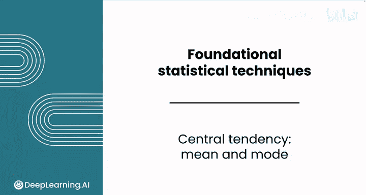
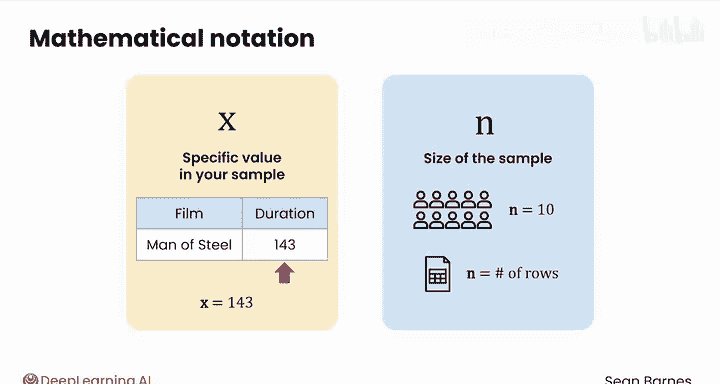
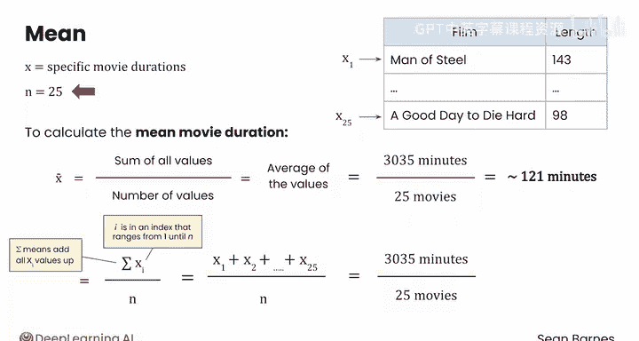
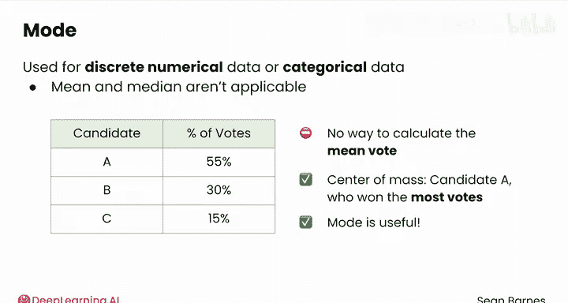

# 082：均值与众数 📊

在本节课中，我们将要学习如何衡量数据的集中趋势，特别是均值与众数这两个核心概念。集中趋势指标能帮助我们理解一组数据的典型值或中心位置。

## 数学符号简介

在深入计算之前，我们需要先了解一些统计学中常用的数学符号。这些符号能让公式适用于各种情况。

*   我们通常用小写字母 **x** 来代表样本中的一个具体数值，例如一部电影的具体时长。
*   我们使用小写字母 **n** 来代表样本的大小，即数据集中有多少个观测值。

例如，如果你采访了10个人，那么在你的样本数据集中，`n = 10`。在电子表格中，`n` 就是行的数量。

## 计算样本均值

上一节我们介绍了基本的数学符号，本节中我们来看看如何计算均值。让我们回到电影时长的例子。

你可能已经熟悉均值的计算，这里我们将用数学符号将其形式化。在这个例子中：
*   **X** 代表具体的电影时长。
*   样本大小 **n** 是 25，因为我们处理的是2013年最受欢迎的25部电影。

样本均值写作 **x̄**。均值的计算方法是：将样本中所有值相加，然后除以值的数量（即样本大小 `n`）。这个计算是对数值的平均，因此“均值”和“平均值”有时可以互换使用。

直观地说，这个过程是将所有值的总和平均分配给样本中的每一个值。所有电影的总时长为3035分钟，共有25部电影。如果这些电影时长相同，那么每部电影大约是121分钟。

使用之前介绍的符号，均值的计算公式如下：

**x̄ = (Σ x_i) / n**

其中：
*   **Σ**（希腊字母西格玛）表示求和。
*   **x_i** 代表样本中的第 `i` 个值，`i` 从1（第一个数据点）到 `n`（最后一个数据点）。
*   **n** 是样本大小。

具体到这个例子，计算过程是：`x₁ + x₂ + ... + x₂₅`，得到总和3035分钟，然后除以样本大小25，最终得到结果121.4分钟。

## 理解众数

除了均值，另一个常见的集中趋势度量是众数。众数是指样本数据中出现次数最多的值。

在2013年电影时长的例子中，实际上有两个众数：有3部电影时长为98分钟，另有3部电影时长为130分钟。对于这种连续型数值数据，众数可能不是最有用的度量。

众数更常用于离散型数值数据或分类数据，因为对于这类数据，均值和（我们将在下一节介绍的）中位数并不适用。

以下是众数适用场景的一个例子：

> 投票结果是一个很好的例子。如果有三名候选人A、B和C，分别获得55%、30%和15%的选票，我们无法计算“平均选票”。此时，众数（候选人A，因为他获得了最多选票）对于描述数据的中心就非常有用。

## 课程总结

本节课中我们一起学习了衡量数据集中趋势的两个基本工具：均值与众数。

*   我们了解了用于表示数据和样本大小的基本数学符号 **x** 和 **n**。
*   我们学习了**均值**的计算公式 **x̄ = (Σ x_i) / n**，它代表了数据的平均值。
*   我们认识了**众数**，即数据集中出现频率最高的值，并了解了它特别适用于分类数据或离散数据。

现在你已经了解了如何恰当地使用均值和众数，但还有一个有用的集中趋势度量——中位数。请跟随我到下一个视频学习如何计算中位数。