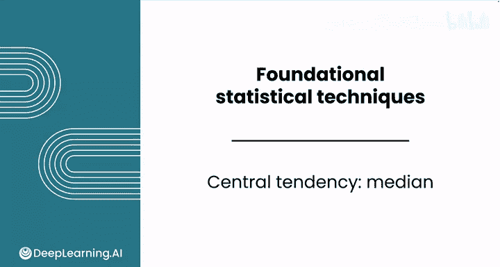
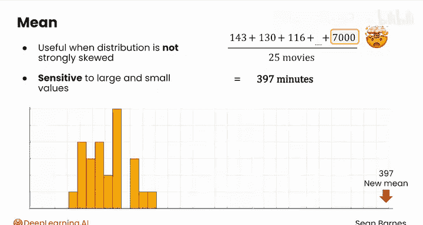
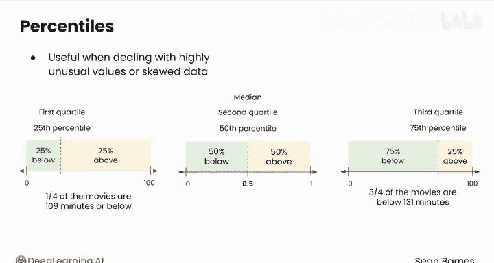

# 083：中位数

在本节课中，我们将要学习集中趋势的另一个重要度量——中位数。我们将了解中位数的定义、计算方法，以及它在处理偏斜数据或异常值时相比均值的优势。最后，我们还会探讨中位数与百分位数之间的紧密联系。

上一节我们介绍了均值和众数，本节中我们来看看中位数。

## 中位数的定义与直观理解

与均值和众数相比，中位数有一个更复杂的正式定义。目前，让我们先直观地理解它的工作原理。

当数据分布没有强烈偏斜时，均值特别有用。但它对非常大和非常小的值相当敏感。假设最后一部电影实际上是有史以来最长的电影，长达7000分钟。这个非常罕见的情况会将均值改变为397分钟。这并不是思考数据中间位置最有用的方式。再次查看直方图，没有一个观测值接近那个标记。这种情况正是中位数可以提供帮助的时候。

## 中位数的计算方法

中位数是通过选择数据集中心的值来计算的。

一种计算方法是按升序排列样本中的所有值 `X`。然后成对地划掉它们：左边一个，右边一个，左边一个，右边一个。最终，你会到达中间。由于电影时长数据集中有25个值，会剩下一个值，那就是119。

当然，计算机能够有效地找到中间值，所以你不需要手动划掉这些值。

以下是计算中位数的步骤：
1.  将数据集中的所有数值按从小到大的顺序排列。
2.  如果数据个数 `n` 是奇数，则中位数是位于正中间的那个数。
    *   **公式**：`Median = X[(n+1)/2]`
3.  如果数据个数 `n` 是偶数，则中位数是中间两个数的平均值。
    *   **公式**：`Median = (X[n/2] + X[n/2 + 1]) / 2`

## 中位数的优势：对异常值的稳健性

当你的样本数据偏斜或包含异常值时，中位数很有帮助。异常值是数据中的极端值。

想象一下，把有史以来最长的那部7000分钟的电影加回数据集中。现在你有了26部电影，数据个数是偶数。重复计算中位数的过程，你会看到7000分钟这个值立刻就被排除在外了。最后，剩下两个值：119和124。要找到中位数，将这两个数字相加然后除以2，取它们的平均值。这给你一个121.5的中位数。这与原来的中位数119非常接近。

将这个2.5分钟的差异，与原始均值和新的均值之间276分钟的差异进行比较。中位数能更好地代表这个修改后样本数据的中心。

## 中位数与百分位数

中位数与百分位数的概念紧密相连。百分位数是理解数据中数值分布的一种强大方式。

你刚刚计算的中位数实际上是**第50百分位数**。它是正好位于中间的值，有50%的数据低于它，50%的数据高于它。

在像 Google Sheets 这样的工具中，你需要选择一个0到1之间的数字来计算百分位数。在这种情况下，0.5就对应第50百分位数。

但你不仅限于第50百分位数（中位数），你可以计算从0（最小值）到100（最大值）之间的任何百分位数。

以下是几个常见的百分位数：
*   **第25百分位数**，也称为**第一四分位数**，是低于该值的数据占25%的那个值。在这个案例中，是109分钟。所以样本中四分之一的电影时长在109分钟或以下。
*   **第二四分位数**就是你刚才看到的中位数119，50%在上，50%在下。
*   **第75百分位数**或**第三四分位数**，是低于该值的数据占75%的那个值。在这个案例中，是131分钟。所以四分之三的电影时长低于131分钟。

百分位数在处理高度异常值或偏斜数据时特别有用。记住那部7000分钟的电影，它可能会极大地影响均值，但对大多数百分位数的影响微乎其微。例如，**第90百分位数**告诉我们样本中较长电影的情况，而不会受到这个极端值的影响。

## 总结与下节预告

现在，你已经了解了如何选择和计算集中趋势的度量，这些是你用来总结样本的一些最关键的描述性统计量。

本节课中我们一起学习了中位数的概念、计算方法及其在处理异常值和偏斜数据时的优势，并了解了中位数作为第50百分位数与四分位数等概念的联系。

跟随我进入下一个视频，在电子表格上计算这些度量。