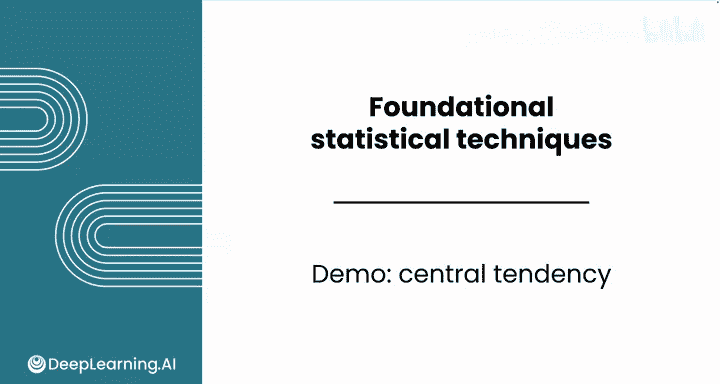
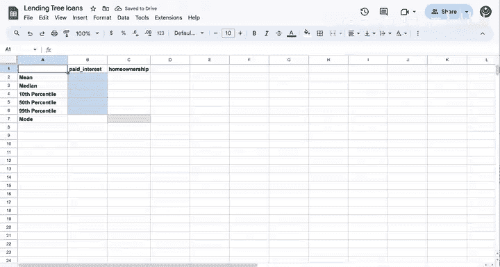
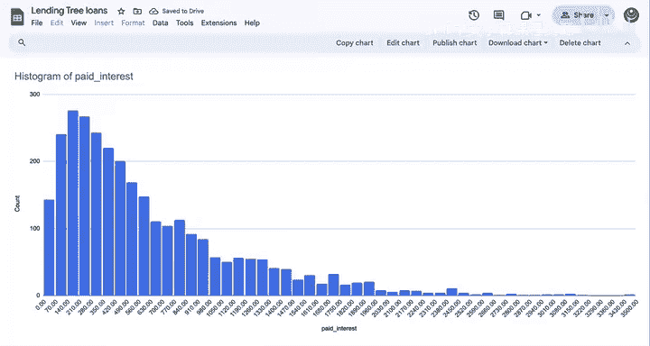
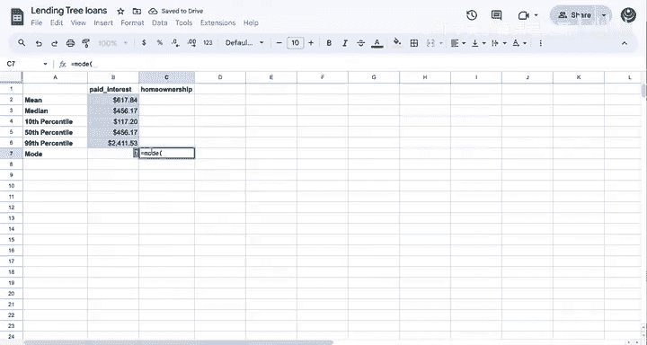

# 084：集中趋势演示 📊

在本节课中，我们将学习如何使用电子表格计算集中趋势，以回答实际的商业问题。如果你需要复习电子表格函数，建议回顾数据分析基础课程，那里涵盖了本演示中将用到的所有函数。

这个电子表格承接了之前使用的Lending Tree贷款数据。回忆一下，你之前已经为“已付利息”这一特征创建了直方图。





“已付利息”本质上代表了贷款上累积的利润。

为了对直方图进行补充，我们将计算一些描述性统计量，以帮助你了解可以从贷款利息中赚取的大致金额。如果你想跟着本演示一起操作，可以在下载选项卡中找到电子表格和解决方案文件。




这里有一个新的工作表，用于单独存放你的统计结果。一个好的起点通常是计算均值。

这些描述性统计量的目的是计算一些特定的度量，以帮助总结数据的分布。要计算“已付利息”的均值，你可以使用 `AVERAGE` 函数。

**公式：**
```
=AVERAGE(数据范围)
```

记住每个公式都以等号开始，加上左括号，然后引用原始数据并选择“已付利息”列。计算结果显示，平均每笔贷款的已付利息约为617美元。

接下来，你可以计算中位数。

**公式：**
```
=MEDIAN(数据范围)
```

同样，输入中位数公式并选择“已付利息”列。计算出的中位数低于均值。均值高于中位数这一事实表明，数据中可能存在一些较高的已付利息值。

为了识别分布中更多的参考点，接下来你可能想计算一些百分位数。要计算第10百分位数，你将使用 `PERCENTILE` 函数。

**公式：**
```
=PERCENTILE(数据范围, 百分位数值)
```

选择“已付利息”列，然后输入百分位数值。百分位数需要用0到1之间的数字表示，因此对于第10百分位数，你需要输入0.1。结果大约是117美元。

要计算第50百分位数，你可以采用相同的方法，只需更改百分位数参数。

**公式：**
```
=PERCENTILE(数据范围, 0.5)
```

请注意，结果与中位数相同。中位数就是数据的第50百分位数。

最后，假设你是一名贷款人，你想了解单笔贷款可能支付的最高利息是多少。你可能需要计算第99百分位数。

**公式：**
```
=PERCENTILE(数据范围, 0.99)
```

计算结果显示，一笔贷款的最高已付利息金额超过2400美元。这属于整个分布中前1%的部分。

现在，假设你希望通过检查房屋所有权情况来了解贷款背后的抵押品。让我们回顾一下D列的数据，你可以看到原始的“房屋所有权”列，其中包含“租住”、“自有”和“抵押贷款”等类别。

对于这种分类特征，你无法计算其中位数或平均值。你想找出这个变量的众数。`MODE` 函数通常只适用于数值数据，因此你可以使用“房屋所有权（数值）”列，其中1代表租住，2代表抵押贷款，3代表自有。



**公式：**
```
=MODE(数据范围)
```

你可以使用 `MODE` 函数来计算最常见的类别。


这里你得到的众数是2，这再次对应着“抵押贷款”类别。因此，大多数申请贷款的人都拥有抵押贷款。这有助于你更好地了解贷款人处于人生的哪个阶段，以及他们可能拥有何种类型的抵押品。

通过计算“已付利息”的集中趋势，你开始理解样本数据的“质量中心”，这让你对平均可以预期的支付额有了大致的了解。

在本节课中，我们一起学习了如何使用电子表格中的 `AVERAGE`、`MEDIAN`、`PERCENTILE` 和 `MODE` 函数来计算数据的均值、中位数、百分位数和众数，从而描述数据的集中趋势。完成本课的练习评估和实践实验室后，请加入下一节课，学习更多关于数据变异性和偏度的知识。