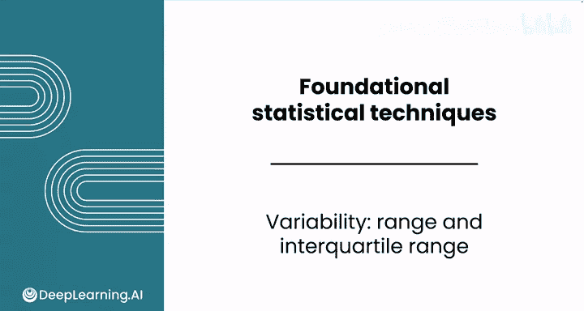
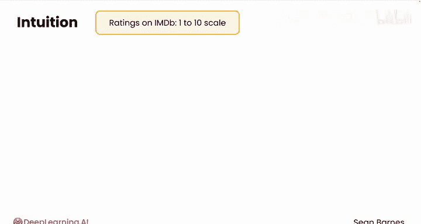
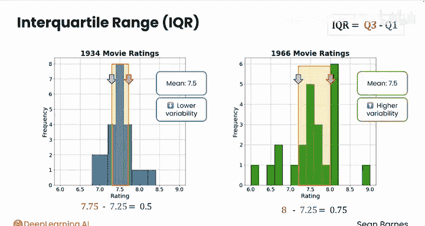

# 085：极差与四分位距 📊

在本节课中，我们将要学习如何衡量数据分布的离散程度，即数据点围绕中心值（如均值）的分散或聚集情况。我们将重点介绍两种衡量离散度的工具：极差和四分位距。

---

在2020年东京奥运会上，精英游泳运动员玛格丽特·麦克尼尔以仅0.05秒的优势赢得了女子100米蝶泳比赛。事实上，决赛中所有八名选手的成绩彼此相差都在1.5秒以内。

这是一个非常微小的差距。相比之下，在你当地的高中游泳队，你可能会看到最快的选手只用70秒就完成了比赛，而其他人则需要200秒或更多。这里的差距要大得多，因为技能水平更加参差不齐。这种衡量数据分布范围的方法被称为**离散度**或**变异性**，它衡量的是数据点围绕均值聚集的紧密或松散程度。

---

上一节我们引入了离散度的概念，本节中我们来看看如何通过具体数据来理解它。

让我们从一些直观感受开始。你之前看到电影数据集也包含评分，因此你可以比较电影在国际电影数据库（IMDB）上的评分情况，该评分采用1到10分制。让我们聚焦于两个年份：1934年和1966年。观察这两个直方图，你能看出这两个年份数据的集中趋势有什么特点吗？

结果表明，1934年和1966年的电影平均评分相同，均值都是7.5分。请注意，每个年份都移除了一个异常值，所以这里各有24部电影。

尽管这两个年份的平均分相同，但它们的分布看起来却大不相同。你能发现一个主要区别吗？

1934年的分布看起来紧密地聚集在均值7.5周围，而1966年的分布则分散得多，数值之间的差异更大。换句话说，1966年的数据具有更高的变异性，而1934年的数据变异性较低。

---

现在，让我们看看可用于计算变异性的不同工具。首先介绍**极差**。

极差是衡量数据分布范围最直接的工具。以下是其定义和计算方法：

**极差** 的计算公式为：
`极差 = 最大值 - 最小值`

它回答的问题是：任意两个数值之间的最大距离是多少？这是一个简单但有用的变异性度量。

以下是两个年份电影评分的极差计算示例：
*   对于1934年，最高评分是8.3，最低评分是6.9，因此极差为 `8.3 - 6.9 = 1.4`。
*   相比之下，1966年的最高评分是9.0，最低评分是6.1，因此极差为 `9.0 - 6.1 = 2.9`，是1934年的两倍多。

计算极差是快速查看评分分布范围以及某一年份电影评分是否一致的方法。在这个案例中，与1966年相比，1934年的评分更加一致。

---

接下来，我们介绍另一种与中位数配合使用的变异性度量：**四分位距**。

四分位距是衡量数据中间部分离散程度的重要指标。以下是其定义和计算方法：

**四分位距** 的计算公式为：
`IQR = Q3 - Q1`

请记住，第一四分位数（Q1）定义了数据中最低的25%，第三四分位数（Q3）定义了数据中最高的25%。它们的差值意味着IQR包含了中间50%的数据。

以下是两个年份电影评分的四分位距计算示例：
*   对于1934年，第一四分位数是7.25，第三四分位数是7.75，因此 `IQR = 7.75 - 7.25 = 0.5`。
*   对于1966年，第一四分位数是7.25，第三四分位数是8.0，因此 `IQR = 8.0 - 7.25 = 0.75`，比1934年宽了50%。

所以你可以看到，IQR遵循了与极差相似的模式：1966年的值高于1934年，这反映了数据中更大的变异性。

---

本节课中我们一起学习了两种常见的变异性度量：极差和四分位距。你已经看到，即使两组数据的中心趋势（如均值）相同，它们的离散程度也可能大不相同。在下一个视频中，你将学习另外两种变异性度量：方差和标准差。