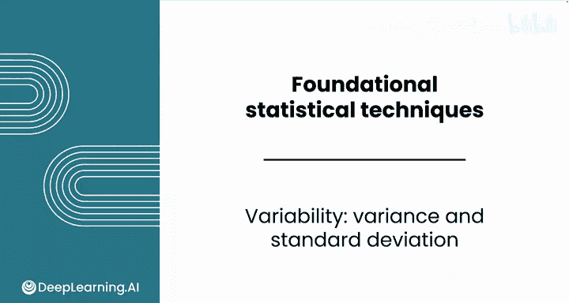
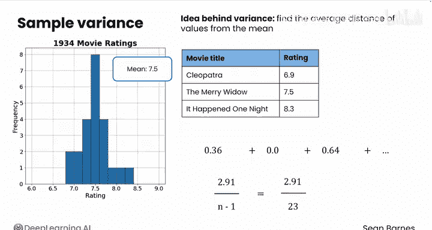
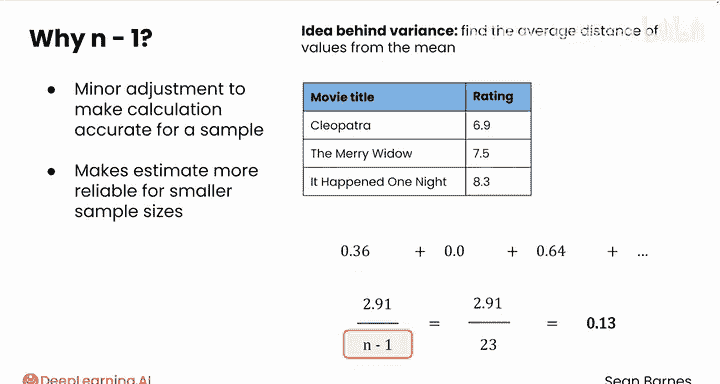
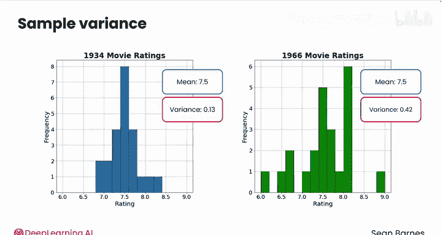
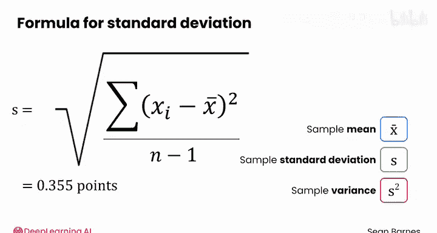
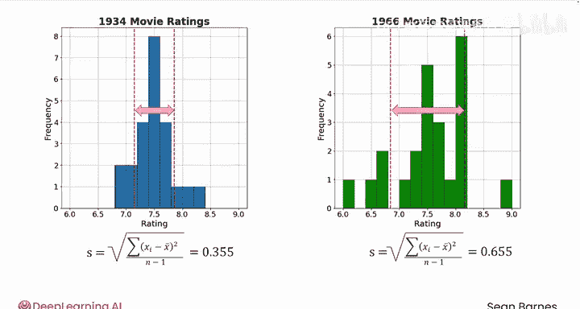

# 086：方差与标准差 📊

在本节课中，我们将要学习两种衡量数据离散程度的核心方法：方差与标准差。它们是比极差和四分位距更复杂的计算，也是许多其他统计学概念的基础。

上一节我们介绍了极差和四分位距，本节中我们来看看如何通过计算每个数据点与均值的平均距离来量化数据的离散程度。

## 方差的计算原理

计算离散度的根本目的是量化数值的分散程度。方差背后的核心思想是找出每个数值与均值之间的**平均平方距离**。

以下是计算样本方差的步骤：
1.  对于样本中的每一个数值，计算它与样本均值的差值。
2.  将这个差值进行平方。
3.  将所有平方差值求和。
4.  将总和除以样本容量减一（n-1）。

## 方差计算实例：1934年电影评分

让我们以1934年的电影评分数据为例，逐步计算其方差。样本均值为7.5分。

以下是计算过程：
*   **《埃及艳后》**：评分为6.9。差值 = 6.9 - 7.5 = -0.6。平方差 = (-0.6)² = 0.36。
*   **《风流寡妇》**：评分为7.5。差值 = 7.5 - 7.5 = 0。平方差 = 0² = 0。
*   **《一夜风流》**：评分为8.3。差值 = 8.3 - 7.5 = 0.8。平方差 = 0.8² = 0.64。

对每个数据点重复此过程后，将所有平方差求和。平方操作有两个目的：一是确保正值和负值不会相互抵消；二是放大了与均值距离较大的偏差，使它们对方差的贡献更显著。

最后，将平方差总和除以 n-1（本例中为23），得到方差约为0.13。

## 关于除以 n-1 的说明

你可能会问，为什么不直接除以 n 来计算平均平方差？这是一个很好的直觉。使用 n-1 是一个微小的调整，当处理样本而非整个总体时，它能使估计值更准确。n-1 比 n 略小，这使得方差估计值略高一些，有助于统计量包含更多的不确定性。

## 方差的公式化定义

样本方差的公式可以总结如下：

**公式**：`s² = Σ (xᵢ - x̄)² / (n - 1)`
*   `s²` 代表样本方差。
*   `xᵢ` 代表样本中的每一个数值。
*   `x̄` 代表样本均值。
*   `Σ` 表示对所有数值的平方差进行求和。
*   `n` 是样本容量。

## 从方差到标准差

方差的一个问题是，由于对差值进行了平方，其单位是原始数据单位的平方（例如“分²”），这不利于直观解释。

解决方法是对方差取平方根，这样我们就得到了与原始数据单位一致的度量，称为**标准差**。

**公式**：`s = √s²`
*   样本标准差记为 `s`。
*   样本方差记为 `s²`，即标准差的平方。

对于1934年的电影评分，方差为0.13，则标准差为 √0.13 ≈ 0.355分。相比之下，1966年电影评分的标准差约为0.655分，这证实了我们的直观判断：1966年的评分分布更为分散。

## 标准差的可视化

我们可以在之前的直方图上可视化标准差。在均值左右各一个标准差的位置画上虚线。

对于1934年的数据，这两条虚线之间的范围较窄。而对于1966年的数据，虚线被“拉”得更开，范围更宽。这从视觉上印证了1966年数据的离散度更大。

在实践中，方差和标准差都会用到。方差是许多衍生计算的基础，而标准差则更常用于描述数据分布的特征。

本节课中我们一起学习了如何计算和解释方差与标准差，它们是量化数据离散度的核心工具。在下一个视频中，我们将探讨描述数据分布的第三个关键指标：偏度。