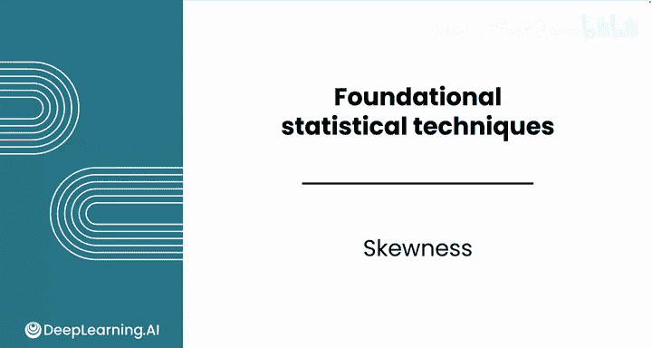
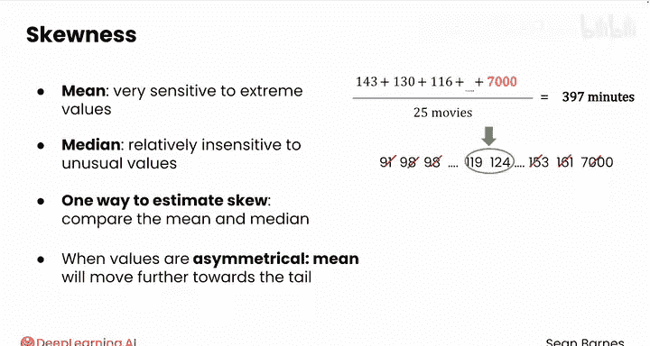
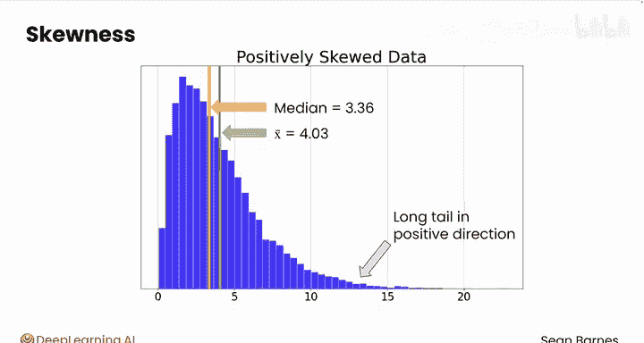
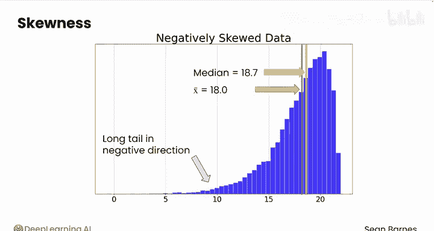
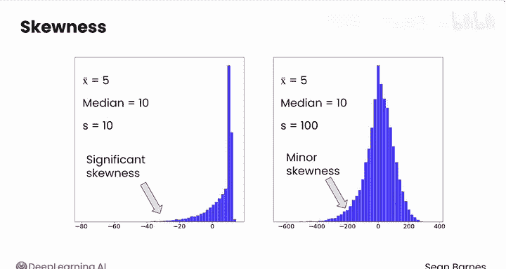
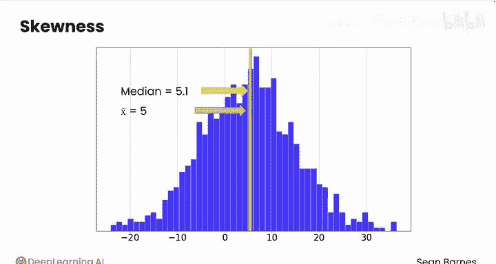
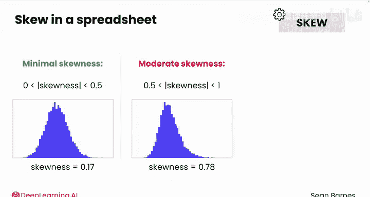

# 087：偏态 📊



在本节课中，我们将要学习偏态这一概念。偏态用于描述数据分布的不对称性，它帮助我们理解数据是否偏向一侧，以及这种偏向的程度。

与均值、中位数、方差和标准差不同，偏态通常不手动计算。它有一个相当复杂的公式。

**公式：**
```
偏态 = [n / ((n-1)(n-2))] * Σ[(Xi - X̄) / s]^3
```
其中，`n` 是样本数量，`Xi` 是每个数据点，`X̄` 是样本均值，`s` 是样本标准差。

不过，偏态是一个非常有用的概念。下面介绍一种快速估算偏态的简便方法。

## 通过均值与中位数比较估算偏态

上一节我们介绍了均值和中位数对极端值的不同敏感性。本节中我们来看看如何利用这种差异来估算偏态。

均值对极端值非常敏感，因为它将所有值的总和分配到样本量上。而中位数对这些异常值相对不敏感。因此，估算偏态的一种方法是比较均值和中位数。当数据分布不对称时，与中位数相比，均值会更多地被异常值的长尾所拉动。

以下是直方图中的表现。如果均值大于中位数，数据向右偏斜，这也称为**正偏态**。可以这样记忆：数值的长尾向正方向延伸。

反之，在另一种分布中，均值小于中位数，表明存在**负偏态**。可以看到，均值被更强地拉向左侧，即从数据中心向负方向延伸的尾部。

这种差异越大，数据偏态就越严重，因为均值会继续被拉得离中位数越来越远。







## 结合标准差理解偏态差异

这种差异的大小需要结合标准差来理解。例如，假设均值为5，中位数为10，标准差为10。均值与中位数之间的巨大差异（相对于标准差而言）表明存在显著的偏态。

现在，假设相同的均值和中位数，但标准差为100。这种差异的影响就不那么显著，但偏态仍然存在。

如果数据没有偏态呢？以下是一个无偏态数据的直方图。在这种情况下，均值和中位数大致相等，因为均值没有受到数据不对称性的显著影响。





## 快速测试

假设均值为18，中位数为10，标准差为15。你认为这组数据是正偏态、负偏态还是无偏态？

考虑均值被拉动的方向。由于均值大于中位数，这种差异表明分布在右侧或正方向存在长尾。差值8与标准差15相比，表明存在相当程度的正偏态。

## 在电子表格中计算与解释偏态

在电子表格中计算偏态时，会使用 `SKEW` 函数，该函数返回一个数值。因此需要知道如何解读它。

以下是偏态值的解读指南：
*   更正值表示更严重的正偏态。
*   更负值表示负偏态。
*   接近0的值表示偏态很小。

具体而言：
*   偏态绝对值小于0.5，表示**偏态很小**。
*   偏态在0.5到1之间，表示**中度偏态**。
*   偏态大于1，表示**高度偏态**。



## 总结

本节课中我们一起学习了偏态的概念。我们了解到偏态描述了数据分布的不对称性，可以通过复杂的公式计算，也可以通过比较均值和中位数来快速估算。关键在于，均值大于中位数通常表示正偏态（右偏），均值小于中位数表示负偏态（左偏），并且需要结合标准差来评估偏态的显著程度。最后，我们学习了如何在电子表格中使用 `SKEW` 函数并解读其结果。

现在你已经熟悉了如何计算和理解集中趋势、变异性和偏态的关键度量，但这些如何在数据分析中使用呢？请跟随我到下一个视频，以更好地理解如何根据你试图回答的业务问题来选择每种度量。