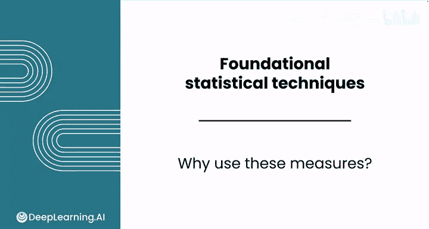
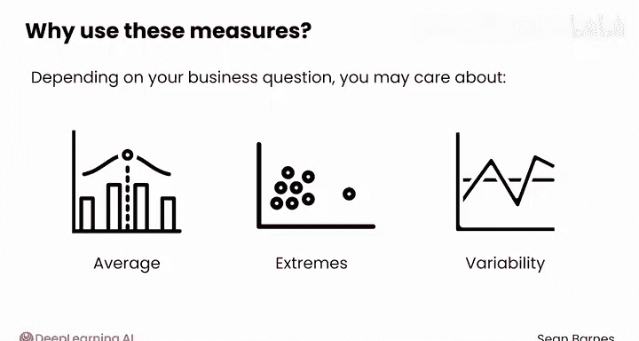
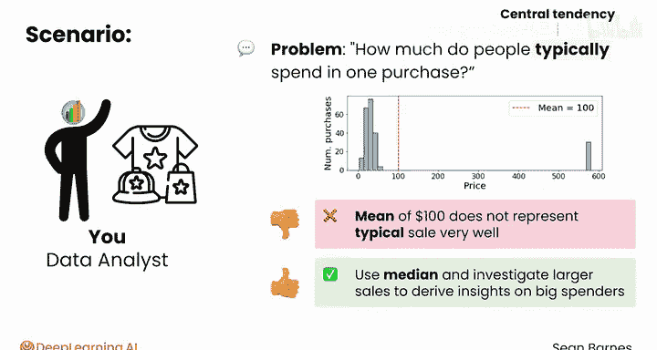
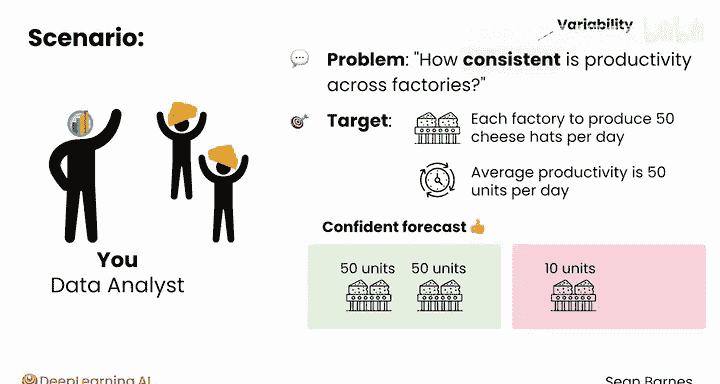
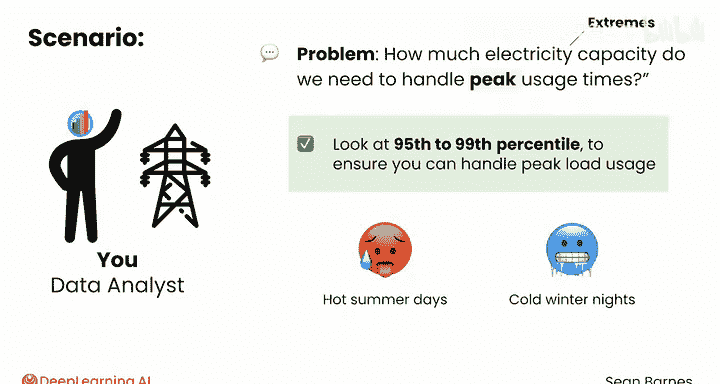

# 088：为何使用这些指标 📊

在本节课中，我们将要学习集中趋势、变异性和偏度这三个描述性统计指标的重要性。我们将通过具体的商业案例，理解不同指标如何帮助我们回答不同的业务问题，并选择合适的指标进行分析。

---

## 概述

描述性统计的核心指标——集中趋势、变异性和偏度——之所以重要，是因为它们能帮助我们理解数据分布的不同方面。根据具体的业务问题，我们可能更关注数据的平均值、极端值或数据的波动情况。

上一节我们介绍了描述性统计的基本概念，本节中我们来看看这些指标在实际商业场景中如何应用。

---

## 商业问题与指标选择

以下是几个不同的商业场景，展示了如何根据问题选择合适的描述性统计指标。

### 案例一：关注典型值（集中趋势）

一家个性化商品公司可能想知道：“人们单次购买通常花费多少钱？”

在这种情况下，你关注的是**集中趋势**，即数据的“中间”位置在哪里。但你必须注意如何描述典型的购买金额。



如果数据分布存在**偏度**，平均值可能会产生误导。例如，如果你的平均购买金额是 **100美元**，但实际数据包含大量小额交易和少数几笔巨额交易，那么100美元这个平均值并不能很好地代表典型的销售情况。





此时，你可能更想使用**中位数**，并进一步调查那些大额销售，以洞察高消费客户的行为。

**公式示例：**
- 均值（可能受偏度影响）：`mean = sum(all_values) / count(all_values)`
- 中位数（对异常值更稳健）：位于排序后数据正中间的值。

### 案例二：关注稳定性（变异性）

假设你为一家奶酪帽制造商工作，他们希望你弄清楚“不同工厂的生产效率一致性如何”。

对于这个问题，**变异性**指标非常有价值。假设你的目标是每个工厂每天生产50顶奶酪帽，并且平均生产率确实是每天50单位。表面上看这很好，但**没有变异性的平均值**与**伴随高变异性的平均值**含义截然不同。

如果每个工厂每天几乎都恰好生产50顶奶酪帽，你可以对生产预测相当有信心。但如果一个工厂某天生产10单位，另一天生产75单位，你就会得出不同的结论：有可能达到每天75顶的产量，你可能需要在全公司推广这些高生产率日所采用的做法。

**核心概念：**
- **低变异性**：数据点紧密围绕均值，如 `[49, 50, 51]`。
- **高变异性**：数据点分散，如 `[10, 50, 75]`。

### 案例三：关注极端情况（偏度与分位数）

最后，考虑一家电力公司，它可能调查：“我们需要多少电力容量来处理用电高峰时段？”

对于这个问题，你不仅对平均用电量感兴趣，更对**极端值**感兴趣。你会希望查看最高用电时段，也许是**第95或第99百分位数**，以确保能够处理峰值负荷而不导致停电。

这种分析对于公用事业公司规划炎热的夏日或寒冷的冬夜（用电量会激增）尤为重要。

**代码示例（概念性）：**
```python
# 假设 `usage_data` 是每小时用电量的列表
peak_usage_95th = np.percentile(usage_data, 95)
peak_usage_99th = np.percentile(usage_data, 99)
```



---

## 总结



本节课中我们一起学习了如何根据不同的商业问题，匹配最合适的描述性统计指标：
- 关心“典型”情况时，使用**集中趋势**指标（如均值、中位数），并注意**偏度**的影响。
- 关心“稳定性”或“一致性”时，**变异性**指标（如方差、标准差）是关键。
- 关心“极端”情况或“峰值”容量时，需要关注分布的尾部，使用**分位数**（如第95百分位数）进行分析。

你已经了解了如何将这些不同的度量指标与它们最能支持的洞察相匹配。接下来，请跟随我到下一个视频，学习如何在电子表格环境中进行这些分析。