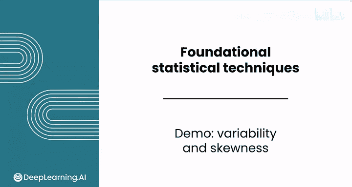
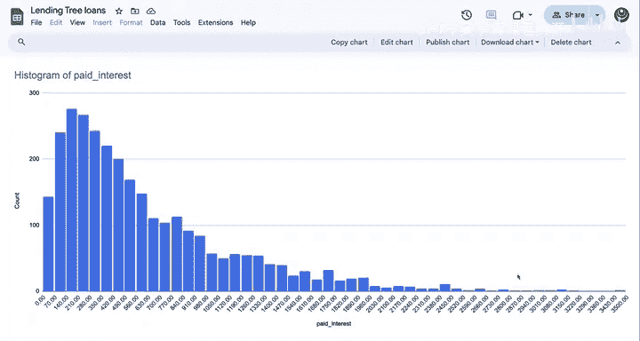

# 089：离散度与偏态分析演示

在本节课中，我们将学习如何使用电子表格计算数据集的离散度（变异性）与偏态。我们将以贷款利息支付数据为例，演示如何通过具体指标更深入地理解数据分布。

## 概述

上一节我们介绍了数据分布的中心趋势度量，如均值和中位数。本节中我们来看看如何度量数据的离散程度和分布形状的偏斜情况。这些指标能帮助我们更全面地评估数据，例如在分析贷款投资机会时，理解利息支付的波动范围。

## 计算离散度指标

首先，我们关注数据的变异性。仅知道平均利息支付约为617美元、中位数约为456美元是不够的。我们需要了解数据是广泛分散在数百美元范围内，还是紧密聚集在均值附近。

以下是计算离散度的几个关键步骤：

1.  **计算极差**
    极差是最大值与最小值之差，能帮助你了解最大与最小可能支付额之间的差距。
    *   使用 `MAX` 函数计算最大支付利息，约为3500美元。
    *   使用 `MIN` 函数计算最小支付利息，为0美元。
    *   极差 = 最大值 - 最小值 ≈ 3500美元。这个范围相当大，表明变异性很高。值得注意的是，最大值比第99百分位数高出近1000美元，在数据的高百分位区间存在较大跳跃。

2.  **计算方差与标准差**
    极差只考虑两个极端值，而方差考虑了所有数据点。以下是计算过程：
    *   使用 `VAR` 函数计算方差，结果约为280,000。**注意**：方差的单位是美元的平方，因此不应将此单元格格式化为货币。
    *   为使结果更易于解释，可将其转换为标准差。使用平方根函数 `SQRT` 计算：`标准差 = SQRT(方差)`。
    *   标准差单位是美元，可以将其格式化为货币。直接使用 `STDEV` 函数也能得到相同结果，公式为：`STDEV(数据范围)`。

## 评估数据偏态

接下来，我们评估数据分布的偏斜方向与程度。根据之前看到的直方图，可以初步判断该数据呈正偏态。

以下是评估偏态的方法：

1.  **通过均值与中位数比较**
    比较均值（约617美元）和中位数（约456美元）。由于**均值 > 中位数**，这初步表明数据存在正偏态。

2.  **计算偏度系数**
    为了更具体地评估偏斜程度，可以计算偏度系数。
    *   使用 `SKEW` 函数进行计算。
    *   计算得到的偏度系数约为1.55。
    *   回顾一下，任何大于1的偏度值都表示**强偏态**。因此，本例中存在强正偏态，这与在分布直方图中观察到的特征一致。

## 总结

本节课中我们一起学习了如何计算和分析数据的离散度与偏态。通过计算极差、方差、标准差以及偏度系数，我们能够更深入地理解数据分布的波动范围和不对称性。即使只是计算中心趋势、离散度和偏态，也能让我们对潜在的利息支付情况有更丰富的认识。

在下一个视频中，我们将通过解读另一种常见的可视化图表——箱线图，来结束关于数据分布的讨论。