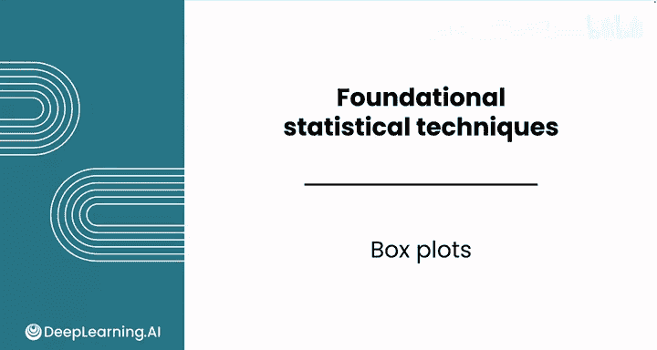
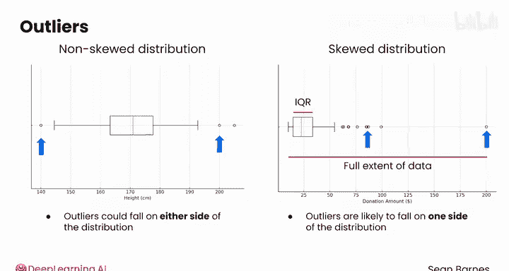
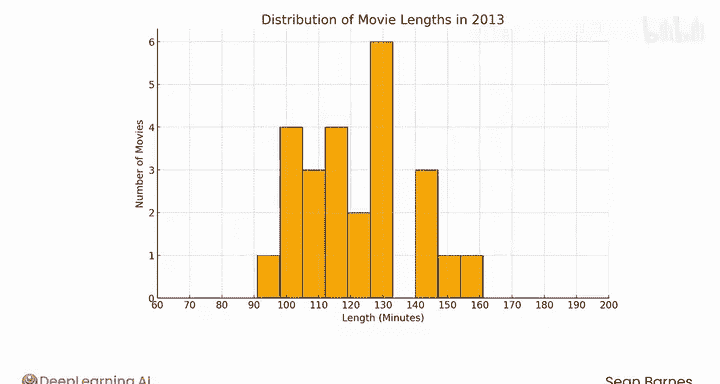
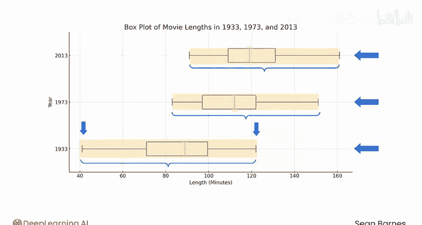
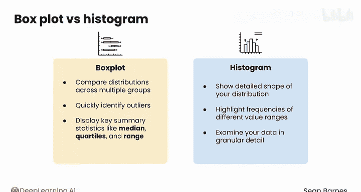

# 090：箱线图教程

在本节课中，我们将要学习一种用于数据分布可视化的强大工具——箱线图。我们将了解它的构成、如何解读，以及它与之前学过的直方图有何不同，并探讨各自的适用场景。

---

## 📦 什么是箱线图？

另一种用于分布可视化的优秀工具是箱线图。它有时也被猫爱好者称为“盒须图”。箱线图虽然不如直方图常见，但非常有用。你需要知道如何解读它们。

箱线图可以可视化数据的四分位数，包括中位数。你之前已经学过，中位数就是第二四分位数。箱体部分由第一和第三四分位数构成，而“须”通常延伸到距离第一和第三四分位数 **1.5倍IQR（四分位距）** 范围内的最小值和最大值。

---

## 🔍 箱线图的构成与解读

箱体覆盖了四分位距的长度。回顾一下，**四分位距（IQR）** 就是第三四分位数与第一四分位数之差。

**IQR = Q3 - Q1**

箱线图也有助于可视化**异常值**。异常值是指任何落在“须”范围之外的值，通常用独立的标记点表示。

---

## ↔️ 异常值与分布形态的关系

在非偏态分布中，异常值可能落在分布中心的两侧。例如，在人类身高的分布中，异常值会出现在两侧，即异常矮小和异常高大的人。

然而，在偏态分布中，大多数异常值很可能只落在分布的一侧。这是因为在偏态分布中，大多数数值高度集中在分布的某个区域，这导致四分位距相对于数据的整体范围显得较小。

例如，在这个慈善捐款的分布中，大多数捐款在10到20美元之间，但存在少数几笔大额捐款。因此，大多数异常值很可能是大额捐款，而不是小额捐款。

---

## 🎬 实例分析：电影时长

作为一个快速回顾，你在之前的课程中看过这张2013年电影时长的直方图。你当时猜测平均电影时长在120到130分钟之间。

现在你熟悉了IQR，可以为同样的数据构建一个箱线图，来比较这两种可视化方式。

以下是同一组电影时长数据的箱线图。现在更容易看出，中位数略低于120分钟，并且大约50%的数据集中在108到132分钟之间。

---

## ⚖️ 箱线图的优势：比较多个分布

箱线图特别适合比较多个分布，因为你可以直接比较它们的中位数、四分位数、潜在的异常值以及变异性。而直方图即使控制了组距和坐标轴尺度，也无法如此直接地进行这些比较。

让我们看看箱线图如何能更好地比较电影时长数据。

以下是底部1933年、中部1973年和顶部2013年电影时长的箱线图。你能看出这些分布的什么信息？

2013年的中位数，正如你所见，大约在120分钟。而1973年的中位数接近115分钟。这不是一个巨大的差异，并且这两年的变异性（考虑到全距和IQR）是相似的。

1933年的情况则有些不同。它的中位时长大约在90分钟。那真是个美好的时代！而且电影时长似乎经常短至40分钟。其全距仅勉强达到120分钟，而这只是2013年的中位数。看来在1933年到2013年之间，电影时长发生了明显的变化，但在这个时期的后期，变化似乎趋于平缓。

---

## ❓ 如何选择：箱线图 vs. 直方图

那么，何时应该选择箱线图，何时选择直方图呢？

**直方图**是一个很好的选择，当你想：
*   展示分布的详细形状。
*   突出数据中不同值范围的频率。
*   以精细的细节检查你的数据。

**箱线图**则是理想的选择，当你想：
*   跨多个组比较分布。
*   快速识别异常值。
*   一目了然地展示关键汇总统计量，如中位数、四分位数和全距。

---

## 📝 课程总结

在本节课中，我们一起学习了箱线图。我们了解了箱线图如何通过箱体和须线展示数据的四分位数、中位数和异常值。我们探讨了它在识别偏态分布和比较多个数据集方面的优势，并与直方图进行了对比，明确了各自最适合的应用场景。直方图和箱线图都是数据可视化的强大工具。

在完成接下来的未评分实验之前，我希望你能在下一个视频中与我一起，学习如何使用大语言模型来帮助你处理电子表格中的错误和公式。我们下个视频见。