# 091：使用LLM处理电子表格公式错误 📊

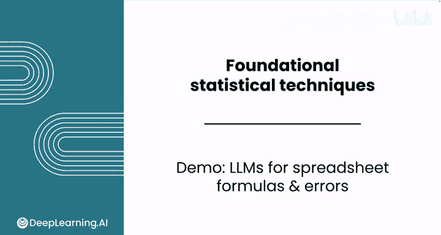

在本节课中，我们将学习如何利用大型语言模型（LLM）作为辅助工具，来编写电子表格公式并排查可能遇到的错误。我们将通过一个具体的电影数据集案例，演示从公式错误修复到高级功能（如条件格式）应用的全过程。

## 概述：LLM作为电子表格助手

在之前的课程中，你已经接触了许多复杂的公式和电子表格任务。大型语言模型可以作为一个有用的“思考伙伴”，不仅能协助你编写公式，还能帮助你排查可能遇到的任何错误。

## 案例：统计时长超过两小时的电影

假设你正在处理一个数据集，它包含了每年排名前25的电影、它们的IMDB评分、评分数量和时长。

你的目标是统计时长超过120分钟（两小时）的电影数量。你知道需要使用 `COUNTIF` 函数，于是写下了公式：`=COUNTIF(E:E, >120)`。

然而，你遇到了一个令人沮丧的错误：“公式解析错误”。这个提示信息并没有提供太多帮助。

## 使用LLM排查公式错误

一个可行的选择是与LLM对话，以帮助你解决这个错误。

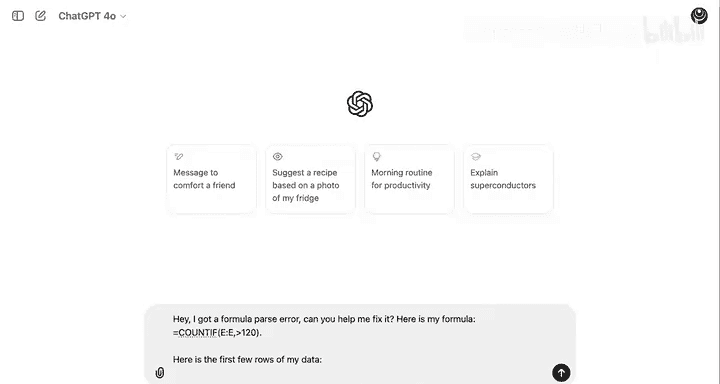

以下是你可以使用的提示词：
> “你好，我遇到了一个公式解析错误。你能帮我修复它吗？这是我的公式：`=COUNTIF(E:E, >120)`。”

为了帮助模型更好地理解，你可能需要添加几行数据样本到提示词中。

LLM首先指出，你公式中的错误是由于条件书写方式导致的。它告诉你，在Excel的 `COUNTIF` 函数中，条件必须用引号括起来。

请注意，模型默认你使用的是Excel。你可以进一步追问这个解决方案是否也适用于Google Sheets。模型会确认该解决方案同样适用于Google Sheets。

因此，问题似乎出在 `COUNTIF` 函数的条件缺少引号上。你可以复制LLM提供的Google Sheets公式代码，并修正单元格中的公式。

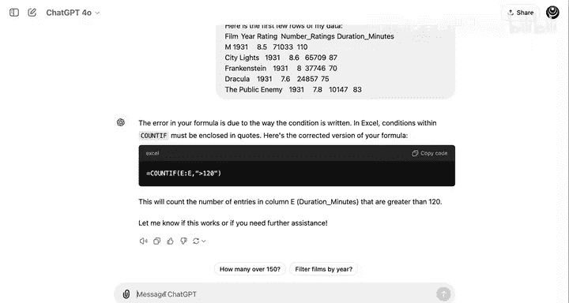

修正后的公式为：`=COUNTIF(E:E, “>120”)`。

现在，你可以看到公式正确执行，并返回大约638部时长超过两小时的电影。

## 计算电影总数与百分比

如果你想计算数据集中的电影总数，可以滚动到底部，看到最后一行是2052。减去标题行，得到总数为2051部电影。但这种方法很繁琐，而且如果未来添加更多年份数据，电影数量会变化。

如何用公式计算数据集的行数呢？你可以再次向LLM提问：“如何用公式计算我数据集中的行数？请给我一些选项。”

这是一个有用的技巧，因为你可以从中选择最佳方案。LLM可能会提供多种选项，例如使用 `COUNTA` 函数。你可以要求它只提供最好的两三个选项。

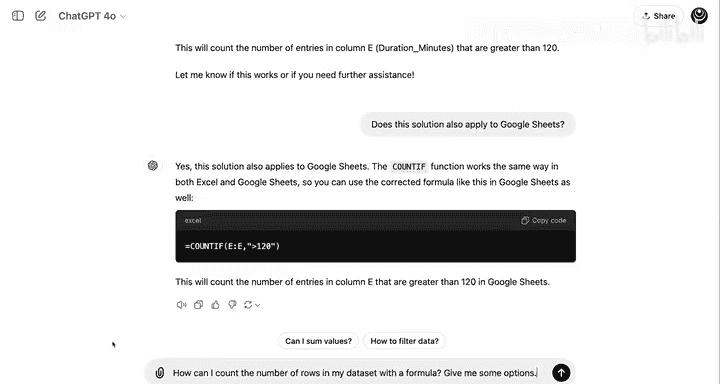

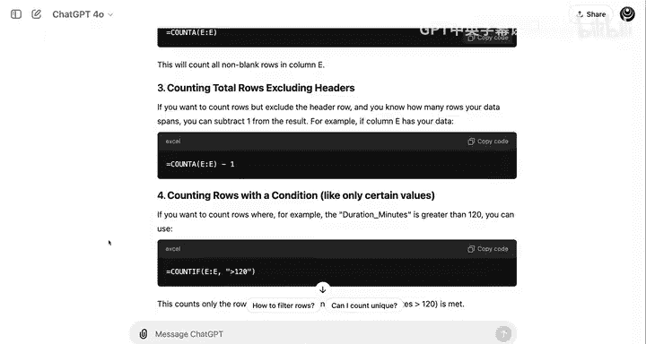

让我们看看 `COUNTA` 函数的效果：`=COUNTA(A:A)`。

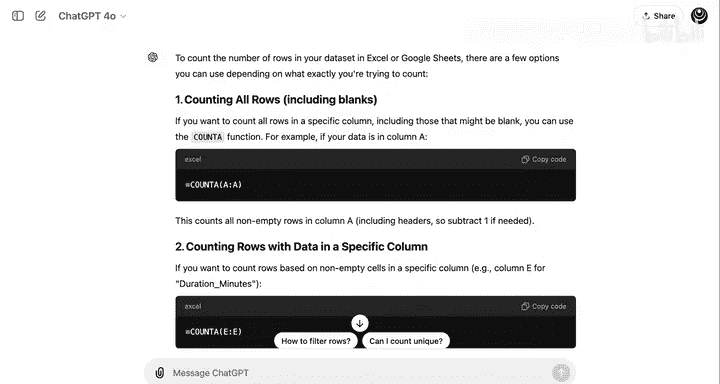

结果显示为2052，但这比实际电影数量多了一个。看来 `COUNTA` 函数把标题行也计算在内了。

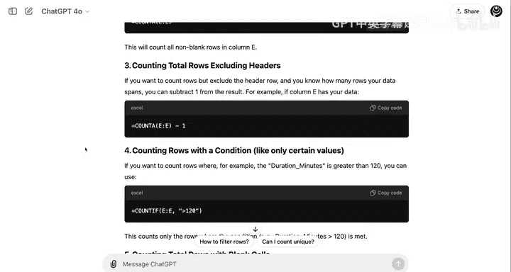

如果你查看LLM提供的第三个选项，会发现它考虑到了这个修正：`=COUNTA(A:A)-1`。

因此，在公式中减去1，你就会得到正确的答案：2051部电影。

实际上，`COUNT` 函数也能达到相同的结果。将 `COUNTA` 函数替换为 `COUNT`，并移除 `-1`，但必须选择一个包含数值特征的列，例如：`=COUNT(E:E)`。现在你可以得到正确的电影总数。

回到与LLM的对话中，你可能会注意到 `COUNT` 函数并不在它提供的选项里。这是一个很好的例子，说明LLM并不总是能提出最佳的解决方案。

现在，让我们完成时长超过两小时的电影百分比计算：`=638/2051`。

结果显示，大约31%的电影时长超过两小时，略低于三分之一。

## 应用条件格式：高亮显示高时长电影

假设我想高亮显示从A列到E列的每一行，但仅当该电影的时长处于75百分位或更高时。

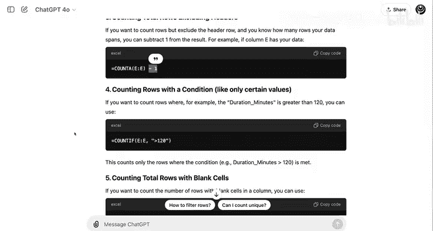

首先，我们需要计算75百分位的值。同样，使用 `PERCENTILE` 函数：`=PERCENTILE(E:E, 0.75)`。

选择时长列（E列），然后输入0.75作为75百分位的参数。可以看到，75百分位的时长是125分钟。

接下来，让我们向LLM寻求帮助，以弄清楚如何对数据应用条件格式。这需要在条件格式中使用自定义公式，而自定义公式很难记忆，因此LLM是一个非常好的资源。

提问：“如何使用条件格式，如果时长处于75百分位或更高，则将A列到E列的整行高亮显示为绿色？我的75百分位值在单元格H6中。”

这是一个重要的引用，这样LLM提供的公式才会引用正确的单元格。

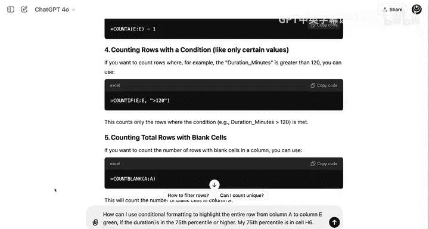

可以看到，LLM为你提供了一系列应用条件格式的步骤。

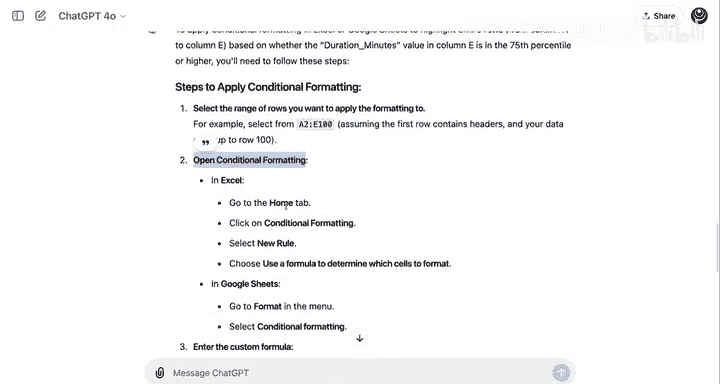

首先，它告诉你要选择数据行。
接着，它说明了如何启动条件格式设置。

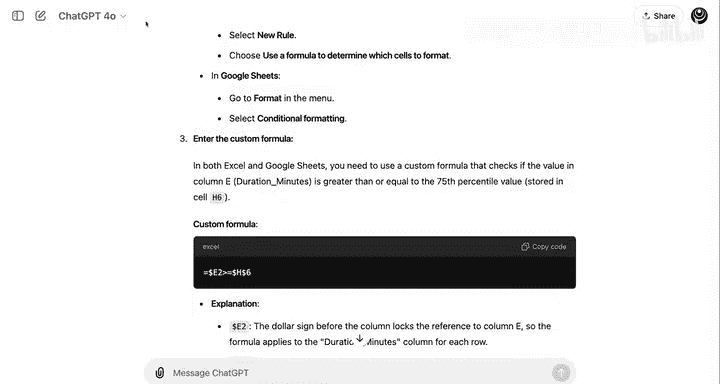

然后，它告诉你如何输入自定义公式。你可以复制这个自定义公式。

你需要选择数据中的所有列，然后使用Command+点击（Mac）或Ctrl+点击（Windows）取消选择标题行中的单元格，因为你不想让标题行被条件格式化。

在格式规则下插入自定义公式。这就是你将从LLM复制的公式粘贴进去的地方。

电影《Marius》的时长为130分钟，这确实高于125分钟的75百分位值。你可以继续向下滚动查看是否还有更多例子，例如在1935年还能找到一些。

记住，通常老电影的时长不会这么长。因此，在这个数据集中，早期年份的例子不会像你滚动到近年份时看到的那么多。

这种条件格式可以帮助你一目了然地看到，哪些电影的时长处于75百分位或更高。

## 总结：LLM提升电子表格技能

LLM可以帮助你发现电子表格的功能，并让你更享受使用它们的过程。

在本模块中，你已经学到了很多。接下来，你将完成本课的实践评估以及两个实践实验室。

在第一个实验室中，你将使用上一课的歌曲数据集练习计算变异性和偏度。
在第二个实验室中，你将与大型语言模型合作，探索新的电子表格功能并排查错误。

完成后，请加入下一节课，我们一起探索相关性分析。