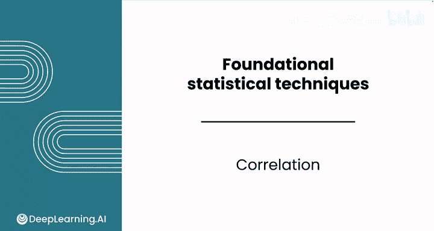
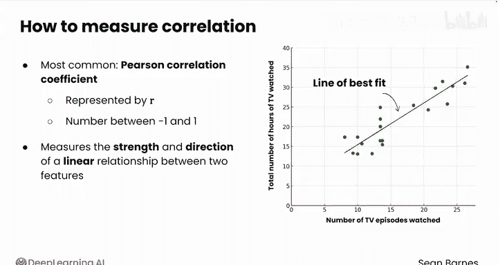
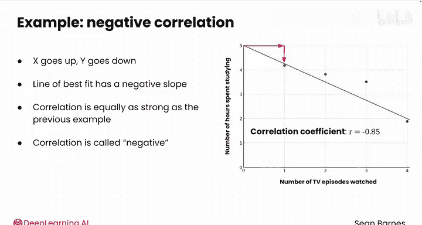
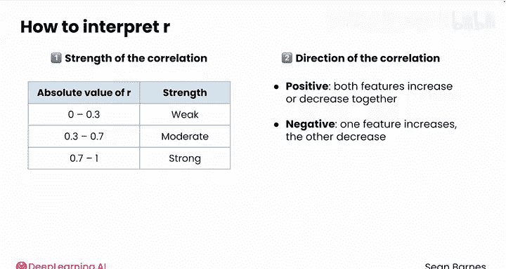
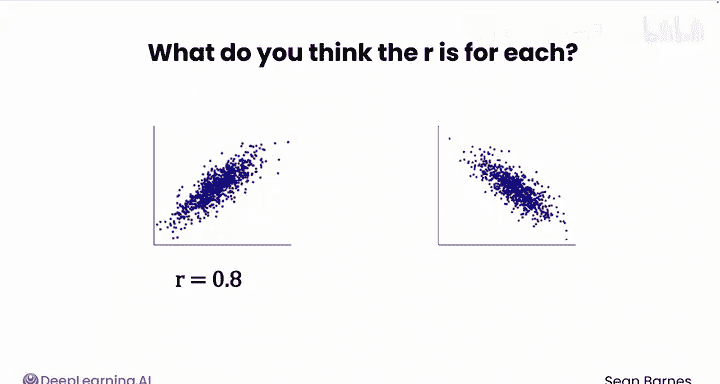
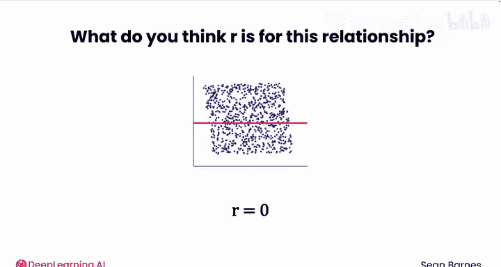

# 092：相关分析 📊

在本节课中，我们将学习如何量化两个数值特征之间的关系，即相关分析。我们将介绍皮尔逊相关系数，理解其含义，并通过示例学习如何解读相关系数。

---

## 什么是相关分析？

相关分析是一种量化两个数值特征之间关系的方法。

你已经见过散点图，它能直观地展示两个特征如何相关。现在，我们将正式定义这种关系。

衡量相关性的方法有多种，但最常见的是**皮尔逊相关系数**，通常用小写字母 **r** 表示。**r** 始终是一个介于 **-1** 和 **1** 之间的数字。

---

## 相关系数的直观理解

让我们从该度量背后的直觉开始。

假设你有一个包含两个数值特征的散点图。在 X 轴上，是观看的电视剧集数；在 Y 轴上，是观看电视的总小时数。

你可以将 **r** 理解为衡量一条**最佳拟合直线**与这些数据点的拟合程度。更专业地说，**r** 衡量的是两个特征之间线性关系的**强度**和**方向**。

---

## 完美相关案例

让我们看一个完美的情况。假设你的散点图有这些点。

这条直线有一个恒定的斜率，意味着 X 每变化 1 个单位，Y 就会变化一个恒定的量。这对于每集时长完全相同的电视剧来说是合理的，比如每集 45 分钟。

如果你知道某人看了多少集电视剧，你也就确切地知道他们看了多长时间的电视。

在这个例子中，有一条直线 `y = 0.75x`，意味着每集是 0.75 小时。所以这条线的斜率为正 0.75。X 每变化 1，Y 就变化 0.75。

在这种情况下，相关系数 **r** 等于 **+1**。你可以说 X 和 Y 是**完美相关**的，因为 X 的变化会产生完全可预测的 Y 变化。

---

## 非完美相关案例

现在，想象你的数据不那么完美，是下面这组点。

虽然不容易画一条线穿过所有点的中心，但肯定可以找到一个很好的近似。

每个点要么略高于线，要么略低于线，但随着 X 增加，Y 也增加，并且增加的量相对可预测。

你可以看出，观看的电视剧集数越多，看电视的时间就越长，但剧集长度并不完全相同。这里的相关系数可能接近 **+0.85**。

在这个散点图中，最佳拟合线与前一个例子相同，但相关性没有那么强。

---

## 负相关案例

这是另一个例子：随着 X 增加，Y 减少。

在这种情况下，X 是观看的电视剧集数，Y 是用于学习的小时数。所以，一个人看电视越多，可能用于学习的时间就越少。

在这种情况下，最佳拟合线具有**负斜率**。然而，相关性与前一个例子同样强。相关系数大约为 **-0.85**。

请记住，你应该将相关性本质上理解为用直线拟合数据的程度，无论关系是正还是负。所以当 X 上升时 Y 下降，并且下降的量大致可预测。这种相关性与前一个例子一样强，只是被称为**负相关**，就像最佳拟合线的斜率一样。

---

## 无相关案例

这是一个没有相关性的散点图，意味着相关系数等于 **0**。

这个图表示观看的电视剧集数和每人每天的饮水量。无论你看不看电视，你都可以喝水。

所以这里似乎没有任何关系。最佳拟合线的斜率为 **0**，因为随着 X 增加，Y 没有以任何可预测的方式上升或下降。因此，最佳拟合线只是预测 Y 的平均值，无论 X 值是多少。这是最好的猜测，但并不准确。

---

## 如何计算与解读相关系数 r

手工计算 **r** 可能很复杂，但现在的计算机让它变得容易得多。

让我们研究一下如何解读 **r**，它会告诉你关于两个特征之间关系的两个重要信息。

**第一，相关性的强度。** 以下是基于 **r** 的绝对值（即与 0 的距离）来解读其强度的一般指南：

*   **0 到 0.3**（正或负）：表示**弱相关**。
*   **0.3 到 0.7**（正或负）：表示**中度相关**。
*   **0.7 到 1**（正或负）：表示**强相关**。

**第二，r 告诉你相关的方向。**

*   **正的 r** 意味着两个特征倾向于一起增加或一起减少。
*   **负的 r** 意味着当一个特征增加时，另一个特征倾向于减少。

请注意，解读 **r** 的过程与解读**偏度**类似，后者也有强度和方向。

---

## 练习：判断相关系数

以下是三个散点图。你认为每个图的 **r** 是多少？

提示：看看它们是否都像一条直线。

这些图的 **r** 都是 **1**。你可以用一条直线完美地拟合这些数据。并且随着一个特征增加，另一个也增加。直线的斜率为正，无论大小，这种关系是高度可预测的。

那么这三个散点图呢？你认为它们的 **r** 是多少？

这些图的 **r** 都是 **-1**。你可以用一条直线完美地拟合它们。然而，随着 X 增加，Y 实际上在减少，使得相关性为负。

以下是两个相关系数分别为 **0.8** 和 **-0.8** 的散点图。你能分辨出哪个是哪个吗？

左边的是 **+0.8**，而右边的是 **-0.8**。

好的，最后一个。你猜这个散点图的相关性是多少？

它是 **0**。这里没有明显的关系。这里的直线将是平坦的。

---

## 总结

本节课中，我们一起学习了相关分析。我们了解到：

1.  **相关系数 r** 是量化两个数值变量之间线性关系强度和方向的指标，其值介于 -1 和 1 之间。
2.  **r = 1** 表示完全正相关，**r = -1** 表示完全负相关，**r = 0** 表示无线性相关。
3.  根据绝对值大小，可以判断相关性的强弱：0-0.3（弱），0.3-0.7（中），0.7-1（强）。
4.  正负号表示相关的方向：正号表示同向变化，负号表示反向变化。

计算出一个能映射到你数据直觉的数字总是令人兴奋的。在下一个视频中，我们将一起学习**相关性与因果关系**之间的重要区别。