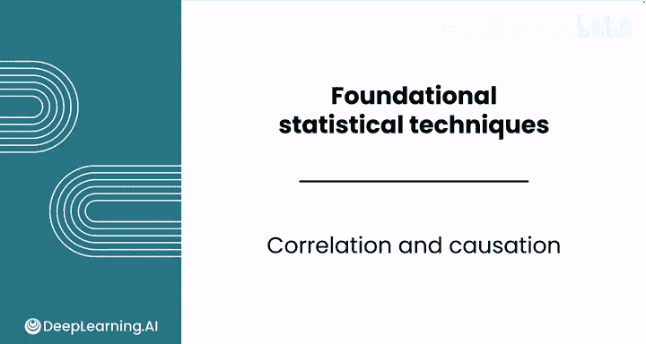
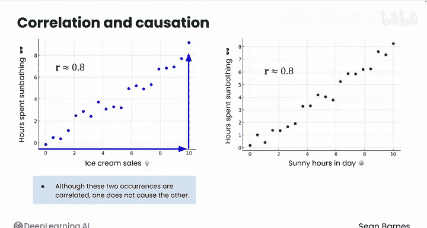
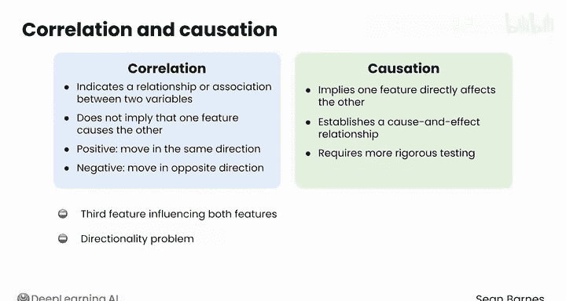

# 093：相关性与因果性 📊

在本节课中，我们将要学习数据分析中两个至关重要的概念：相关性与因果性。理解它们之间的区别，对于正确解读数据关系、避免常见误区至关重要。

---

## 概述

相关性容易被误解，因为它常常与一个相关的概念——因果性——相混淆。

相关性与因果性听起来相似，但它们指的是两个特征之间关系的两个不同方面。

---

## 相关性 vs. 因果性：核心区别

上一节我们提到了这两个概念容易混淆，本节中我们来看看它们的具体含义。

**相关性**表示两个特征之间存在某种关系或关联。
**因果性**则意味着一个事件是另一个事件的结果，存在明确的因果关系。

用一个简单的公式来概括：
- **相关性**: `X` 与 `Y` 一同变化。
- **因果性**: `X` 导致 `Y` 发生。

---

## 通过示例理解

以下是两个示例，帮助我们直观地感受相关性与因果性的不同。

**示例一：冰淇淋销量与日光浴时间**
请看这张图，X轴是冰淇淋销量，Y轴是日光浴时长。
可以看到，随着冰淇淋销量上升，日光浴时间也增加。R值（相关系数）可能约为 +0.8。
基于此信息，你能得出结论说购买冰淇淋会导致人们进行更多日光浴吗？不能。
尽管这两个事件相关，但其中一个并非另一个的原因。

**示例二：日照时长与日光浴时间**
请看这张关于每日日照时长和日光浴时长的图。
它与刚才看到的图非常相似。R值可能同样在 +0.8 左右，但这里存在因果关系吗？
是的，存在。因为阳光的可获得性直接影响了人们进行日光浴的可能性。在阴天你就不太可能去日光浴。

---

## 关键差异总结

为了总结两者的区别，以下是相关性与因果性的核心要点对比：

- **相关性**：指示两个特征之间存在关系或关联，但**不意味着**一个特征导致了另一个。当特征同向变动时为**正相关**，反向变动时为**负相关**。
- **因果性**：意味着一个特征**直接影响**另一个，并确立了因果关系。

---

## 确立因果性的挑战与误区

你无法通过散点图或皮尔逊相关系数来确立因果性。确立因果性需要比相关性更严格的检验。

你应注意，可能存在**第三个特征**同时影响我们所关注的两个特征，从而制造出它们直接相互影响的假象。
在冰淇淋和日光浴的例子中，虽然两者相关，但它们实际上都是由“阳光更充足的日子”这个第三特征导致的。

另一个潜在的陷阱是**方向性问题**。即使存在因果关系，在没有实验证据的情况下，也可能难以确定哪个特征是原因，哪个是结果。
“晴朗天气导致更多日光浴”是清晰的，但反之则不成立。
那么，如果你研究的是孤独感与社交媒体使用量之间的关系呢？是孤独的人使用更多社交媒体，还是社交媒体让人感到更孤独？

---

## 本节总结

本节课中我们一起学习了：
1.  **相关性**表示变量间的伴随变化关系，可通过散点图和相关系数（如R值）度量。
2.  **因果性**表示一个变量直接导致另一个变量发生变化。
3.  两者最核心的区别是：**相关不等于因果**。
4.  混淆两者是常见的数据解读误区，需警惕“第三变量”和“方向性”问题。
5.  确立相关性相对简单，但确立因果性需要更严谨的研究设计（如实验）。

虽然可以通过散点图和皮尔逊相关系数建立相关性，但确立因果性需要更高水平的严谨性。请务必注意你如何解读相关性。

跟随我进入下一个视频，学习如何在电子表格中进行相关性分析。