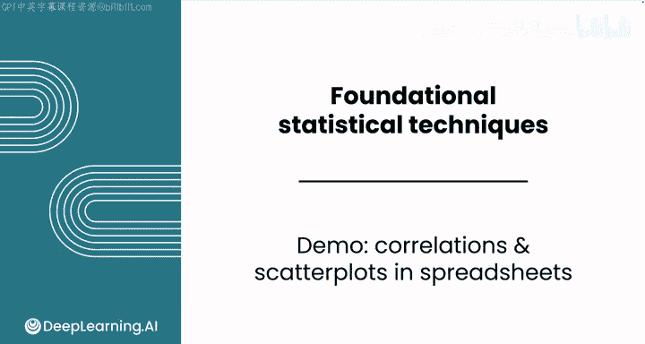
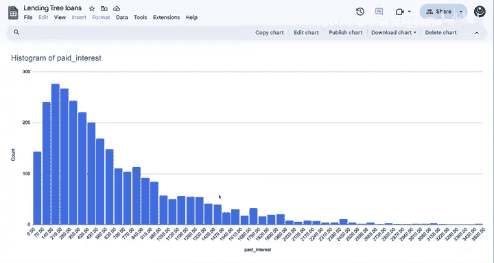
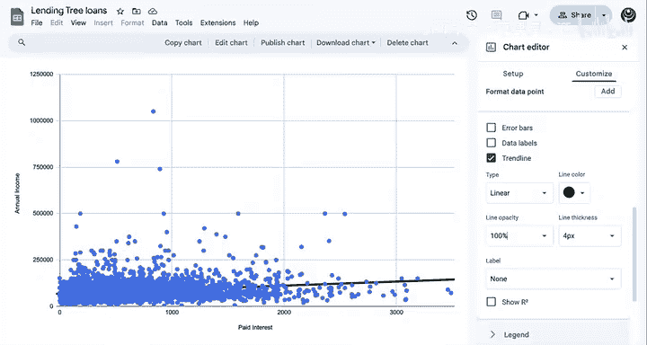

# 094：电子表格中的相关分析与散点图 📊

在本节课中，我们将学习如何在电子表格中实践相关性分析，并使用散点图可视化数据关系。我们将以借贷数据集为例，探索不同数值特征之间的关联。

---

## 实践：借贷数据集中的相关性分析



上一节我们介绍了相关性的基本概念，本节中我们来看看如何在具体数据集中应用它。

你可以选择任意一对数值特征来观察它们如何相关。需要提醒的是，该数据集包含了通过借贷平台发放的数千笔贷款记录。每一行代表一笔特定的贷款，每一列包含了借款人的特征信息，例如其职位、年收入，以及贷款信息，例如贷款金额。

如果你想跟随演示操作，可以在下载选项卡中找到电子表格和解决方案文件。

到目前为止，你已经查看了“已支付利息”这一特征的分布，并检查了其集中趋势、变异性和偏度。从贷款人的角度来看，这是一个有趣的特征，但结合更多背景信息它会更有用。你可能还对哪些因素会导致更高的利息和贷款金额感兴趣。

---

## 分析“已支付利息”与“分期付款”的相关性

让我们考虑“已支付利息”和“分期付款”之间的相关性。请记住，“分期付款”是申请人每月应支付的金额。



以下是“已支付利息”和“分期付款”的数据。你预计这两个特征会如何相关？是正相关还是负相关？相关性是强、中等还是弱？

你可能想先可视化这两个数值特征之间的关系。


你可能想添加一条趋势线，以便观察两个特征之间潜在的线性相关性。

首先，趋势线在“已支付利息”值较小时具有正斜率。此时“分期付款”的值也较小，并且这类数据点很多。对于较大的“已支付利息”值，你会得到较大的“分期付款”值，但数据点密度较低。这表明存在正相关，可能介于中等和强相关之间。

现在，你可能想找出这两个特征之间的实际相关系数。你可以使用 `CORREL` 函数，然后只需选择这两列数据。

```excel
=CORREL(数据范围1, 数据范围2)
```

相关系数约为 **0.69**，这处于中等正相关和强正相关的边界上。你还应注意，相关性计算是对称的。这意味着你选择列的顺序无关紧要，你会得到相同的结果。

---

## 分析“已支付利息”与“年收入”的相关性

让我们看一些其他例子。看看“已支付利息”与“年收入”如何相关。

同样，你可以创建一个散点图来直观感受这两个特征之间的相关性。



同样，你可以为数据添加趋势线，以便整体可视化其模式。


你在这个散点图中看到了什么？总体而言，低已支付利息和低年收入的数据点密度较高，但数据点相当分散。你还会看到一些距离很远的点，这些点会影响相关性。总体来看，数据点与趋势线的拟合较为松散，这意味着这些特征之间可能不存在强的线性关系。这表明存在弱正相关。

接下来，你可以计算实际相关系数。返回数据选项卡，选择这两列来计算相关性。同样，由于计算是对称的，你选择列的顺序无关紧要。

“已支付利息”与“年收入”之间的相关系数约为 **0.20**。这比之前的相关系数计算值低得多，表明存在弱正相关。总体而言，这与你在散点图中观察到的趋势一致。人们一年赚的钱越多，支付的利息也越多，但还有许多其他因素可以解释已支付利息的变化。仅根据收入来预测确切的已支付利息值是困难的。

---

## 分析“年收入”与“负债收入比”的相关性

让我们再看另外两个特征：“年收入”和“负债收入比”。

“负债收入比”是你的贷款负债与年收入之比。较低的负债收入比意味着一个人的债务比例较小，更有可能偿还新贷款。

这个相关性有助于回答一个问题：这些借款人的收入与他们相对债务金额之间的关系是什么？

你预计这些特征会如何相关？是正相关还是负相关？相关性是强、中等还是弱？

让我们看一下计算。从数据中选择这两个特征。

结果约为 **-0.177**。因此，在这种情况下，这是一种负相关关系，表明收入较高的人平均负债收入比较低，反之亦然。此外，相关系数的较小幅度表明这种关系总体上是弱的。

---

## 总结与下一步

出色地完成了使用散点图识别相关性的符号和幅度，以及解释 `CORREL` 函数输出的工作。本节课到此结束。

接下来，你将完成本课的练习评估以及实践实验。在实践实验中，你将探索音乐不同特征之间的相关性，以构建更好的播放列表。完成后，请跟随我进入下一节关于市场细分的课程。

---

本节课中我们一起学习了如何在电子表格中使用散点图和相关函数（`CORREL`）来分析和量化两个数值变量之间的关系。我们通过借贷数据的实例，理解了正相关、负相关以及相关性强弱的判断与解释。